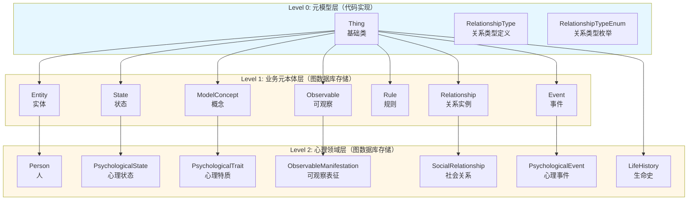

# 元本体数据模型需求文档

> **版本**: v1.0
> **文档类型**: 数据模型需求文档
> **创建日期**: 2026-02-06
> **状态**: Draft
> **关联PRD**: 心理分析系统_产品需求文档_v2.0.md（FR-3.4 元本体体系）

---

## 目录

1. [文档概述](#1-文档概述)
2. [架构层级划分](#2-架构层级划分)
3. [Level 0：元模型层（代码实现）](#3-level-0元模型层代码实现)
4. [Level 1：业务元本体层（代码实现）](#4-level-1业务元本体层代码实现)
5. [Level 2：心理领域层（图数据库存储）](#5-level-2心理领域层图数据库存储)
6. [关系类型管理需求](#6-关系类型管理需求)
7. [属性建模需求](#7-属性建模需求)
8. [时间戳支持需求](#8-时间戳支持需求)
9. [验证规则需求](#9-验证规则需求)
10. [实施建议](#10-实施建议)

---

## 1. 文档概述

### 1.1 文档目的

本文档定义了心理分析系统的元本体数据模型需求，包括：
- 元模型层、业务元本体层、心理领域层的模型定义
- 关系类型的管理和扩展机制
- 属性建模的约束和验证规则
- 时间戳支持和验证规则

### 1.2 核心设计理念

**分层架构**：
- **Level 0（元模型层）**：提供最基础的建模框架，代码实现
- **Level 1（业务元本体层）**：提供跨领域通用的业务概念，代码实现
- **Level 2（心理领域层）**：用户通过UI建模，存储在图数据库

**元本体 vs 知识图谱**：
- **元本体（Schema）**：定义模型结构、属性、关系类型
- **知识图谱（Data）**：存储具体的实例数据

**用户建模方式**：
- 用户通过UI界面创建本体定义（概念、属性、关系）
- 用户基于本体定义创建知识实例
- 所有用户创建的内容存储在Neo4j图数据库中

### 1.3 实现方式说明

| 层级 | 实现方式 | 存储位置 | 可扩展性 |
|------|---------|---------|---------|
| **Level 0** | Python代码 | 代码库 | 通过代码扩展 |
| **Level 1** | P0：代码预定义6种类型（Entity, Event, State, Observable, Rule, ModelConcept），标记为"系统预定义"；P1：开放UI建模，支持用户自定义Level 1类型 | P0：代码库；P1：Neo4j图数据库 | P0：固定6种；P1：用户可扩展 |
| **Level 2** | UI建模 | Neo4j图数据库 | 用户自由建模 |
| **关系类型枚举** | Python枚举 | 代码库 | 预定义核心类型 |
| **关系类型元数据** | 注册机制 | Neo4j图数据库 | 动态注册扩展 |
| **属性定义** | UI建模 | Neo4j图数据库 | 用户自由定义 |

---

## 2. 架构层级划分

### 2.1 三层架构概览



### 2.2 层级职责说明

**Level 0（元模型层）**：
- **职责**：提供最基础的建模框架
- **实现方式**：Neo4j图数据库存储（作为MetaClass节点）
- **核心类**：Thing（基础类）、RelationshipType（关系类型定义）
- **扩展方式**：通过修改代码扩展

**Level 1（业务元本体层）**：
- **职责**：提供跨领域通用的业务概念
- **实现方式**：用户通过UI建模，存储在Neo4j图数据库
- **核心类**：Entity、Event、State、Observable、Rule、ModelConcept、Relationship
- **扩展方式**：用户自由建模，支持动态扩展
- **设计理念**：符合业内知识图谱最佳实践（Wikidata、Schema.org等）

**Level 2（心理领域层）**：
- **职责**：心理学领域特定的模型定义
- **实现方式**：用户通过UI建模，存储在Neo4j
- **核心类**：Person、PsychologicalState、PsychologicalTrait等
- **扩展方式**：用户自由建模，无代码限制

---

## 3. Level 0：元模型层（代码实现）

### 3.1 Thing（基础类）

**定义**：所有模型的顶层基类，提供最基础的属性和方法。

**实现方式**：Python代码

**核心属性**：

| 属性名 | 数据类型 | 必填 | 说明 |
|--------|---------|------|------|
| id | string | 是 | 唯一标识符，格式：UUID |
| type | string | 是 | 运行时类型名（自动生成） |
| name | string | 是 | 显示名称 |
| description | string | 否 | 描述信息 |
| created_at | datetime | 是 | 创建时间（自动生成） |
| updated_at | datetime | 是 | 更新时间（自动更新） |

**设计说明**：
- Thing是所有模型的基类，提供通用的元数据字段
- `type`字段自动记录类名，用于运行时类型识别
- `created_at`和`updated_at`自动管理，支持时间追溯

### 3.2 RelationshipType（关系类型定义）

**定义**：关系类型的元数据定义，描述关系的结构和约束。

**实现方式**：Python代码

**核心属性**：

| 属性名 | 数据类型 | 必填 | 说明 |
|--------|---------|------|------|
| name | string | 是 | 关系类型名称（如：IS_A、HAS_A） |
| source_class | string | 是 | 源实体类名 |
| target_class | string | 是 | 目标实体类名 |
| description | string | 是 | 关系描述 |
| direction | enum | 是 | 方向性：directed（有向）/ undirected（无向） |
| cardinality | enum | 是 | 基数：1:1 / 1:N / M:N |
| has_edge_properties | boolean | 是 | 是否支持边属性 |

**设计说明**：
- RelationshipType定义关系的元数据，不是具体的关系实例
- 支持方向性和基数约束
- 支持边属性（如：关系强度、置信度等）

### 3.3 RelationshipTypeEnum（关系类型枚举）

**定义**：预定义的关系类型枚举，提供常用的关系类型。

**实现方式**：Python代码（枚举类）

**存储说明**：
- 枚举定义在代码中，保证类型安全
- 系统启动时自动注册到Neo4j图数据库
- 关系类型的元数据存储在图数据库中（见第6节）

**预定义关系类型**：

| 关系类型 | 分类 | 说明 | 示例 |
|---------|------|------|------|
| **IS_A** | 结构关系 | 继承关系 | Person IS_A Entity |
| **HAS_A** | 结构关系 | 关联关系 | Person HAS_A PsychologicalState |
| **PART_OF** | 结构关系 | 组合关系 | Attribute PART_OF Entity |
| **CONTAINS** | 结构关系 | 聚合关系 | LifeHistory CONTAINS Event |
| **OBSERVED_AS** | 语义关系 | 观察关系 | Entity OBSERVED_AS Observable |
| **EVIDENCE_OF** | 语义关系 | 证据关系 | Observable EVIDENCE_OF State |
| **TRIGGERS** | 语义关系 | 触发关系 | Event TRIGGERS State |
| **INFLUENCES** | 语义关系 | 影响关系 | State INFLUENCES State |
| **HAS_HISTORY** | 语义关系 | 历史关系 | Entity HAS_HISTORY Event |
| **USES** | 语义关系 | 使用关系 | Rule USES Thing |
| **DERIVES** | 语义关系 | 推导关系 | Rule DERIVES State |
| **MITIGATES** | 语义关系 | 缓解关系 | Event MITIGATES State |
| **PRECEDES** | 语义关系 | 先后关系 | Event PRECEDES Event |
| **IN_ENVIRONMENT** | 语义关系 | 环境关系 | Thing IN_ENVIRONMENT State |

**心理学特定关系类型**：

| 关系类型 | 说明 | 示例 |
|---------|------|------|
| **INDICATES** | 指示关系 | Observable INDICATES State |
| **SUGGESTS** | 暗示关系 | Observable SUGGESTS Trait |
| **SHAPES** | 塑造关系 | History SHAPES Trait |
| **MODERATES** | 调节关系 | Trait MODERATES State |
| **AFFECTS** | 影响关系 | Event AFFECTS SocialRelationship |
| **POSSESSES** | 拥有关系 | Person POSSESSES Trait |
| **PARTICIPATES_IN** | 参与关系 | Person PARTICIPATES_IN SocialRelationship |
| **EXPERIENCES** | 体验关系 | Person EXPERIENCES State/Event |
| **HAS** | 拥有关系 | Person HAS ObservableManifestation |
| **IMPACTS** | 冲击关系 | Event IMPACTS Person |
| **SHAPES_BY** | 被塑造关系 | Trait SHAPES_BY SocialRelationship |
| **INFLUENCED_BY** | 被影响关系 | State INFLUENCED_BY SocialRelationship |
| **REFLECTS** | 反映关系 | Observable REFLECTS Event |
| **FOLLOWS** | 后继关系 | State FOLLOWS State |
| **DEVELOPS_INTO** | 发展关系 | Trait DEVELOPS_INTO Trait |

**扩展机制**：
- 预定义关系类型存储在枚举中
- 用户可以通过关系类型注册机制动态添加新的关系类型（见第6节）

---

## 4. Level 1：业务元本体层（P0代码预定义，P1图数据库存储）

> **P0阶段实现策略**：Level 1的6种业务元本体类型（Entity, Event, State, Observable, Rule, ModelConcept）在P0阶段作为系统预定义类型，由代码内置。P1阶段开放UI建模，支持用户自定义Level 1类型，届时迁移至Neo4j图数据库存储。

### 4.1 Entity（实体）

**定义**：有"长期身份"的对象，如人、组织、设备等。

**实现方式**：Neo4j图数据库存储（作为MetaClass节点）

**继承关系**：Entity → Thing

**核心属性**：

| 属性名 | 数据类型 | 必填 | 说明 |
|--------|---------|------|------|
| identity_key | string | 是 | 业务身份标识（如：user_id、device_sn） |
| entity_category | string | 是 | 实体类别（如：person、organization、device） |
| metadata | map | 否 | 可扩展的业务属性（JSON格式） |

**设计说明**：
- Entity代表有持久身份的对象
- `identity_key`用于业务层面的唯一标识
- `metadata`提供灵活的扩展属性存储

### 4.2 Event（事件）

**定义**：发生在时间轴上的"事"，如生活事件、日常事件、干预行为等。

**实现方式**：Neo4j图数据库存储（作为MetaClass节点）

**继承关系**：Event → Thing

**核心属性**：

| 属性名 | 数据类型 | 必填 | 说明 |
|--------|---------|------|------|
| start_time | datetime | 是 | 事件开始时间 |
| end_time | datetime | 否 | 事件结束时间（瞬时事件可为空） |
| event_type | string | 是 | 事件类型（具体业务再细化） |
| severity | integer | 否 | 严重程度（0-10） |
| impact_score | float | 否 | 影响分数（0.0-1.0） |

**设计说明**：
- Event代表时间轴上的离散事件
- 支持瞬时事件（end_time为空）和持续事件
- `severity`和`impact_score`用于评估事件的重要性

### 4.3 State（状态）

**定义**：某个时间段内"处于某种状态"，如心理状态、环境状态等。

**实现方式**：Neo4j图数据库存储（作为MetaClass节点）

**继承关系**：State → Thing

**核心属性**：

| 属性名 | 数据类型 | 必填 | 说明 |
|--------|---------|------|------|
| intensity | float | 是 | 状态强度（0.0-1.0） |
| confidence | float | 是 | 判断置信度（0.0-1.0） |
| temporal_pattern | string | 否 | 时间模式（phasic/tonic/chronic） |

**设计说明**：
- State代表动态的状态信息
- `intensity`表示状态的强度
- `confidence`表示对该状态判断的可信度
- `temporal_pattern`描述状态的时间特征

### 4.4 Observable（可观察）

**定义**：所有"直接可观测到的信号"，如行为、表情、生理、文本等。

**实现方式**：Neo4j图数据库存储（作为MetaClass节点）

**继承关系**：Observable → Thing

**核心属性**：

| 属性名 | 数据类型 | 必填 | 说明 |
|--------|---------|------|------|
| timestamp | datetime | 是 | 观测时间点 |
| source_device | string | 否 | 数据来源设备 |
| measurement_method | string | 是 | 测量方法 |
| confidence | float | 是 | 观测置信度（0.0-1.0） |

**设计说明**：
- Observable代表可直接观察到的证据
- `timestamp`记录观测的时间点
- `confidence`表示观测的可靠性

### 4.5 Rule（规则）

**定义**：规则/模型本体，用于推断状态、诊断、评估风险等。

**实现方式**：Neo4j图数据库存储（作为MetaClass节点）

**继承关系**：Rule → Thing

**核心属性**：

| 属性名 | 数据类型 | 必填 | 说明 |
|--------|---------|------|------|
| rule_type | string | 是 | 规则类型（inference/diagnosis/risk_assessment） |
| logic_expression | text | 是 | 规则或模型描述 |
| confidence_threshold | float | 是 | 输出阈值（0.0-1.0） |

**设计说明**：
- Rule代表推理规则或诊断模型
- `logic_expression`可以是自然语言描述或形式化表达式
- `confidence_threshold`用于判断规则是否触发

### 4.6 ModelConcept（概念）

**定义**：纯"概念位"，用来挂心理本体/环境本体等定义。

**实现方式**：Neo4j图数据库存储（作为MetaClass节点）

**继承关系**：ModelConcept → Thing

**核心属性**：

| 属性名 | 数据类型 | 必填 | 说明 |
|--------|---------|------|------|
| concept_category | string | 是 | 概念类别（心理/环境/诊断/量表等） |
| definition | text | 是 | 概念的正式定义 |

**设计说明**：
- ModelConcept代表抽象的概念定义
- 不包含具体的实例数据，只定义概念本身
- 用于构建本体层次结构

### 4.7 Relationship（关系实例）

**定义**：具体的"关系实例"（边），连接两个Thing。

**实现方式**：Neo4j图数据库存储（作为MetaClass节点）

**继承关系**：Relationship → Thing

**核心属性**：

| 属性名 | 数据类型 | 必填 | 说明 |
|--------|---------|------|------|
| source_id | string | 是 | 源Thing的id |
| target_id | string | 是 | 目标Thing的id |
| rel_type | RelationshipTypeEnum | 是 | 关系类型枚举 |
| edge_properties | map | 否 | 边上的扩展属性（如：strength、confidence等） |

**设计说明**：
- Relationship代表图中的实际连接
- 支持边属性，可以存储关系的强度、置信度等信息
- `rel_type`引用预定义的关系类型

---

## 5. Level 2：心理领域层（图数据库存储）

### 5.1 概述

**实现方式**：用户通过UI建模，存储在Neo4j图数据库

**设计理念**：
- Level 2的模型定义不固化在代码中
- 用户通过UI界面创建本体定义（概念、属性、关系）
- 所有定义存储在Neo4j图数据库中
- 系统提供参考模板（如心理学本体模型），用户可以基于模板创建或自定义

### 5.2 心理学本体模型参考

以下是心理学领域的参考模型，用户可以基于此创建自己的本体定义。

#### 5.2.1 Person（人）

**定义**：本体的核心实体，代表被分析的个体。

**继承自**：Entity

**参考属性**：

| 属性名 | 数据类型 | 必填 | 说明 |
|--------|---------|------|------|
| person_id | string | 是 | 个体唯一标识符 |
| basic_info | map | 是 | 基础信息（name、age、gender、occupation） |
| socioeconomic_status | map | 否 | 社会经济地位（education、income、socialClass） |
| biological_features | map | 否 | 生理学特点（physicalHealth、neurologicalConditions） |

**参考关系**：
- Person → ObservableManifestation（has）
- Person → PsychologicalState（experiences）
- Person → PsychologicalTrait（possesses）
- Person → SocialRelationship（participates_in）
- Person → Event（experiences_event）
- Person → LifeHistory（has_history）

#### 5.2.2 ObservableManifestation（可观察表征）

**定义**：可以通过直接观察获得的个体外显特征和行为。

**继承自**：Observable

**参考属性**：

| 属性名 | 数据类型 | 必填 | 说明 |
|--------|---------|------|------|
| manifestation_type | string | 是 | 表征类型（PhysiologicalSigns/AppearanceFeatures/BehavioralPatterns） |
| observed_content | text | 是 | 观察到的具体内容 |
| observation_context | string | 否 | 观察情境 |
| intensity | float | 是 | 强度/显著性（0.0-1.0） |

**参考关系**：
- ObservableManifestation → PsychologicalState（indicates）
- ObservableManifestation → PsychologicalTrait（suggests）
- ObservableManifestation → Event（reflects）

#### 5.2.3 PsychologicalState（心理状态）

**定义**：个体当前或特定时刻的动态心理过程和体验。

**继承自**：State

**参考属性**：

| 属性名 | 数据类型 | 必填 | 说明 |
|--------|---------|------|------|
| state_type | string | 是 | 状态类型（EmotionalStates/MotivationalStates/IntentionalStates等） |
| content | text | 是 | 状态内容（如具体情绪、具体想法） |
| valence | enum | 是 | 效价（positive/negative/neutral） |
| duration | float | 否 | 持续时间（小时） |
| trigger | string | 否 | 触发因素 |
| timestamp | datetime | 是 | 状态发生时间 |

**参考关系**：
- PsychologicalState → PsychologicalState（follows）
- Event → PsychologicalState（triggers）
- PsychologicalTrait → PsychologicalState（moderates）

#### 5.2.4 PsychologicalTrait（心理特质）

**定义**：个体相对稳定和持久的心理特征。

**继承自**：ModelConcept

**参考属性**：

| 属性名 | 数据类型 | 必填 | 说明 |
|--------|---------|------|------|
| trait_type | string | 是 | 特质类型（PersonalityTraits/CognitiveTraits/AbilityTraits等） |
| level | float | 是 | 程度（0.0-1.0） |
| stability | float | 是 | 稳定性评估（0.0-1.0） |
| formation_period | string | 否 | 形成时期 |

**参考关系**：
- PsychologicalTrait → PsychologicalTrait（develops_into）
- LifeHistory → PsychologicalTrait（shapes）
- SocialRelationship → PsychologicalTrait（shapes_by）

#### 5.2.5 SocialRelationship（社会关系）

**定义**：个体与他人的关系模式、社会网络及人际互动特征。

**继承自**：Relationship

**参考属性**：

| 属性名 | 数据类型 | 必填 | 说明 |
|--------|---------|------|------|
| relationship_type | string | 是 | 关系类型（RelationshipNetwork/AttachmentPatterns等） |
| quality | map | 否 | 关系质量（intimacy、satisfaction、conflict） |
| duration | float | 否 | 关系持续时间（年） |
| significance | float | 是 | 关系重要性/影响力（0.0-1.0） |

**参考关系**：
- Event → SocialRelationship（affects）
- SocialRelationship → PsychologicalState（influences）

#### 5.2.6 PsychologicalEvent（心理事件）

**定义**：个体经历的离散的、有时间点的事件，对心理产生影响。

**继承自**：Event

**参考属性**：

| 属性名 | 数据类型 | 必填 | 说明 |
|--------|---------|------|------|
| event_description | text | 是 | 事件描述 |
| location | string | 否 | 发生地点/情境 |
| involved_persons | array | 否 | 涉及的人物 |
| perceived_impact | float | 是 | 主观感知的影响程度（0.0-1.0） |
| objective_impact | float | 否 | 客观影响评估（0.0-1.0） |

**参考关系**：
- Event → Event（precedes）
- Event → Person（impacts）

#### 5.2.7 LifeHistory（生命史）

**定义**：个体从出生到现在的发展历程。

**继承自**：Thing

**参考属性**：

| 属性名 | 数据类型 | 必填 | 说明 |
|--------|---------|------|------|
| history_type | string | 是 | 历史类型（DevelopmentalHistory/FunctionalHistory等） |
| period | string | 是 | 时间段 |
| key_events | array | 否 | 关键事件ID列表 |
| psychological_themes | array | 否 | 心理主题 |
| developmental_outcomes | text | 否 | 发展结果 |

**参考关系**：
- LifeHistory → Person（influences）
- LifeHistory → Event（contains）

### 5.3 用户建模流程

**步骤1：创建本体定义**
- 用户通过UI界面创建概念（如：Person、PsychologicalState）
- 定义概念的属性（属性名、类型、必填、描述等）
- 定义概念之间的关系（关系类型、源概念、目标概念）

**步骤2：存储到Neo4j**
- 本体定义存储为Neo4j节点（标签：OntologyDefinition）
- 属性定义存储为节点属性或关联节点
- 关系定义存储为Neo4j关系（标签：OntologyRelationship）

**步骤3：实例化知识**
- 用户基于本体定义创建知识实例
- 知识实例存储为Neo4j节点（标签：KnowledgeInstance）
- 实例之间的关系存储为Neo4j关系

**步骤4：查询和分析**
- 通过Cypher查询知识图谱
- 通过Function Calling或Auto Cypher生成进行智能查询
- 在分析过程中通过RAG机制检索相关知识

---

## 6. 关系类型管理需求

### 6.0 存储架构说明

**混合存储方案**：

关系类型采用**代码+数据库混合存储**的方式，兼顾类型安全和灵活扩展：

| 存储内容 | 存储位置 | 用途 | 可扩展性 |
|---------|---------|------|---------|
| **RelationshipTypeEnum** | Python代码（枚举类） | 预定义核心关系类型，保证类型安全 | 通过代码扩展 |
| **关系类型元数据** | Neo4j图数据库 | 存储所有关系类型的详细定义和约束 | 用户可动态添加 |

**工作流程**：
1. **系统启动时**：自动将代码中的RelationshipTypeEnum注册到Neo4j图数据库
2. **运行时**：所有关系类型的元数据从Neo4j加载，支持预定义类型和用户自定义类型
3. **用户扩展**：用户可通过UI添加自定义关系类型，直接存储在Neo4j中

**设计理念**：
- **类型安全**：核心关系类型在代码中定义，编译时检查
- **灵活扩展**：用户可动态添加领域特定关系类型
- **统一管理**：所有关系类型元数据统一存储在Neo4j中

### 6.1 需求背景

**问题描述**：
- 当前关系类型定义在枚举中，用户无法动态添加新的关系类型
- 不同领域可能需要不同的关系类型
- 需要支持关系类型的动态注册和管理

**解决方案**：
- 提供关系类型注册机制
- 支持预定义关系类型和用户自定义关系类型
- 关系类型定义存储在Neo4j图数据库中

### 6.2 关系类型注册机制

**功能需求**：

**FR-6.2.1：关系类型注册**
- 系统应支持用户通过UI注册新的关系类型
- 系统应支持关系类型的CRUD操作（创建、读取、更新、删除）
- 系统应支持关系类型的分类管理（结构关系、语义关系、领域特定关系）

**FR-6.2.2：关系类型定义**
- 系统应支持定义关系类型的基本信息（名称、描述、分类）
- 系统应支持定义关系的方向性（有向/无向）
- 系统应支持定义关系的基数约束（1:1、1:N、M:N）
- 系统应支持定义关系是否支持边属性

**FR-6.2.3：关系类型验证**
- 系统应验证关系类型名称的唯一性
- 系统应验证关系类型定义的完整性
- 系统应验证关系类型的源类和目标类是否存在

### 6.3 关系类型数据模型

**存储方式**：Neo4j图数据库

**节点标签**：RelationshipTypeDefinition

**节点属性**：

| 属性名 | 数据类型 | 必填 | 说明 |
|--------|---------|------|------|
| type_id | string | 是 | 关系类型唯一标识符（UUID） |
| type_name | string | 是 | 关系类型名称（如：IS_A、HAS_A、CUSTOM_REL） |
| category | enum | 是 | 分类（structural/semantic/domain_specific） |
| description | text | 是 | 关系描述 |
| source_class | string | 否 | 源实体类名（为空表示不限制） |
| target_class | string | 否 | 目标实体类名（为空表示不限制） |
| direction | enum | 是 | 方向性（directed/undirected） |
| cardinality | enum | 是 | 基数（1:1、1:N、M:N） |
| has_edge_properties | boolean | 是 | 是否支持边属性 |
| is_predefined | boolean | 是 | 是否为预定义类型 |
| created_by | string | 否 | 创建者ID |
| created_at | datetime | 是 | 创建时间 |
| updated_at | datetime | 是 | 更新时间 |

### 6.4 关系类型使用流程

**步骤1：注册关系类型**
```
用户通过UI界面 → 填写关系类型信息 → 系统验证 → 存储到Neo4j
```

**步骤2：使用关系类型**
```
用户创建关系 → 选择关系类型 → 系统验证约束 → 创建关系实例
```

**步骤3：查询关系类型**
```
系统加载关系类型定义 → 提供给Function Calling → 用于Cypher生成
```

### 6.5 预定义关系类型初始化

**自动注册机制**：

系统启动时，自动将Python代码中的`RelationshipTypeEnum`注册到Neo4j图数据库：

1. **读取枚举定义**：从`RelationshipTypeEnum`中读取所有预定义关系类型
2. **创建元数据节点**：为每个枚举值在Neo4j中创建`RelationshipTypeDefinition`节点
3. **标记预定义类型**：设置`is_predefined=true`，防止用户删除核心类型
4. **幂等性保证**：如果关系类型已存在，则跳过创建（支持系统重启）

**注册流程**：
```
系统启动 → 遍历RelationshipTypeEnum → 检查Neo4j中是否存在 →
不存在则创建RelationshipTypeDefinition节点 → 标记is_predefined=true
```

**初始化列表**：
- **结构关系**：IS_A、HAS_A、PART_OF、CONTAINS
- **语义关系**：OBSERVED_AS、EVIDENCE_OF、TRIGGERS、INFLUENCES、HAS_HISTORY、USES、DERIVES、MITIGATES、PRECEDES、IN_ENVIRONMENT
- **心理学特定**（可选）：INDICATES、SUGGESTS、SHAPES、MODERATES、AFFECTS、POSSESSES、PARTICIPATES_IN、EXPERIENCES

**约束规则**：
- 预定义类型不可删除（UI中禁用删除按钮）
- 预定义类型可以查看和使用
- 预定义类型的核心属性不可修改（如type_name、category）
- 预定义类型的描述可以补充完善

### 6.6 关系类型扩展示例

**示例1：添加自定义关系类型**

用户需求：在教育领域，需要定义"教授"关系

关系类型定义：
- type_name: TEACHES
- category: domain_specific
- description: 教师教授学生的关系
- source_class: Teacher
- target_class: Student
- direction: directed
- cardinality: 1:N
- has_edge_properties: true（可以存储课程名称、学期等）

**示例2：使用自定义关系类型**

创建关系实例：
```
Teacher(张老师) -[TEACHES {course: "心理学导论", semester: "2024春"}]-> Student(李同学)
```

---

## 7. 属性建模需求

### 7.1 需求背景

**问题描述**：
- 用户需要为本体定义灵活的属性
- 属性需要支持类型约束、必填约束、默认值等
- 需要参考Apifox等工具的属性约束设计

**解决方案**：
- 提供完整的属性建模能力
- 支持多种数据类型和约束规则
- 属性定义存储在Neo4j图数据库中

### 7.2 属性定义数据模型

**存储方式**：Neo4j图数据库

**节点标签**：AttributeDefinition

**节点属性**：

| 属性名 | 数据类型 | 必填 | 说明 |
|--------|---------|------|------|
| attribute_id | string | 是 | 属性唯一标识符（UUID） |
| attribute_name | string | 是 | 属性名称（如：age、name、confidence） |
| display_name | string | 否 | 显示名称（用于UI展示） |
| data_type | enum | 是 | 数据类型（见7.3节） |
| required | boolean | 是 | 是否必填 |
| default_value | any | 否 | 默认值 |
| description | text | 否 | 属性描述 |
| validation_rules | map | 否 | 验证规则（见7.4节） |
| metadata | map | 否 | 扩展元数据 |
| created_at | datetime | 是 | 创建时间 |
| updated_at | datetime | 是 | 更新时间 |

**关系**：
- AttributeDefinition -[BELONGS_TO]-> OntologyDefinition（属性属于某个本体）

### 7.3 支持的数据类型

参考原型中的设计和Apifox的类型系统：

| 数据类型 | 说明 | 示例值 | 验证规则支持 |
|---------|------|--------|------------|
| **string** | 字符串 | "张三" | minLength、maxLength、pattern、enum |
| **number** | 数字（整数或浮点数） | 25、3.14 | min、max、multipleOf |
| **integer** | 整数 | 25 | min、max、multipleOf |
| **float** | 浮点数 | 3.14 | min、max、precision |
| **boolean** | 布尔值 | true、false | - |
| **datetime** | 日期时间 | "2024-01-01T12:00:00Z" | min、max、format |
| **date** | 日期 | "2024-01-01" | min、max |
| **time** | 时间 | "12:00:00" | - |
| **enum** | 枚举 | "male"、"female" | enumValues |
| **array** | 数组 | ["tag1", "tag2"] | minItems、maxItems、itemType |
| **map** | 映射/对象 | {"key": "value"} | properties |
| **uuid** | UUID | "550e8400-e29b-41d4-a716-446655440000" | - |
| **url** | URL | "https://example.com" | - |
| **email** | 邮箱 | "user@example.com" | - |

### 7.4 验证规则定义

**validation_rules**字段存储JSON格式的验证规则：

#### 7.4.1 字符串类型验证规则

```json
{
  "minLength": 1,
  "maxLength": 100,
  "pattern": "^[a-zA-Z0-9]+$",
  "enum": ["option1", "option2", "option3"]
}
```

| 规则名 | 说明 | 示例 |
|--------|------|------|
| minLength | 最小长度 | 1 |
| maxLength | 最大长度 | 100 |
| pattern | 正则表达式 | "^[a-zA-Z0-9]+$" |
| enum | 枚举值列表 | ["male", "female", "other"] |

#### 7.4.2 数字类型验证规则

```json
{
  "min": 0,
  "max": 100,
  "multipleOf": 0.1,
  "precision": 2
}
```

| 规则名 | 说明 | 示例 |
|--------|------|------|
| min | 最小值 | 0 |
| max | 最大值 | 100 |
| multipleOf | 倍数 | 0.1（表示必须是0.1的倍数） |
| precision | 精度（小数位数） | 2 |

#### 7.4.3 日期时间类型验证规则

```json
{
  "min": "2020-01-01T00:00:00Z",
  "max": "2030-12-31T23:59:59Z",
  "format": "ISO8601"
}
```

| 规则名 | 说明 | 示例 |
|--------|------|------|
| min | 最小日期时间 | "2020-01-01T00:00:00Z" |
| max | 最大日期时间 | "2030-12-31T23:59:59Z" |
| format | 格式 | "ISO8601"、"YYYY-MM-DD" |

#### 7.4.4 数组类型验证规则

```json
{
  "minItems": 1,
  "maxItems": 10,
  "itemType": "string",
  "uniqueItems": true
}
```

| 规则名 | 说明 | 示例 |
|--------|------|------|
| minItems | 最小元素数量 | 1 |
| maxItems | 最大元素数量 | 10 |
| itemType | 元素类型 | "string"、"number" |
| uniqueItems | 元素是否唯一 | true |

#### 7.4.5 枚举类型验证规则

```json
{
  "enumValues": [
    {"value": "male", "label": "男性"},
    {"value": "female", "label": "女性"},
    {"value": "other", "label": "其他"}
  ]
}
```

| 规则名 | 说明 | 示例 |
|--------|------|------|
| enumValues | 枚举值列表 | [{"value": "male", "label": "男性"}] |

### 7.5 属性建模UI需求

参考原型中的ConceptEditDrawer组件设计：

**FR-7.5.1：属性列表展示**
- 系统应以表格形式展示本体的所有属性
- 表格列：属性名、类型、必填、描述、操作
- 支持属性的排序和筛选

**FR-7.5.2：属性添加**
- 系统应提供"添加属性"按钮
- 点击后在表格中插入新行，允许用户编辑
- 新属性默认值：name="新属性"、type="string"、required=false

**FR-7.5.3：属性编辑**
- 属性名：文本输入框
- 数据类型：下拉选择框（支持7.3节中的所有类型）
- 必填：下拉选择框（是/否）
- 描述：文本输入框
- 验证规则：点击展开高级配置面板

**FR-7.5.4：属性删除**
- 每行提供删除按钮
- 删除前需要确认
- 删除后立即从列表中移除

**FR-7.5.5：验证规则配置**
- 根据数据类型动态显示可配置的验证规则
- 提供友好的输入控件（如：数字输入框、日期选择器）
- 实时验证规则的有效性

### 7.6 属性使用示例

**示例1：定义Person的age属性**

```json
{
  "attribute_id": "ATTR_001",
  "attribute_name": "age",
  "display_name": "年龄",
  "data_type": "integer",
  "required": true,
  "default_value": null,
  "description": "个体的年龄",
  "validation_rules": {
    "min": 0,
    "max": 150
  }
}
```

**示例2：定义PsychologicalState的valence属性**

```json
{
  "attribute_id": "ATTR_002",
  "attribute_name": "valence",
  "display_name": "效价",
  "data_type": "enum",
  "required": true,
  "default_value": "neutral",
  "description": "情绪的正负性",
  "validation_rules": {
    "enumValues": [
      {"value": "positive", "label": "正性"},
      {"value": "negative", "label": "负性"},
      {"value": "neutral", "label": "中性"}
    ]
  }
}
```

**示例3：定义Observable的timestamp属性**

```json
{
  "attribute_id": "ATTR_003",
  "attribute_name": "timestamp",
  "display_name": "观测时间",
  "data_type": "datetime",
  "required": true,
  "default_value": null,
  "description": "观测发生的时间点",
  "validation_rules": {
    "format": "ISO8601",
    "max": "now"
  }
}
```

### 7.7 子类型层次建模方法

心理学本体模型中存在深层次的子类型分类，如：

```
PsychologicalStates（心理状态）
└─ EmotionalStates（情绪状态）
   ├─ BasicEmotions（基本情绪）
   │  ├─ Joy（喜悦）
   │  ├─ Anger（愤怒）
   │  └─ Sadness（悲伤）
   └─ ComplexEmotions（复合情绪）
      ├─ Anxiety（焦虑）
      └─ Depression（抑郁）
```

本节提供三种建模方法，用户可根据实际需求选择。

#### 方法1：使用点分隔符（推荐用于查询和展示）

**说明**：使用点号分隔不同层级，形成层次化的类型标识。

**属性定义示例**：

```json
{
  "attribute_name": "stateType",
  "data_type": "string",
  "description": "心理状态类型（层次化）",
  "validation_rules": {
    "pattern": "^[A-Za-z]+\\.[A-Za-z]+\\.[A-Za-z]+$"
  }
}
```

**实例数据示例**：
```json
{
  "id": "STATE_001",
  "type": "PsychologicalState",
  "name": "当前情绪状态",
  "stateType": "EmotionalStates.BasicEmotions.Joy",
  "content": "感到非常开心",
  "intensity": 0.8
}
```

**优点**：
- 结构清晰，易于理解
- 便于字符串匹配和前缀查询（如查询所有BasicEmotions）
- 适合在UI中展示层次结构

**缺点**：
- 需要解析字符串才能获取各层级信息
- 不便于按层级进行独立查询

#### 方法2：使用嵌套属性（推荐用于独立查询）

**说明**：为每个层级定义独立的属性字段，便于按层级进行查询和统计。

**属性定义示例**：

```json
{
  "attributes": [
    {
      "attribute_name": "stateCategory",
      "data_type": "enum",
      "description": "心理状态大类",
      "validation_rules": {
        "enumValues": [
          {"value": "EmotionalStates", "label": "情绪状态"},
          {"value": "MotivationalStates", "label": "动机状态"},
          {"value": "CognitiveStates", "label": "认知状态"}
        ]
      }
    },
    {
      "attribute_name": "stateSubcategory",
      "data_type": "enum",
      "description": "心理状态子类",
      "validation_rules": {
        "enumValues": [
          {"value": "BasicEmotions", "label": "基本情绪"},
          {"value": "ComplexEmotions", "label": "复合情绪"}
        ]
      }
    },
    {
      "attribute_name": "specificEmotion",
      "data_type": "enum",
      "description": "具体情绪类型",
      "validation_rules": {
        "enumValues": [
          {"value": "Joy", "label": "喜悦"},
          {"value": "Anger", "label": "愤怒"},
          {"value": "Sadness", "label": "悲伤"}
        ]
      }
    }
  ]
}
```

**实例数据示例**：
```json
{
  "id": "STATE_001",
  "type": "PsychologicalState",
  "name": "当前情绪状态",
  "stateCategory": "EmotionalStates",
  "stateSubcategory": "BasicEmotions",
  "specificEmotion": "Joy",
  "content": "感到非常开心",
  "intensity": 0.8
}
```

**优点**：
- 便于按层级进行独立查询（如：查询所有EmotionalStates）
- 支持层级聚合统计
- 数据结构清晰，无需解析

**缺点**：
- 属性字段较多，增加数据模型复杂度
- 需要维护层级之间的一致性约束

#### 方法3：使用层次化枚举值（推荐用于固定分类）

**说明**：在枚举值中包含完整的层次信息，适合分类相对固定的场景。

**属性定义示例**：

```json
{
  "attribute_name": "emotionType",
  "data_type": "enum",
  "description": "情绪类型（层次化枚举）",
  "validation_rules": {
    "enumValues": [
      {"value": "EmotionalStates.BasicEmotions.Joy", "label": "基本情绪 - 喜悦"},
      {"value": "EmotionalStates.BasicEmotions.Anger", "label": "基本情绪 - 愤怒"},
      {"value": "EmotionalStates.BasicEmotions.Sadness", "label": "基本情绪 - 悲伤"},
      {"value": "EmotionalStates.ComplexEmotions.Anxiety", "label": "复合情绪 - 焦虑"},
      {"value": "EmotionalStates.ComplexEmotions.Depression", "label": "复合情绪 - 抑郁"}
    ]
  }
}
```

**实例数据示例**：
```json
{
  "id": "STATE_001",
  "type": "PsychologicalState",
  "name": "当前情绪状态",
  "emotionType": "EmotionalStates.BasicEmotions.Joy",
  "content": "感到非常开心",
  "intensity": 0.8
}
```

**优点**：
- 结合了方法1和方法2的优点
- 枚举值提供了类型安全和UI友好的标签
- 便于前端下拉选择和展示

**缺点**：
- 枚举值列表可能较长
- 新增子类型需要更新枚举定义

#### 方法选择建议

| 场景 | 推荐方法 | 理由 |
|------|---------|------|
| 分类层次深且灵活 | 方法1（点分隔符） | 易于扩展，无需修改schema |
| 需要按层级统计分析 | 方法2（嵌套属性） | 便于独立查询和聚合 |
| 分类相对固定 | 方法3（层次化枚举） | 类型安全，UI友好 |
| 心理学本体建模 | 方法1 + 方法3组合 | 存储用方法1，UI展示用方法3 |

### 7.8 组合关系的自动属性生成

#### 7.8.1 需求背景

**问题描述**：
- 用户通过拖拽方式建立对象之间的组合关系（PART_OF/CONTAINS）
- 需要在父对象中自动生成指向子对象的属性引用
- 属性的数据类型应该是子对象的类型
- 用户需要能够选择关系的基数（1:1或1:N）

**解决方案**：
- 当用户通过UI拖拽建立组合关系时，系统自动生成属性
- 属性名称根据子对象类型自动生成，用户可以修改
- 属性的数据类型根据基数选择自动确定（对象引用或对象数组）
- 提供友好的UI交互，让用户选择基数关系

#### 7.8.2 自动生成规则

**触发条件**：
- 用户在UI界面中拖拽对象B到对象A上
- 用户选择关系类型为PART_OF或CONTAINS
- 系统检测到这是一个组合关系

**自动生成流程**：

1. **属性名称生成**：
   - 默认使用子对象类型的小驼峰命名：`childObjectType`
   - 如果是1:N关系，自动添加复数形式：`childObjectTypes`
   - 用户可以在生成后修改属性名称

2. **数据类型确定**：
   - 1:1关系：数据类型为子对象的类型引用（如：`PsychologicalState`）
   - 1:N关系：数据类型为子对象类型的数组（如：`array<PsychologicalState>`）

3. **属性约束设置**：
   - 1:1关系：`required`根据业务需求由用户选择
   - 1:N关系：`required=false`，但可以设置`minItems`约束

#### 7.8.3 基数选择机制

**UI交互设计**：

当用户拖拽建立组合关系后，系统弹出对话框让用户选择基数：

**选项1：一对一（1:1）**
- 说明：父对象只包含一个子对象
- 生成属性类型：对象引用
- 示例：`Person`包含一个`LifeHistory`

**选项2：一对多（1:N）**
- 说明：父对象可以包含多个子对象
- 生成属性类型：对象数组
- 示例：`Person`包含多个`PsychologicalState`

**默认选择**：
- 系统根据关系类型提供智能推荐
- CONTAINS关系默认推荐1:N（容器通常包含多个元素）
- PART_OF关系默认推荐1:1（部分通常是整体的单一组成）
- 用户可以覆盖默认选择

#### 7.8.4 示例说明

**示例1：一对一关系（1:1）**

用户操作：
1. 拖拽`LifeHistory`对象到`Person`对象上
2. 选择关系类型：PART_OF
3. 选择基数：1:1

系统自动生成的属性：

```json
{
  "attribute_id": "AUTO_ATTR_001",
  "attribute_name": "lifeHistory",
  "display_name": "生命史",
  "data_type": "LifeHistory",
  "required": true,
  "description": "个体的生命史（自动生成）"
}
```

**示例2：一对多关系（1:N）**

用户操作：
1. 拖拽`PsychologicalState`对象到`Person`对象上
2. 选择关系类型：CONTAINS
3. 选择基数：1:N

系统自动生成的属性：

```json
{
  "attribute_id": "AUTO_ATTR_002",
  "attribute_name": "psychologicalStates",
  "display_name": "心理状态列表",
  "data_type": "array",
  "required": false,
  "description": "个体的心理状态集合（自动生成）",
  "validation_rules": {
    "itemType": "PsychologicalState",
    "minItems": 0,
    "maxItems": 1000
  }
}
```

**说明**：
- 属性名称自动添加了复数形式（`psychologicalStates`）
- 数据类型为`array`，元素类型为`PsychologicalState`
- 用户可以在生成后修改属性名称、验证规则等配置

---

## 8. 时间戳支持需求

### 8.1 需求背景

**问题描述**：
- 心理分析系统需要追踪数据的时间维度
- 需要记录实体的创建时间、更新时间、观测时间等
- 需要支持时间序列分析和历史追溯
- 需要支持时间范围查询和时间点查询

**解决方案**：
- 在元模型层（Level 0）定义标准的时间戳字段
- 所有继承自Thing的类自动获得时间戳支持
- 特定领域类可以添加额外的时间字段
- 提供时间戳的自动管理和验证机制

### 8.2 标准时间戳字段

**Thing基类的时间戳字段**：

| 字段名 | 数据类型 | 必填 | 自动管理 | 说明 |
|--------|---------|------|---------|------|
| created_at | datetime | 是 | 是 | 创建时间，对象首次创建时自动设置 |
| updated_at | datetime | 是 | 是 | 更新时间，对象每次修改时自动更新 |

**设计说明**：
- `created_at`：在对象创建时自动设置为当前时间，之后不可修改
- `updated_at`：在对象创建时设置为当前时间，每次修改时自动更新
- 时间格式：ISO 8601格式（YYYY-MM-DDTHH:MM:SS.sssZ）
- 时区：统一使用UTC时区存储，展示时转换为本地时区

### 8.3 领域特定时间字段

不同领域类根据业务需求添加特定的时间字段：

#### 8.3.1 Event（事件）

| 字段名 | 数据类型 | 必填 | 说明 |
|--------|---------|------|------|
| start_time | datetime | 是 | 事件开始时间 |
| end_time | datetime | 否 | 事件结束时间（瞬时事件可为空） |

**验证规则**：
- `start_time` ≤ `end_time`（如果end_time不为空）
- `start_time` ≤ `created_at`（事件记录时间不能早于事件发生时间）

#### 8.3.2 Observable（可观察）

| 字段名 | 数据类型 | 必填 | 说明 |
|--------|---------|------|------|
| timestamp | datetime | 是 | 观测时间点 |

**验证规则**：
- `timestamp` ≤ `created_at`（观测记录时间不能早于观测发生时间）
- `timestamp` ≤ 当前时间（不能观测未来）

#### 8.3.3 State（状态）

| 字段名 | 数据类型 | 必填 | 说明 |
|--------|---------|------|------|
| state_start_time | datetime | 否 | 状态开始时间 |
| state_end_time | datetime | 否 | 状态结束时间 |

**验证规则**：
- `state_start_time` ≤ `state_end_time`（如果两者都不为空）
- 如果状态仍在持续，`state_end_time`为空

#### 8.3.4 PsychologicalState（心理状态）

继承State的时间字段，并添加：

| 字段名 | 数据类型 | 必填 | 说明 |
|--------|---------|------|------|
| duration | float | 否 | 持续时间（小时） |

**验证规则**：
- 如果`state_start_time`和`state_end_time`都存在，`duration`应该等于两者的时间差
- `duration` ≥ 0

### 8.4 时间戳自动管理需求

**FR-8.4.1：创建时间自动设置**

需求描述：
- 系统应在对象创建时自动设置`created_at`字段
- 系统应在对象创建时自动设置`updated_at`字段
- 用户不应该能够手动修改`created_at`字段

验收标准：
- `created_at`字段自动设置准确率 = 100%
- `created_at`字段不可修改
- 时间精度 ≥ 毫秒级

**FR-8.4.2：更新时间自动更新**

需求描述：
- 系统应在对象修改时自动更新`updated_at`字段
- 系统应确保`updated_at` ≥ `created_at`
- 系统应记录每次更新的时间

验收标准：
- `updated_at`字段自动更新准确率 = 100%
- `updated_at` ≥ `created_at`始终成立
- 更新时间记录完整

**FR-8.4.3：时间戳验证**

需求描述：
- 系统应验证所有时间字段的格式正确性
- 系统应验证时间字段的逻辑一致性（如：start_time ≤ end_time）
- 系统应验证时间字段的合理性（如：不能是未来时间）
- 系统应在验证失败时提供明确的错误信息

验收标准：
- 时间格式验证准确率 = 100%
- 时间逻辑验证准确率 = 100%
- 错误信息清晰明确
- 验证响应时间 < 10ms

### 8.5 时间查询支持需求

**FR-8.5.1：时间范围查询**

需求描述：
- 系统应支持查询指定时间范围内创建的对象
- 系统应支持查询指定时间范围内更新的对象
- 系统应支持查询指定时间范围内发生的事件
- 系统应支持时间范围的开区间、闭区间、半开区间查询

验收标准：
- 时间范围查询准确率 = 100%
- 查询响应时间 < 500ms
- 支持多种时间范围表达方式

**FR-8.5.2：时间点查询**

需求描述：
- 系统应支持查询特定时间点的对象状态
- 系统应支持查询特定时间点之前/之后的对象
- 系统应支持时间点的精确匹配和模糊匹配

验收标准：
- 时间点查询准确率 = 100%
- 查询响应时间 < 300ms
- 支持多种时间精度（年、月、日、时、分、秒）

**FR-8.5.3：时间序列分析**

需求描述：
- 系统应支持按时间顺序排序对象
- 系统应支持时间序列的聚合统计（按天、按周、按月）
- 系统应支持时间趋势分析
- 系统应支持时间间隔计算

验收标准：
- 时间排序准确率 = 100%
- 时间聚合统计准确率 = 100%
- 支持至少3种时间粒度（天、周、月）
- 时间间隔计算精确到秒

### 8.6 时间戳存储需求

**存储格式**：
- **代码层**：使用Python的`datetime`对象
- **数据库层**：使用ISO 8601格式字符串或数据库原生datetime类型
- **API层**：使用ISO 8601格式字符串（JSON传输）
- **UI层**：根据用户本地时区格式化显示

**时区处理**：
- 所有时间戳在存储时统一转换为UTC时区
- 在展示时根据用户设置转换为本地时区
- 在API传输时明确标注时区信息

**精度要求**：
- 时间戳精度至少到毫秒级
- 支持微秒级精度（可选）
- 时间戳范围：1970-01-01 00:00:00 至 2099-12-31 23:59:59

### 8.7 时间戳使用示例

**示例1：创建Person对象**

```json
{
  "id": "PERSON_001",
  "type": "Person",
  "name": "张三",
  "created_at": "2024-01-15T08:30:00.000Z",
  "updated_at": "2024-01-15T08:30:00.000Z",
  "person_id": "P001",
  "basic_info": {
    "age": 30,
    "gender": "male"
  }
}
```

**示例2：创建Event对象**

```json
{
  "id": "EVENT_001",
  "type": "PsychologicalEvent",
  "name": "重大生活事件",
  "created_at": "2024-01-15T09:00:00.000Z",
  "updated_at": "2024-01-15T09:00:00.000Z",
  "start_time": "2024-01-10T14:00:00.000Z",
  "end_time": "2024-01-10T18:00:00.000Z",
  "event_type": "LifeEvents",
  "event_description": "失业"
}
```

**示例3：创建Observable对象**

```json
{
  "id": "OBS_001",
  "type": "ObservableManifestation",
  "name": "睡眠障碍",
  "created_at": "2024-01-15T10:00:00.000Z",
  "updated_at": "2024-01-15T10:00:00.000Z",
  "timestamp": "2024-01-14T22:00:00.000Z",
  "manifestation_type": "PhysiologicalSigns",
  "observed_content": "入睡困难，夜间多次醒来",
  "intensity": 0.8
}
```

**示例4：时间范围查询**

查询2024年1月10日至1月15日之间创建的所有事件：

```cypher
MATCH (e:Event)
WHERE e.created_at >= datetime('2024-01-10T00:00:00.000Z')
  AND e.created_at <= datetime('2024-01-15T23:59:59.999Z')
RETURN e
ORDER BY e.created_at ASC
```

---

## 9. 验证规则需求

### 9.1 需求背景

**问题描述**：
- 用户创建的本体定义和知识实例需要验证其正确性
- 需要确保数据符合本体定义的约束
- 需要确保数据的逻辑一致性
- 需要在数据保存前进行验证，避免无效数据进入系统

**解决方案**：
- 提供多层次的验证机制
- 支持数据类型验证、约束验证、逻辑一致性验证
- 提供清晰的验证错误信息
- 支持验证规则的自定义扩展

### 9.2 数据类型验证

**FR-9.2.1：基础类型验证**

需求描述：
- 系统应验证属性值是否符合定义的数据类型
- 系统应支持所有7.3节定义的数据类型验证
- 系统应在类型不匹配时提供明确的错误信息

验收标准：
- 类型验证准确率 = 100%
- 支持所有定义的数据类型
- 错误信息包含：字段名、期望类型、实际类型

### 9.3 约束验证

**FR-9.3.1：必填字段验证**

需求描述：
- 系统应验证所有标记为必填的字段是否已填写
- 系统应在必填字段缺失时阻止保存

验收标准：
- 必填验证准确率 = 100%
- 错误信息明确指出缺失的字段

**FR-9.3.2：数值范围验证**

需求描述：
- 系统应验证数值是否在定义的范围内（min、max）
- 系统应验证数值是否符合倍数约束（multipleOf）
- 系统应验证浮点数精度（precision）

验收标准：
- 范围验证准确率 = 100%
- 支持开区间、闭区间、半开区间

**FR-9.3.3：字符串验证**

需求描述：
- 系统应验证字符串长度（minLength、maxLength）
- 系统应验证字符串格式（pattern正则表达式）
- 系统应验证枚举值（enum）

验收标准：
- 字符串验证准确率 = 100%
- 正则表达式支持标准语法

### 9.4 逻辑一致性验证

**FR-9.4.1：时间一致性验证**

需求描述：
- 系统应验证时间字段的逻辑关系（如：start_time ≤ end_time）
- 系统应验证时间字段的合理性（如：不能是未来时间）
- 系统应验证时间戳的自动管理规则

验收标准：
- 时间一致性验证准确率 = 100%
- 支持自定义时间验证规则

**FR-9.4.2：关系一致性验证**

需求描述：
- 系统应验证关系的源节点和目标节点是否存在
- 系统应验证关系类型是否符合本体定义
- 系统应验证关系的基数约束（1:1、1:N、M:N）

验收标准：
- 关系一致性验证准确率 = 100%
- 基数约束验证准确

### 9.5 复杂约束实现示例

本节提供心理学领域的复杂约束实现示例，展示如何实现领域特定的验证逻辑。

#### 9.5.1 示例1：同一时刻不能有矛盾情绪

**约束描述**：同一个Person在同一时刻不能同时处于矛盾的EmotionalStates（如极度快乐和极度悲伤）。

**实现方式**：

```python
# 定义矛盾情绪对
CONTRADICTORY_EMOTIONS = [
    ("极度快乐", "极度悲伤"),
    ("平静", "极度焦虑"),
    ("兴奋", "抑郁"),
    ("满足", "愤怒")
]

def validate_emotional_consistency(person_id: str, timestamp: datetime) -> bool:
    """
    验证同一时刻的情绪一致性

    Args:
        person_id: 个体ID
        timestamp: 时间点

    Returns:
        bool: 验证是否通过

    Raises:
        ValidationError: 如果存在矛盾情绪
    """
    # 查询该时刻的所有心理状态
    states = query_psychological_states(
        person_id=person_id,
        timestamp=timestamp,
        state_type="EmotionalStates"
    )

    # 提取情绪内容
    emotions = [state.content for state in states]

    # 检查是否存在矛盾情绪对
    for emotion1, emotion2 in CONTRADICTORY_EMOTIONS:
        if emotion1 in emotions and emotion2 in emotions:
            raise ValidationError(
                f"矛盾情绪检测：个体{person_id}在{timestamp}同时存在"
                f"'{emotion1}'和'{emotion2}'，这在逻辑上不一致"
            )

    return True
```

**使用场景**：在创建或更新PsychologicalState时自动调用此验证。

#### 9.5.2 示例2：年龄与认知能力的匹配验证

**约束描述**：婴幼儿期（0-3岁）不能存在需要成熟认知能力的CognitiveTraits（如抽象思维、元认知能力）。

**实现方式**：

```python
# 定义年龄段与认知能力的匹配规则
AGE_COGNITIVE_RULES = {
    "0-3": {  # 婴幼儿期
        "forbidden_traits": [
            "抽象思维", "元认知能力", "逻辑推理",
            "批判性思维", "假设演绎推理"
        ],
        "allowed_traits": [
            "感知觉", "简单记忆", "基础语言理解"
        ]
    },
    "3-6": {  # 学龄前期
        "forbidden_traits": [
            "元认知能力", "批判性思维", "假设演绎推理"
        ],
        "allowed_traits": [
            "具体思维", "简单分类", "因果理解"
        ]
    },
    "6-12": {  # 儿童期
        "forbidden_traits": [
            "完全成熟的抽象思维", "高级元认知"
        ],
        "allowed_traits": [
            "逻辑推理", "分类能力", "初步抽象思维"
        ]
    }
}

def validate_age_cognitive_match(person_id: str, trait: PsychologicalTrait) -> bool:
    """
    验证认知特质与年龄的匹配性

    Args:
        person_id: 个体ID
        trait: 心理特质对象

    Returns:
        bool: 验证是否通过

    Raises:
        ValidationError: 如果认知特质与年龄不匹配
    """
    # 获取个体年龄
    person = get_person(person_id)
    age = person.basic_info.get("age")

    if age is None:
        raise ValidationError("无法验证：个体年龄信息缺失")

    # 确定年龄段
    age_group = None
    if 0 <= age < 3:
        age_group = "0-3"
    elif 3 <= age < 6:
        age_group = "3-6"
    elif 6 <= age < 12:
        age_group = "6-12"
    else:
        return True  # 12岁以上不做限制

    # 检查是否为认知特质
    if trait.traitType != "CognitiveTraits":
        return True  # 非认知特质不做限制

    # 验证是否为禁止的特质
    rules = AGE_COGNITIVE_RULES.get(age_group, {})
    forbidden = rules.get("forbidden_traits", [])

    if trait.traitName in forbidden:
        raise ValidationError(
            f"年龄不匹配：{age}岁的个体不应具有'{trait.traitName}'特质，"
            f"该特质需要更成熟的认知发展阶段"
        )

    return True
```

**使用场景**：在创建或更新PsychologicalTrait时，根据Person的年龄自动验证。

#### 9.5.3 示例3：事件影响的时间窗口验证

**约束描述**：TraumaticEvents（创伤事件）应该在合理的时间窗口内与负性EmotionalStates相关联。

**实现方式**：

```python
from datetime import timedelta

# 定义事件影响的时间窗口（天数）
EVENT_IMPACT_WINDOWS = {
    "TraumaticEvents": {
        "immediate": 7,      # 立即影响：7天内
        "short_term": 90,    # 短期影响：3个月内
        "long_term": 365 * 2 # 长期影响：2年内
    },
    "LifeEvents": {
        "immediate": 30,
        "short_term": 180,
        "long_term": 365
    }
}

def validate_event_state_temporal_consistency(
    event: PsychologicalEvent,
    state: PsychologicalState,
    relationship_type: str
) -> bool:
    """
    验证事件与心理状态的时间一致性

    Args:
        event: 心理事件对象
        state: 心理状态对象
        relationship_type: 关系类型（如TRIGGERS）

    Returns:
        bool: 验证是否通过

    Raises:
        ValidationError: 如果时间关系不合理
    """
    # 计算时间差
    time_diff = (state.timestamp - event.start_time).days

    # 获取事件类型的时间窗口
    windows = EVENT_IMPACT_WINDOWS.get(event.event_type, {})

    # 验证时间窗口
    if relationship_type == "TRIGGERS":
        # 触发关系应该在立即或短期窗口内
        max_window = windows.get("short_term", 90)

        if time_diff < 0:
            raise ValidationError(
                f"时间顺序错误：心理状态({state.timestamp})不能早于"
                f"触发事件({event.start_time})"
            )

        if time_diff > max_window:
            raise ValidationError(
                f"时间窗口超限：事件({event.name})发生于{event.start_time}，"
                f"但心理状态({state.name})出现于{state.timestamp}，"
                f"时间间隔{time_diff}天超过了合理窗口{max_window}天"
            )

    # 验证创伤事件与负性情绪的关联
    if event.event_type == "TraumaticEvents":
        if state.stateType == "EmotionalStates" and state.valence != "negative":
            raise ValidationError(
                f"逻辑不一致：创伤事件({event.name})应该与负性情绪相关联，"
                f"但当前状态效价为'{state.valence}'"
            )

    return True
```

**使用场景**：在创建TRIGGERS或INFLUENCES关系时自动验证时间一致性。

---

## 10. 实施建议

### 10.1 分阶段实施策略

**Phase 1：元模型层和业务元本体层实现（代码实现）**

实施内容：
- 实现Level 0的Thing、RelationshipType、RelationshipTypeEnum类
- 实现Level 1的7个业务元本体类（Entity、Event、State、Observable、Rule、ModelConcept、Relationship）
- 实现时间戳自动管理机制
- 实现基础验证规则

优先级：P0（最高优先级）

预期成果：
- 提供稳定的元模型框架
- 为上层应用提供统一的数据模型基础

**Phase 2：图数据库存储和UI建模支持**

实施内容：
- 设计Neo4j图数据库Schema
- 实现本体定义的存储和查询
- 实现关系类型注册机制
- 实现属性定义管理
- 开发UI建模界面（参考原型设计）

优先级：P0（最高优先级）

预期成果：
- 用户可以通过UI创建本体定义
- 本体定义存储在Neo4j中
- 支持关系类型的动态扩展

**Phase 3：心理领域层参考模型**

实施内容：
- 提供心理学领域的参考本体模板
- 实现7个心理学核心实体类型的模板
- 提供预定义的心理学关系类型
- 提供示例数据和使用指南

优先级：P1（高优先级）

预期成果：
- 用户可以基于参考模板快速创建心理学本体
- 降低用户的建模学习成本

### 10.2 技术实现建议

**10.2.1 代码实现（Level 0和Level 1）**

建议技术栈：
- 编程语言：Python 3.8+
- 类型注解：使用Type Hints提高代码可维护性
- 数据验证：使用Pydantic进行数据验证
- 时间处理：使用Python标准库datetime和pytz

关键设计原则：
- 单一职责：每个类只负责一个明确的职责
- 开闭原则：对扩展开放，对修改封闭
- 依赖倒置：依赖抽象而不是具体实现

**10.2.2 图数据库存储（Level 2）**

建议技术栈：
- 图数据库：Neo4j 5.x
- Python驱动：neo4j-driver
- 查询语言：Cypher

Schema设计建议：
- 使用标签区分本体定义和知识实例
- 本体定义标签：OntologyDefinition、AttributeDefinition、RelationshipTypeDefinition
- 知识实例标签：根据本体定义动态创建
- 使用属性存储元数据（created_at、updated_at等）

**10.2.3 UI建模界面**

建议技术栈：
- 前端框架：React + TypeScript
- UI组件库：Ant Design
- 图可视化：G6或Cytoscape.js
- 状态管理：Zustand或Redux

界面设计建议：
- 参考原型中的ConceptEditDrawer设计
- 提供直观的属性编辑表格
- 提供关系类型的下拉选择
- 提供实时验证反馈

### 10.3 最佳实践建议

**10.3.1 本体设计最佳实践**

- **保持简单**：从最小可用本体开始，逐步扩展
- **复用优先**：优先使用Level 1的业务元本体，避免重复定义
- **命名规范**：使用清晰、一致的命名规范（如：PascalCase for类名，snake_case for属性名）
- **文档完善**：为每个本体类和属性提供清晰的描述

**10.3.2 关系类型管理最佳实践**

- **语义明确**：关系类型名称应该清晰表达语义（如：INDICATES而不是REL1）
- **方向一致**：统一关系的方向性（如：主体 → 客体）
- **避免冗余**：不要创建语义重复的关系类型
- **文档记录**：记录每个关系类型的使用场景和示例

**10.3.3 数据验证最佳实践**

- **早期验证**：在数据输入时就进行验证，而不是保存时
- **友好提示**：提供清晰、可操作的错误信息
- **渐进式验证**：先验证基础规则，再验证复杂规则
- **性能优化**：对于复杂验证，考虑异步验证或批量验证

### 10.4 风险和注意事项

**10.4.1 性能风险**

风险描述：
- 大规模图数据查询可能导致性能问题
- 复杂的验证规则可能影响用户体验

缓解措施：
- 使用Neo4j索引优化查询性能
- 对验证规则进行性能测试和优化
- 考虑使用缓存机制减少重复查询

**10.4.2 数据一致性风险**

风险描述：
- 本体定义变更可能导致已有知识实例不一致
- 并发修改可能导致数据冲突

缓解措施：
- 实现本体版本管理机制
- 提供数据迁移工具
- 使用事务保证数据一致性

**10.4.3 用户学习成本**

风险描述：
- 本体建模概念对非技术用户可能较难理解
- UI界面复杂度可能影响用户体验

缓解措施：
- 提供详细的用户指南和教程
- 提供参考模板降低学习成本
- 设计直观的UI界面
- 提供在线帮助和示例

---

## 11. 参考实现：心理学本体模型

### 11.1 概述

本节展示如何使用元本体数据模型构建心理学领域的本体，作为实际应用的参考实现。

**完整心理学本体模型文档**：`docs/方法论/心理学/心理学本体模型.md`

**本节内容**：
- 实体类型映射：展示7大心理学实体如何映射到元本体
- 关系类型应用：展示心理学特定关系的使用
- 属性建模示例：提供典型的属性定义
- 约束规则实现：展示领域约束的实现
- 完整建模示例：提供端到端的案例

### 11.2 实体类型映射

心理学本体模型的7大核心实体完全映射到元本体数据模型：

| 心理学实体 | 元本体基类 | 实现层级 | 存储方式 |
|-----------|-----------|---------|---------|
| Person（人） | Entity | Level 2 | Neo4j图数据库 |
| ObservableManifestation（可观察表征） | Observable | Level 2 | Neo4j图数据库 |
| PsychologicalState（心理状态） | State | Level 2 | Neo4j图数据库 |
| PsychologicalTrait（心理特质） | ModelConcept | Level 2 | Neo4j图数据库 |
| SocialRelationship（社会关系） | Relationship | Level 2 | Neo4j图数据库 |
| PsychologicalEvent（事件） | Event | Level 2 | Neo4j图数据库 |
| LifeHistory（生命史） | Thing | Level 2 | Neo4j图数据库 |

**关键设计点**：
- 所有心理学实体都存储在Neo4j图数据库中（Level 2）
- 继承Level 1的业务元本体类，获得标准属性和方法
- 通过UI建模创建，无需修改代码

### 11.3 关系类型应用

心理学本体模型使用的关系类型已在第3.3节预定义，以下展示典型应用场景：

**Person相关关系**：
```cypher
// Person拥有可观察表征
(person:Person)-[:HAS]->(obs:ObservableManifestation)

// Person体验心理状态
(person:Person)-[:EXPERIENCES]->(state:PsychologicalState)

// Person具有心理特质
(person:Person)-[:POSSESSES]->(trait:PsychologicalTrait)

// Person参与社会关系
(person:Person)-[:PARTICIPATES_IN]->(rel:SocialRelationship)
```

**推断关系**：
```cypher
// 可观察表征指示心理状态
(obs:ObservableManifestation)-[:INDICATES {confidence: 0.85}]->(state:PsychologicalState)

// 可观察表征暗示心理特质
(obs:ObservableManifestation)-[:SUGGESTS {confidence: 0.70}]->(trait:PsychologicalTrait)
```

**影响关系**：
```cypher
// 事件触发心理状态
(event:PsychologicalEvent)-[:TRIGGERS]->(state:PsychologicalState)

// 生命史塑造心理特质
(history:LifeHistory)-[:SHAPES]->(trait:PsychologicalTrait)

// 心理特质调节心理状态
(trait:PsychologicalTrait)-[:MODERATES]->(state:PsychologicalState)
```

### 11.4 属性建模示例

以下展示心理学实体的典型属性定义：

**Person（人）的属性定义**：
```json
{
  "concept_name": "Person",
  "base_class": "Entity",
  "attributes": [
    {
      "attribute_name": "person_id",
      "data_type": "string",
      "required": true,
      "description": "个体唯一标识符"
    },
    {
      "attribute_name": "basic_info",
      "data_type": "map",
      "required": true,
      "description": "基础信息",
      "properties": {
        "name": {"type": "string", "required": true},
        "age": {"type": "integer", "min": 0, "max": 150},
        "gender": {"type": "enum", "values": ["male", "female", "other"]},
        "occupation": {"type": "string"}
      }
    }
  ]
}
```

**PsychologicalState（心理状态）的属性定义**：
```json
{
  "concept_name": "PsychologicalState",
  "base_class": "State",
  "attributes": [
    {
      "attribute_name": "stateType",
      "data_type": "string",
      "required": true,
      "description": "状态类型（使用点分隔符表示层次）",
      "validation_rules": {
        "pattern": "^[A-Za-z]+\\.[A-Za-z]+$"
      }
    },
    {
      "attribute_name": "content",
      "data_type": "text",
      "required": true,
      "description": "状态内容"
    },
    {
      "attribute_name": "valence",
      "data_type": "enum",
      "required": true,
      "validation_rules": {
        "enumValues": [
          {"value": "positive", "label": "正性"},
          {"value": "negative", "label": "负性"},
          {"value": "neutral", "label": "中性"}
        ]
      }
    }
  ]
}
```

### 11.5 约束规则实现

心理学本体模型的约束规则通过第9节定义的验证机制实现：

**必要性约束**：
- 每个Person必须至少有一个ObservableManifestation → 通过关系基数验证
- 每个Person必须至少有一个PsychologicalState → 通过关系基数验证

**时间一致性约束**：
- Events的occurTime必须在Person的生命周期内 → 使用第8.4.3节的时间验证
- PsychologicalStates的timestamp不能早于Person的出生时间 → 使用时间验证

**逻辑一致性约束**：
- 同一时刻不能有矛盾的EmotionalStates → 使用第9.5.1节的复杂约束实现
- 婴幼儿期不能有成熟认知特质 → 使用第9.5.2节的年龄认知匹配验证

### 11.6 完整建模示例

以下提供一个完整的心理分析案例，展示如何使用元本体数据模型进行建模。

**案例场景**：来访者A，30岁女性，主诉焦虑和失眠

#### 步骤1：创建Person节点

```json
{
  "id": "PERSON_A",
  "type": "Person",
  "name": "来访者A",
  "person_id": "P_001",
  "basic_info": {
    "age": 30,
    "gender": "female",
    "occupation": "项目经理"
  },
  "created_at": "2024-01-15T08:00:00.000Z"
}
```

#### 步骤2：记录可观察表征

```json
[
  {
    "id": "OBS_001",
    "type": "ObservableManifestation",
    "name": "睡眠障碍",
    "manifestation_type": "PhysiologicalSigns",
    "observed_content": "入睡困难、早醒、夜间多次醒来",
    "timestamp": "2024-01-14T22:00:00.000Z",
    "intensity": 0.8
  },
  {
    "id": "OBS_002",
    "type": "ObservableManifestation",
    "name": "生理反应",
    "manifestation_type": "PhysiologicalSigns",
    "observed_content": "呼吸急促、手心出汗",
    "timestamp": "2024-01-15T09:00:00.000Z",
    "intensity": 0.7
  }
]
```

#### 步骤3：推断心理状态

```json
{
  "id": "STATE_001",
  "type": "PsychologicalState",
  "name": "高焦虑状态",
  "stateType": "EmotionalStates.ComplexEmotions.Anxiety",
  "content": "持续的紧张和担忧",
  "valence": "negative",
  "intensity": 0.85,
  "confidence": 0.90,
  "timestamp": "2024-01-15T09:00:00.000Z"
}
```

#### 步骤4：识别心理特质

```json
{
  "id": "TRAIT_001",
  "type": "PsychologicalTrait",
  "name": "完美主义倾向",
  "traitType": "PersonalityTraits",
  "level": 0.80,
  "stability": 0.85
}
```

#### 步骤5：记录关键事件

```json
{
  "id": "EVENT_001",
  "type": "PsychologicalEvent",
  "name": "工作项目失败",
  "event_type": "LifeEvents",
  "start_time": "2023-10-15T00:00:00.000Z",
  "event_description": "负责的重要项目未能按时交付",
  "perceived_impact": 0.90
}
```

#### 步骤6：建立关系

```cypher
// Person拥有可观察表征
(PERSON_A)-[:HAS]->(OBS_001)
(PERSON_A)-[:HAS]->(OBS_002)

// 可观察表征指示心理状态
(OBS_001)-[:INDICATES {confidence: 0.85}]->(STATE_001)
(OBS_002)-[:INDICATES {confidence: 0.80}]->(STATE_001)

// Person体验心理状态
(PERSON_A)-[:EXPERIENCES]->(STATE_001)

// Person具有心理特质
(PERSON_A)-[:POSSESSES]->(TRAIT_001)

// 事件触发心理状态
(EVENT_001)-[:TRIGGERS]->(STATE_001)

// 心理特质调节心理状态（使完美主义者对失败更敏感）
(TRAIT_001)-[:MODERATES {effect: "amplifies"}]->(STATE_001)
```

#### 步骤7：分析推理链

通过图查询可以追溯完整的推理链：

```cypher
// 查询：为什么来访者A会焦虑？
MATCH path = (event:PsychologicalEvent {id: "EVENT_001"})
             -[:TRIGGERS]->
             (state:PsychologicalState {id: "STATE_001"})
             <-[:INDICATES]-
             (obs:ObservableManifestation)
RETURN path

// 结果：工作失败事件 → 触发焦虑状态 ← 睡眠障碍和生理反应指示
```

**关键洞察**：
- 可观察证据：睡眠障碍、生理反应
- 心理状态：高焦虑（置信度0.90）
- 触发因素：工作项目失败
- 调节因素：完美主义特质放大了对失败的反应
- 推理链路：事件 → 特质调节 → 状态 ← 可观察表征

---

**文档结束**

> **版本历史**:
> - v1.0 (2026-02-06): 初始版本，基于包含心理学的模型体系.py转换而来
> - v1.1 (2026-02-06): 优化版本
>   - 补充7个缺失的关系类型（HAS、IMPACTS、SHAPES_BY、INFLUENCED_BY、REFLECTS、FOLLOWS、DEVELOPS_INTO）
>   - 增加复杂约束实现示例（第9.5节，3个示例）
>   - 明确子类型层次建模方法（第7.7节，3种方法）
>   - 新增第11节：参考实现 - 心理学本体模型
> - v1.2 (2026-02-06): 新增组合关系自动属性生成需求
>   - 新增第7.8节：组合关系的自动属性生成
>   - 定义了拖拽建模时的自动属性生成规则
>   - 支持1:1和1:N基数选择
>   - 提供了完整的示例说明
> - v1.3 (2026-02-06): 架构优化 - 对齐业界知识图谱最佳实践
>   - **核心变更**：Level 1（业务元本体层）从代码实现改为图数据库存储
>   - 更新第1.3节：实现方式表，明确Level 0代码/Level 1-2图数据库的混合架构
>   - 更新第2.1节：架构图，调整Level 1为"图数据库存储"
>   - 更新第2.2节：Level 1职责说明，强调用户UI建模和动态扩展
>   - 更新第4节标题及所有子节：Level 1各类从"代码实现"改为"图数据库存储"
>   - 新增第6.0节：关系类型混合存储架构说明（代码枚举+数据库元数据）
>   - 增强第6.5节：详细说明预定义关系类型的自动注册机制
>   - 设计理念：参考Wikidata、Schema.org等顶级知识图谱的架构模式
>
> **下一步行动**:
> 1. 评审本需求文档，确认需求完整性和合理性
> 2. 基于本文档进行技术方案设计
> 3. 制定详细的开发计划和里程碑
> 4. 开始Phase 1的代码实现
