# 心理分析系统 - 前端架构与详细设计 v1.0

> **版本**: v1.0
> **文档类型**: 前端架构设计 + 详细设计（合并版）
> **创建日期**: 2026-02-13
> **状态**: Draft
> **项目根目录**: D:\项目\AI中台\frontend
> **关联文档**:
> - 心理分析系统_产品需求文档_v2.0.md
> - 心理分析系统_全栈架构设计_v1.0.md
> - 心理分析系统_后端详细设计文档_v1.0.md
> - 心理分析系统_P0阶段交互需求设计_v2.0.md
> - 元本体数据模型需求文档_v1.0.md
> - Neo4j_RAG技术调研报告_完整版.md

---

## 文档说明

本文档是心理分析系统的**前端技术架构设计 + 各模块详细设计**合并文档，基于全栈架构设计v1.0、后端详细设计文档v1.0和P0阶段交互需求设计v2.0编写。文档覆盖从空目录到每个组件、接口、测试用例的全部细节，开发团队可按章节逐个实现。

**设计原则**：
- **MBSE思想**：以模型为中心，所有设计可100%追溯到源文档具体章节
- **Feature-Sliced Design (FSD)**：严格分层（App → Pages → Widgets → Features → Entities → Shared），禁止跨层逆向依赖
- **模块化单体架构**：单一代码库，模块独立可测试/构建/替换，**严禁微前端或微服务架构**
- **领域驱动**：按业务域划分模块边界（本体建模域、知识图谱域、提示词域、模型管理域）
- **可扩展性**：插件化/配置化设计，预留P1/P2扩展点，但当前不实现跨应用拆分

**P0阶段范围**：
- P0-1: 模型管理与调度（对应PRD 3.7）
- P0-2: 提示词管理系统（对应PRD 3.2）
- P0-3: 元本体体系（对应PRD 3.4）
- P0-4: 知识图谱与语义查询（对应PRD 3.6）

---

## 目录

1. [项目初始化与目录结构设计](#1-项目初始化与目录结构设计)
   - 1.1 技术栈清单
   - 1.2 完整目录结构
   - 1.3 构建与部署配置
   - 1.4 代码规范配置
2. [整体前端架构设计](#2-整体前端架构设计)
   - 2.1 FSD分层架构图
   - 2.2 Bounded Contexts与模块划分
   - 2.3 数据流架构
   - 2.4 组件/模块交互矩阵
   - 2.5 未来扩展点
3. [状态管理设计](#3-状态管理设计)
   - 3.1 分层策略
   - 3.2 各Store定义
   - 3.3 TanStack Query集成
4. [路由与布局设计](#4-路由与布局设计)
   - 4.1 路由配置
   - 4.2 布局组件
   - 4.3 权限守卫
5. [Shared层设计](#5-shared层设计)
   - 5.1 API Client封装
   - 5.2 通用类型定义
   - 5.3 通用Hooks
   - 5.4 通用UI组件
6. [模块详细设计：元本体管理（P0-3）](#6-模块详细设计元本体管理p0-3)
   - 6.1 功能描述与追溯
   - 6.2 组件图
   - 6.3 关键接口
   - 6.4 数据模型
   - 6.5 关键流程
   - 6.6 UI布局
7. [模块详细设计：知识图谱（P0-4）](#7-模块详细设计知识图谱p0-4)
   - 7.1 功能描述与追溯
   - 7.2 组件图
   - 7.3 关键接口
   - 7.4 数据模型
   - 7.5 关键流程
   - 7.6 UI布局
8. [模块详细设计：提示词管理（P0-2）](#8-模块详细设计提示词管理p0-2)
   - 8.1 功能描述与追溯
   - 8.2 组件图
   - 8.3 关键接口
   - 8.4 数据模型
   - 8.5 关键流程
   - 8.6 UI布局
9. [模块详细设计：模型管理（P0-1）](#9-模块详细设计模型管理p0-1)
   - 9.1 功能描述与追溯
   - 9.2 组件图
   - 9.3 关键接口
   - 9.4 数据模型
   - 9.5 关键流程
   - 9.6 UI布局
10. [关键设计说明](#10-关键设计说明)
    - 10.1 本体关系建模与实例化
    - 10.2 提示词流转与热更新
    - 10.3 组件选取与兼容性
11. [通用机制设计](#11-通用机制设计)
    - 11.1 国际化
    - 11.2 主题切换
    - 11.3 错误边界
    - 11.4 性能优化
    - 11.5 可访问性
    - 11.6 安全
12. [测试与验收设计](#12-测试与验收设计)
    - 12.1 测试分层策略
    - 12.2 各模块测试用例
    - 12.3 Mock策略
    - 12.4 验收标准
13. [风险与缓解](#13-风险与缓解)

---

## 1. 项目初始化与目录结构设计

### 1.1 技术栈清单

> **追溯**: 全栈架构设计 2.3.2节（前端框架选型）、P0交互需求 6节（技术实现建议）

| 技术领域 | 技术选型 | 版本 | 选型理由 | 备选方案 |
|---------|---------|------|---------|---------|
| **框架** | React | ^18.3.x | 生态成熟，与AntV/G6同属蚂蚁生态；Concurrent Mode支持大图渲染 | Vue 3 |
| **构建工具** | Vite | ^6.x | 极速HMR，ESM原生支持，生产构建基于Rollup | Webpack 5 |
| **语言** | TypeScript | ^5.5.x | 类型安全，与后端Pydantic Schema对齐 | - |
| **UI组件库** | Ant Design | ^5.22.x | 企业级组件库，与G6同生态，Pro Layout开箱即用 | shadcn/ui |
| **状态管理** | Zustand | ^5.x | 轻量、TypeScript友好、无样板代码、支持中间件 | Redux Toolkit |
| **服务端状态** | TanStack Query | ^5.x | 自动缓存/重试/失效、DevTools | SWR |
| **路由** | React Router | ^7.x | 嵌套路由、懒加载、数据加载器 | TanStack Router |
| **表单** | React Hook Form + Zod | ^7.x / ^3.x | 高性能非受控表单 + Schema验证 | Formily |
| **图可视化** | @antv/g6 | ^4.8.x (稳定版) | 力导向布局、自定义节点/边、Neo4j Bloom风格 | ECharts Graph |
| **代码编辑器** | Monaco Editor | ^0.52.x | VSCode同款引擎，Cypher/Markdown语法高亮 | CodeMirror 6 |
| **图表** | ECharts | ^5.5.x | 性能监控图表，丰富图表类型 | Recharts |
| **拖拽** | @dnd-kit | ^6.x | 轻量、可组合、无障碍支持 | react-beautiful-dnd |
| **HTTP客户端** | Axios | ^1.7.x | 拦截器、取消请求、SSE支持 | ky |
| **CSS方案** | Tailwind CSS + Ant Design Token | ^3.4.x | 原子化CSS + 主题Token统一 | CSS Modules |
| **国际化** | react-i18next | ^15.x | 成熟方案，支持命名空间和懒加载 | - |
| **测试框架** | Vitest + Testing Library + Playwright | ^2.x / ^16.x / ^1.x | 单元+集成+E2E全覆盖 | Jest |
| **Mock** | MSW | ^2.x | Service Worker拦截，零侵入 | JSON Server |
| **代码规范** | ESLint + Prettier | ^9.x / ^3.x | Flat Config，统一代码风格 | Biome |
| **Git Hooks** | Husky + lint-staged | ^9.x / ^15.x | 提交前自动检查 | - |

#### 1.1.1 兼容性矩阵

| 依赖组合 | 兼容性 | 备注 |
|---------|--------|------|
| React 18 + Ant Design 5 | ✅ 完全兼容 | Ant Design 5原生支持React 18 |
| React 18 + G6 4.8.x | ✅ 完全兼容 | G6 4.x稳定版，避免5.x不稳定问题 |
| Vite 6 + React 18 | ✅ 完全兼容 | @vitejs/plugin-react |
| TypeScript 5.5 + Zustand 5 | ✅ 完全兼容 | 原生TS支持 |
| TanStack Query 5 + Axios | ✅ 完全兼容 | 自定义queryFn |
| Tailwind 3.4 + Ant Design 5 | ⚠️ 需配置 | 禁用preflight，使用Ant Design Token |
| Monaco Editor + Vite | ⚠️ 需配置 | 需vite-plugin-monaco-editor处理Worker |

#### 1.1.2 G6版本选型说明

> **关键决策**：选择G6 4.8.x而非G6 5.x

| 维度 | G6 4.8.x | G6 5.x |
|------|----------|--------|
| 稳定性 | ✅ 生产验证，API稳定 | ❌ 仍在迭代，Breaking Changes频繁 |
| 文档 | ✅ 完善 | ⚠️ 部分缺失 |
| 社区 | ✅ 大量案例 | ⚠️ 案例较少 |
| 性能 | ✅ 满足2000节点需求 | ✅ WebGPU加速（P0不需要） |
| 自定义节点 | ✅ 成熟API | ⚠️ API变更中 |

**升级策略**：P0使用G6 4.8.x，通过GraphCanvas组件封装隔离G6 API。P2阶段评估G6 5.x稳定性后，仅需替换GraphCanvas内部实现。

### 1.2 完整目录结构

> **追溯**: 全栈架构设计 4.1节（前端分层架构）、P0交互需求 2.3节（页面路由结构）

严格遵循Feature-Sliced Design (FSD)分层规范，从空目录`D:\项目\AI中台\frontend`开始：

```
frontend/
├── .husky/                                # Git Hooks
│   ├── pre-commit                         # 提交前lint检查
│   └── commit-msg                         # 提交信息规范检查
│
├── .github/                               # CI/CD
│   └── workflows/
│       ├── ci.yml                         # PR检查（lint + test + build）
│       └── deploy.yml                     # 部署流水线
│
├── public/                                # 静态资源
│   ├── favicon.ico
│   └── locales/                           # 国际化资源
│       ├── zh-CN/
│       │   ├── common.json
│       │   ├── ontology.json
│       │   ├── knowledge.json
│       │   ├── prompt.json
│       │   └── model.json
│       └── en-US/
│           └── ...
│
├── src/
│   ├── main.tsx                           # 应用入口
│   ├── vite-env.d.ts                      # Vite类型声明
│   │
│   ├── app/                               # App层 - 应用级配置
│   │   ├── index.tsx                      # App根组件（Provider组合）
│   │   ├── router.tsx                     # 路由配置（嵌套路由 + 懒加载）
│   │   ├── providers.tsx                  # Provider组合（QueryClient, Theme, I18n）
│   │   ├── global.css                     # 全局样式（Tailwind指令 + Ant Design覆盖）
│   │   └── config.ts                      # 运行时配置（API地址、Feature Flags）
│   │
│   ├── pages/                             # Pages层 - 页面组件（路由入口）
│   │   ├── ontology/                      # 元本体管理页面
│   │   │   ├── OntologyPage.tsx           # 本体管理主页（Tab切换：定义 / 关系图）
│   │   │   └── OntologyPage.lazy.tsx      # 懒加载包装
│   │   ├── knowledge/                     # 知识图谱页面
│   │   │   ├── KnowledgeCanvasPage.tsx    # 知识图谱画布主页
│   │   │   ├── KnowledgeCanvasPage.lazy.tsx
│   │   │   ├── KnowledgeImportPage.tsx    # 知识导入页
│   │   │   └── KnowledgeImportPage.lazy.tsx
│   │   ├── prompt/                        # 提示词管理页面
│   │   │   ├── PromptPage.tsx             # 提示词管理主页（三栏布局）
│   │   │   └── PromptPage.lazy.tsx
│   │   ├── model/                         # 模型管理页面
│   │   │   ├── ModelPage.tsx              # 模型管理主页（Tab切换：列表 / 调度 / 监控）
│   │   │   └── ModelPage.lazy.tsx
│   │   └── _layout/                       # 布局页面
│   │       └── AdminLayout.tsx            # 管理后台布局（左侧导航 + 主工作区）
│   │
│   ├── widgets/                           # Widgets层 - 业务组合组件（跨Feature组合）
│   │   ├── ontology/
│   │   │   ├── OntologyDefinitionPanel/   # 本体定义面板（分类树 + 详情编辑）
│   │   │   │   ├── index.tsx
│   │   │   │   ├── CategoryTree.tsx       # 左侧分类树
│   │   │   │   ├── OntologyDetail.tsx     # 右侧本体详情
│   │   │   │   ├── PropertyTable.tsx      # 属性定义表格
│   │   │   │   └── RelationTable.tsx      # 关系定义表格
│   │   │   ├── OntologyGraphPanel/        # 本体关系图面板
│   │   │   │   ├── index.tsx
│   │   │   │   ├── GraphToolbar.tsx       # 图工具栏
│   │   │   │   └── NodeDetailDrawer.tsx   # 节点详情抽屉
│   │   │   ├── VersionHistoryPanel/       # 版本历史面板
│   │   │   │   └── index.tsx
│   │   │   └── OrphanCheckPanel/          # 孤立本体检查面板
│   │   │       └── index.tsx
│   │   ├── knowledge/
│   │   │   ├── KnowledgeCanvas/           # 知识图谱画布（左侧图 + 右侧工具栏）
│   │   │   │   ├── index.tsx
│   │   │   │   ├── CanvasToolbar.tsx      # 画布工具栏
│   │   │   │   └── RightToolbar/          # 右侧工具栏（Tab切换）
│   │   │   │       ├── index.tsx
│   │   │   │       ├── NodeToolTab.tsx    # 节点工具Tab
│   │   │   │       ├── EdgeToolTab.tsx    # 关系工具Tab
│   │   │   │       ├── AIAssistTab.tsx    # AI助手Tab
│   │   │   │       └── QueryToolTab.tsx   # 查询工具Tab
│   │   │   └── KnowledgeImport/           # 知识导入组件
│   │   │       ├── index.tsx
│   │   │       ├── FileUploader.tsx
│   │   │       ├── FieldMapper.tsx
│   │   │       └── ImportPreview.tsx
│   │   ├── prompt/
│   │   │   ├── PromptCategoryTree/        # 提示词分类树
│   │   │   │   └── index.tsx
│   │   │   ├── PromptEditor/              # 提示词编辑器（中间栏）
│   │   │   │   ├── index.tsx
│   │   │   │   ├── ContentTab.tsx         # 提示词内容Tab
│   │   │   │   ├── VariableTab.tsx        # 变量配置Tab
│   │   │   │   └── VersionTab.tsx         # 版本历史Tab
│   │   │   └── PromptTestPanel/           # 提示词测试面板（右侧栏）
│   │   │       ├── index.tsx
│   │   │       ├── VariableInput.tsx      # 变量输入表单
│   │   │       ├── ParamConfig.tsx        # 参数配置
│   │   │       └── TestResult.tsx         # 测试结果展示
│   │   └── model/
│   │       ├── ModelList/                 # 模型列表
│   │       │   ├── index.tsx
│   │       │   ├── ModelCard.tsx          # 模型卡片
│   │       │   └── ModelConfigModal.tsx   # 模型配置对话框
│   │       ├── ScheduleStrategy/          # 调度策略配置
│   │       │   ├── index.tsx
│   │       │   ├── StrategySelector.tsx
│   │       │   └── TaskTypeMapping.tsx
│   │       └── PerformanceMonitor/        # 性能监控
│   │           ├── index.tsx
│   │           ├── MetricsOverview.tsx    # 关键指标概览
│   │           ├── PerformanceChart.tsx   # 性能对比图表
│   │           └── AlertLog.tsx           # 告警记录
│   │
│   ├── features/                          # Features层 - 业务逻辑单元
│   │   ├── ontology/
│   │   │   ├── api/                       # 本体API调用
│   │   │   │   ├── ontologyApi.ts         # API函数定义
│   │   │   │   └── ontologyQueries.ts     # TanStack Query hooks
│   │   │   ├── model/                     # 本体前端数据模型
│   │   │   │   ├── types.ts               # TypeScript类型
│   │   │   │   └── schemas.ts             # Zod验证Schema
│   │   │   ├── store/                     # 本体Zustand Store
│   │   │   │   └── ontologyStore.ts
│   │   │   └── lib/                       # 本体业务逻辑
│   │   │       ├── ontologyTransform.ts   # 数据转换（API DTO ↔ 前端模型）
│   │   │       └── ontologyValidation.ts  # 前端验证逻辑
│   │   ├── knowledge/
│   │   │   ├── api/
│   │   │   │   ├── knowledgeApi.ts
│   │   │   │   └── knowledgeQueries.ts
│   │   │   ├── model/
│   │   │   │   ├── types.ts
│   │   │   │   └── schemas.ts
│   │   │   ├── store/
│   │   │   │   └── knowledgeStore.ts
│   │   │   └── lib/
│   │   │       ├── graphTransform.ts      # G6图数据转换
│   │   │       └── cypherHelper.ts        # Cypher查询辅助
│   │   ├── prompt/
│   │   │   ├── api/
│   │   │   │   ├── promptApi.ts
│   │   │   │   └── promptQueries.ts
│   │   │   ├── model/
│   │   │   │   ├── types.ts
│   │   │   │   └── schemas.ts
│   │   │   ├── store/
│   │   │   │   └── promptStore.ts
│   │   │   └── lib/
│   │   │       ├── promptRenderer.ts      # 前端提示词预览渲染
│   │   │       └── variableExtractor.ts   # 变量提取器
│   │   └── model/
│   │       ├── api/
│   │       │   ├── modelApi.ts
│   │       │   └── modelQueries.ts
│   │       ├── model/
│   │       │   ├── types.ts
│   │       │   └── schemas.ts
│   │       ├── store/
│   │       │   └── modelStore.ts
│   │       └── lib/
│   │           └── metricsAggregator.ts   # 指标聚合计算
│   │
│   ├── entities/                          # Entities层 - 领域实体（跨Feature复用）
│   │   ├── ontology/
│   │   │   └── ui/
│   │   │       ├── OntologyTypeTag.tsx    # 本体类型标签（颜色编码）
│   │   │       └── OntologySelect.tsx     # 本体选择器
│   │   ├── knowledge/
│   │   │   └── ui/
│   │   │       ├── NodeBadge.tsx          # 节点徽章
│   │   │       └── RelationLabel.tsx      # 关系标签
│   │   ├── prompt/
│   │   │   └── ui/
│   │   │       ├── PromptStatusTag.tsx    # 提示词状态标签
│   │   │       └── VariableBadge.tsx      # 变量徽章
│   │   └── model/
│   │       └── ui/
│   │           ├── ModelStatusDot.tsx     # 模型状态指示灯
│   │           └── ProviderIcon.tsx       # 提供商图标
│   │
│   └── shared/                            # Shared层 - 全局共享（无业务逻辑）
│       ├── api/
│       │   ├── apiClient.ts              # Axios实例（拦截器、错误处理）
│       │   └── types.ts                  # 通用API类型（分页、响应格式）
│       ├── ui/
│       │   ├── GraphCanvas/              # G6图画布封装（隔离G6 API）
│       │   │   ├── index.tsx
│       │   │   ├── useGraph.ts           # G6实例管理Hook
│       │   │   ├── registerNodes.ts      # 自定义节点注册
│       │   │   ├── registerEdges.ts      # 自定义边注册
│       │   │   └── types.ts              # 图数据类型
│       │   ├── MonacoEditor/             # Monaco编辑器封装
│       │   │   ├── index.tsx
│       │   │   ├── cypherLanguage.ts     # Cypher语法定义
│       │   │   └── markdownLanguage.ts   # Markdown语法增强
│       │   ├── ErrorBoundary/            # 错误边界
│       │   │   └── index.tsx
│       │   ├── LoadingFallback/          # 加载占位
│       │   │   └── index.tsx
│       │   └── ConfirmModal/             # 确认对话框
│       │       └── index.tsx
│       ├── hooks/
│       │   ├── useDebounce.ts
│       │   ├── useLocalStorage.ts
│       │   ├── useKeyboardShortcut.ts
│       │   └── useSSE.ts                 # Server-Sent Events Hook
│       ├── lib/
│       │   ├── constants.ts              # 全局常量
│       │   ├── dayjs.ts                  # dayjs配置
│       │   └── logger.ts                 # 前端日志
│       └── config/
│           ├── theme.ts                  # Ant Design主题Token
│           ├── queryClient.ts            # TanStack Query配置
│           └── i18n.ts                   # i18n配置
│
├── e2e/                                   # E2E测试（Playwright）
│   ├── ontology.spec.ts
│   ├── knowledge.spec.ts
│   ├── prompt.spec.ts
│   ├── model.spec.ts
│   └── playwright.config.ts
│
├── mocks/                                 # MSW Mock定义
│   ├── handlers/
│   │   ├── ontologyHandlers.ts
│   │   ├── knowledgeHandlers.ts
│   │   ├── promptHandlers.ts
│   │   └── modelHandlers.ts
│   ├── browser.ts                         # 浏览器环境MSW
│   └── server.ts                          # 测试环境MSW
│
├── .env.example                           # 环境变量示例
├── .env.development                       # 开发环境
├── .env.production                        # 生产环境
├── .eslintrc.js                           # ESLint Flat Config
├── .prettierrc                            # Prettier配置
├── .gitignore
├── Dockerfile                             # Docker构建
├── nginx.conf                             # Nginx配置（生产部署）
├── index.html                             # HTML入口
├── package.json
├── pnpm-lock.yaml                         # 使用pnpm管理依赖
├── tailwind.config.ts                     # Tailwind配置
├── tsconfig.json                          # TypeScript配置
├── tsconfig.node.json                     # Node环境TS配置
└── vite.config.ts                         # Vite配置
```

**FSD层级依赖规则**（严禁违反）：

```
App层      → 可引用: Pages, Shared
Pages层    → 可引用: Widgets, Features, Entities, Shared
Widgets层  → 可引用: Features, Entities, Shared
Features层 → 可引用: Entities, Shared
Entities层 → 可引用: Shared
Shared层   → 可引用: 无（最底层）
```

**禁止的依赖**：
- ❌ Features层不能引用Widgets层或Pages层
- ❌ Entities层不能引用Features层
- ❌ Shared层不能引用任何上层
- ❌ 同层Feature之间不能直接引用（通过Widgets层组合）

### 1.3 构建与部署配置

> **追溯**: 全栈架构设计 2.3.2节、P0交互需求 6节

#### 1.3.1 package.json

```jsonc
{
  "name": "psychology-analysis-frontend",
  "version": "0.1.0",
  "private": true,
  "type": "module",
  "scripts": {
    "dev": "vite --host 0.0.0.0 --port 3000",
    "build": "tsc -b && vite build",
    "preview": "vite preview --port 3000",
    "lint": "eslint . --ext .ts,.tsx --report-unused-disable-directives --max-warnings 0",
    "lint:fix": "eslint . --ext .ts,.tsx --fix",
    "format": "prettier --write \"src/**/*.{ts,tsx,css,json}\"",
    "type-check": "tsc --noEmit",
    "test": "vitest run",
    "test:watch": "vitest",
    "test:coverage": "vitest run --coverage",
    "test:e2e": "playwright test",
    "test:e2e:ui": "playwright test --ui",
    "prepare": "husky"
  },
  "dependencies": {
    "react": "^18.3.1",
    "react-dom": "^18.3.1",
    "react-router-dom": "^7.1.0",
    "@tanstack/react-query": "^5.62.0",
    "@tanstack/react-query-devtools": "^5.62.0",
    "zustand": "^5.0.0",
    "antd": "^5.22.0",
    "@ant-design/icons": "^5.5.0",
    "@ant-design/pro-layout": "^7.19.0",
    "axios": "^1.7.9",
    "@antv/g6": "^4.8.24",
    "monaco-editor": "^0.52.0",
    "@monaco-editor/react": "^4.6.0",
    "echarts": "^5.5.1",
    "echarts-for-react": "^3.0.2",
    "@dnd-kit/core": "^6.3.0",
    "@dnd-kit/sortable": "^10.0.0",
    "@dnd-kit/utilities": "^3.2.2",
    "react-hook-form": "^7.54.0",
    "@hookform/resolvers": "^3.9.0",
    "zod": "^3.24.0",
    "react-i18next": "^15.1.0",
    "i18next": "^24.2.0",
    "i18next-http-backend": "^3.0.0",
    "dayjs": "^1.11.13",
    "lodash-es": "^4.17.21",
    "clsx": "^2.1.1"
  },
  "devDependencies": {
    "@types/react": "^18.3.12",
    "@types/react-dom": "^18.3.1",
    "@types/lodash-es": "^4.17.12",
    "@vitejs/plugin-react": "^4.3.4",
    "vite": "^6.0.0",
    "vite-plugin-monaco-editor": "^1.1.0",
    "typescript": "^5.5.4",
    "tailwindcss": "^3.4.16",
    "postcss": "^8.4.49",
    "autoprefixer": "^10.4.20",
    "eslint": "^9.16.0",
    "@typescript-eslint/eslint-plugin": "^8.18.0",
    "@typescript-eslint/parser": "^8.18.0",
    "eslint-plugin-react-hooks": "^5.1.0",
    "eslint-plugin-react-refresh": "^0.4.16",
    "eslint-plugin-import": "^2.31.0",
    "eslint-plugin-boundaries": "^4.2.0",
    "prettier": "^3.4.2",
    "prettier-plugin-tailwindcss": "^0.6.9",
    "husky": "^9.1.7",
    "lint-staged": "^15.2.11",
    "vitest": "^2.1.8",
    "@testing-library/react": "^16.1.0",
    "@testing-library/jest-dom": "^6.6.3",
    "@testing-library/user-event": "^14.5.2",
    "jsdom": "^25.0.1",
    "msw": "^2.7.0",
    "@playwright/test": "^1.49.0",
    "@vitest/coverage-v8": "^2.1.8"
  },
  "lint-staged": {
    "*.{ts,tsx}": ["eslint --fix", "prettier --write"],
    "*.{css,json,md}": ["prettier --write"]
  },
  "msw": {
    "workerDirectory": ["public"]
  }
}
```

#### 1.3.2 vite.config.ts

```typescript
import { defineConfig, loadEnv } from 'vite';
import react from '@vitejs/plugin-react';
import monacoEditorPlugin from 'vite-plugin-monaco-editor';
import path from 'path';

export default defineConfig(({ mode }) => {
  const env = loadEnv(mode, process.cwd(), '');

  return {
    plugins: [
      react(),
      monacoEditorPlugin({
        languageWorkers: ['editorWorkerService', 'json', 'typescript'],
        customWorkers: [
          {
            label: 'cypher',
            entry: 'src/shared/ui/MonacoEditor/cypherWorker.ts',
          },
        ],
      }),
    ],

    resolve: {
      alias: {
        '@': path.resolve(__dirname, 'src'),
        '@app': path.resolve(__dirname, 'src/app'),
        '@pages': path.resolve(__dirname, 'src/pages'),
        '@widgets': path.resolve(__dirname, 'src/widgets'),
        '@features': path.resolve(__dirname, 'src/features'),
        '@entities': path.resolve(__dirname, 'src/entities'),
        '@shared': path.resolve(__dirname, 'src/shared'),
      },
    },

    server: {
      port: 3000,
      proxy: {
        '/api': {
          target: env.VITE_API_BASE_URL || 'http://localhost:8000',
          changeOrigin: true,
        },
      },
    },

    build: {
      target: 'es2020',
      outDir: 'dist',
      sourcemap: mode !== 'production',
      rollupOptions: {
        output: {
          manualChunks: {
            'vendor-react': ['react', 'react-dom', 'react-router-dom'],
            'vendor-antd': ['antd', '@ant-design/icons'],
            'vendor-g6': ['@antv/g6'],
            'vendor-monaco': ['monaco-editor'],
            'vendor-echarts': ['echarts', 'echarts-for-react'],
            'vendor-query': ['@tanstack/react-query'],
          },
        },
      },
      chunkSizeWarningLimit: 1000,
    },

    css: {
      postcss: './postcss.config.js',
    },

    test: {
      globals: true,
      environment: 'jsdom',
      setupFiles: ['./src/test-setup.ts'],
      include: ['src/**/*.{test,spec}.{ts,tsx}'],
      coverage: {
        provider: 'v8',
        reporter: ['text', 'json', 'html'],
        include: ['src/**/*.{ts,tsx}'],
        exclude: ['src/**/*.d.ts', 'src/**/*.test.*', 'src/**/*.spec.*', 'src/main.tsx'],
      },
    },
  };
});
```

#### 1.3.3 tsconfig.json

```jsonc
{
  "compilerOptions": {
    "target": "ES2020",
    "useDefineForClassFields": true,
    "lib": ["ES2020", "DOM", "DOM.Iterable"],
    "module": "ESNext",
    "skipLibCheck": true,
    "moduleResolution": "bundler",
    "allowImportingTsExtensions": true,
    "isolatedModules": true,
    "moduleDetection": "force",
    "noEmit": true,
    "jsx": "react-jsx",
    "strict": true,
    "noUnusedLocals": true,
    "noUnusedParameters": true,
    "noFallthroughCasesInSwitch": true,
    "noUncheckedIndexedAccess": true,
    "forceConsistentCasingInFileNames": true,
    "baseUrl": ".",
    "paths": {
      "@/*": ["src/*"],
      "@app/*": ["src/app/*"],
      "@pages/*": ["src/pages/*"],
      "@widgets/*": ["src/widgets/*"],
      "@features/*": ["src/features/*"],
      "@entities/*": ["src/entities/*"],
      "@shared/*": ["src/shared/*"]
    }
  },
  "include": ["src"],
  "references": [{ "path": "./tsconfig.node.json" }]
}
```

#### 1.3.4 环境变量

```bash
# .env.example
VITE_API_BASE_URL=http://localhost:8000
VITE_APP_TITLE=心理分析系统
VITE_APP_VERSION=0.1.0
VITE_ENABLE_MOCK=true
VITE_ENABLE_DEVTOOLS=true
VITE_I18N_DEFAULT_LOCALE=zh-CN
VITE_NEO4J_BROWSER_URL=http://localhost:7474
```

#### 1.3.5 Dockerfile

```dockerfile
# 构建阶段
FROM node:20-alpine AS builder
RUN corepack enable && corepack prepare pnpm@9 --activate
WORKDIR /app
COPY package.json pnpm-lock.yaml ./
RUN pnpm install --frozen-lockfile
COPY . .
RUN pnpm build

# 运行阶段
FROM nginx:1.27-alpine
COPY --from=builder /app/dist /usr/share/nginx/html
COPY nginx.conf /etc/nginx/conf.d/default.conf
EXPOSE 80
CMD ["nginx", "-g", "daemon off;"]
```

#### 1.3.6 nginx.conf

```nginx
server {
    listen 80;
    server_name _;
    root /usr/share/nginx/html;
    index index.html;

    # Gzip压缩
    gzip on;
    gzip_types text/plain text/css application/json application/javascript text/xml;
    gzip_min_length 1024;

    # 静态资源缓存（带hash的文件长期缓存）
    location /assets/ {
        expires 1y;
        add_header Cache-Control "public, immutable";
    }

    # API反向代理
    location /api/ {
        proxy_pass http://backend:8000;
        proxy_set_header Host $host;
        proxy_set_header X-Real-IP $remote_addr;
        proxy_set_header X-Forwarded-For $proxy_add_x_forwarded_for;
        # SSE支持
        proxy_set_header Connection '';
        proxy_http_version 1.1;
        chunked_transfer_encoding off;
        proxy_buffering off;
        proxy_cache off;
    }

    # SPA路由回退
    location / {
        try_files $uri $uri/ /index.html;
    }
}
```

#### 1.3.7 CI/CD（GitHub Actions）

```yaml
# .github/workflows/ci.yml
name: CI
on:
  pull_request:
    branches: [main, develop]
  push:
    branches: [main]

jobs:
  lint-and-test:
    runs-on: ubuntu-latest
    steps:
      - uses: actions/checkout@v4
      - uses: pnpm/action-setup@v4
        with:
          version: 9
      - uses: actions/setup-node@v4
        with:
          node-version: 20
          cache: 'pnpm'
      - run: pnpm install --frozen-lockfile
      - run: pnpm type-check
      - run: pnpm lint
      - run: pnpm test:coverage
      - run: pnpm build

  e2e:
    runs-on: ubuntu-latest
    needs: lint-and-test
    steps:
      - uses: actions/checkout@v4
      - uses: pnpm/action-setup@v4
        with:
          version: 9
      - uses: actions/setup-node@v4
        with:
          node-version: 20
          cache: 'pnpm'
      - run: pnpm install --frozen-lockfile
      - run: pnpm exec playwright install --with-deps
      - run: pnpm test:e2e
```

**开发实现 checklist**：
- [ ] 执行 `pnpm init` 并填入 package.json
- [ ] 安装全部 dependencies 和 devDependencies
- [ ] 配置 vite.config.ts（路径别名、代理、Monaco插件、分包）
- [ ] 配置 tsconfig.json 和 tsconfig.node.json
- [ ] 创建 .env.example / .env.development / .env.production
- [ ] 编写 Dockerfile 和 nginx.conf
- [ ] 配置 GitHub Actions CI/CD
- [ ] 验证 `pnpm dev` 启动正常、`pnpm build` 构建成功

### 1.4 代码规范配置

> **追溯**: 全栈架构设计 2.3.2节

#### 1.4.1 ESLint Flat Config

```javascript
// eslint.config.js
import js from '@eslint/js';
import tsPlugin from '@typescript-eslint/eslint-plugin';
import tsParser from '@typescript-eslint/parser';
import reactHooksPlugin from 'eslint-plugin-react-hooks';
import reactRefreshPlugin from 'eslint-plugin-react-refresh';
import importPlugin from 'eslint-plugin-import';
import boundariesPlugin from 'eslint-plugin-boundaries';

export default [
  js.configs.recommended,
  {
    files: ['src/**/*.{ts,tsx}'],
    languageOptions: {
      parser: tsParser,
      parserOptions: {
        ecmaVersion: 'latest',
        sourceType: 'module',
        ecmaFeatures: { jsx: true },
      },
    },
    plugins: {
      '@typescript-eslint': tsPlugin,
      'react-hooks': reactHooksPlugin,
      'react-refresh': reactRefreshPlugin,
      'import': importPlugin,
      'boundaries': boundariesPlugin,
    },
    settings: {
      // FSD层级边界定义
      'boundaries/elements': [
        { type: 'app', pattern: 'src/app/*' },
        { type: 'pages', pattern: 'src/pages/*' },
        { type: 'widgets', pattern: 'src/widgets/*' },
        { type: 'features', pattern: 'src/features/*' },
        { type: 'entities', pattern: 'src/entities/*' },
        { type: 'shared', pattern: 'src/shared/*' },
      ],
    },
    rules: {
      // TypeScript
      '@typescript-eslint/no-unused-vars': ['error', { argsIgnorePattern: '^_' }],
      '@typescript-eslint/no-explicit-any': 'warn',
      '@typescript-eslint/consistent-type-imports': 'error',

      // React
      'react-hooks/rules-of-hooks': 'error',
      'react-hooks/exhaustive-deps': 'warn',
      'react-refresh/only-export-components': ['warn', { allowConstantExport: true }],

      // Import排序
      'import/order': ['error', {
        groups: ['builtin', 'external', 'internal', 'parent', 'sibling', 'index'],
        pathGroups: [
          { pattern: '@app/**', group: 'internal', position: 'before' },
          { pattern: '@pages/**', group: 'internal', position: 'before' },
          { pattern: '@widgets/**', group: 'internal', position: 'before' },
          { pattern: '@features/**', group: 'internal', position: 'before' },
          { pattern: '@entities/**', group: 'internal', position: 'before' },
          { pattern: '@shared/**', group: 'internal', position: 'before' },
        ],
        'newlines-between': 'always',
      }],

      // FSD层级边界（严禁逆向依赖）
      'boundaries/element-types': ['error', {
        default: 'disallow',
        rules: [
          { from: 'app', allow: ['pages', 'shared'] },
          { from: 'pages', allow: ['widgets', 'features', 'entities', 'shared'] },
          { from: 'widgets', allow: ['features', 'entities', 'shared'] },
          { from: 'features', allow: ['entities', 'shared'] },
          { from: 'entities', allow: ['shared'] },
          { from: 'shared', allow: [] },
        ],
      }],
    },
  },
  {
    ignores: ['dist/', 'node_modules/', '*.config.*', 'mocks/'],
  },
];
```

#### 1.4.2 Prettier

```jsonc
// .prettierrc
{
  "semi": true,
  "singleQuote": true,
  "trailingComma": "all",
  "printWidth": 100,
  "tabWidth": 2,
  "bracketSpacing": true,
  "arrowParens": "always",
  "endOfLine": "lf",
  "plugins": ["prettier-plugin-tailwindcss"]
}
```

#### 1.4.3 Husky + lint-staged

```bash
# .husky/pre-commit
pnpm lint-staged

# .husky/commit-msg
npx --no -- commitlint --edit ${1}
```

```jsonc
// commitlint.config.js
export default {
  extends: ['@commitlint/config-conventional'],
  rules: {
    'type-enum': [2, 'always', [
      'feat', 'fix', 'docs', 'style', 'refactor', 'perf', 'test', 'chore', 'ci', 'revert'
    ]],
    'subject-max-length': [2, 'always', 72],
  },
};
```

**开发实现 checklist**：
- [ ] 创建 eslint.config.js（含FSD boundaries规则）
- [ ] 创建 .prettierrc
- [ ] 执行 `pnpm exec husky init` 配置Git Hooks
- [ ] 创建 pre-commit 和 commit-msg hooks
- [ ] 配置 commitlint
- [ ] 验证 `pnpm lint` 和 `pnpm format` 正常运行
- [ ] 验证提交时自动触发lint-staged

---

## 2. 整体前端架构设计

### 2.1 FSD分层架构图

> **追溯**: 全栈架构设计 4.1节（前端分层架构）

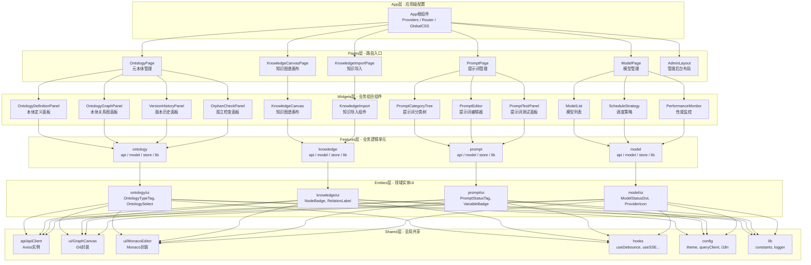
```mermaid
graph TB
    subgraph "App层 - 应用级配置"
        APP[App根组件<br/>Providers / Router / GlobalCSS]
    end

    subgraph "Pages层 - 路由入口"
        P1[OntologyPage<br/>元本体管理]
        P2[KnowledgeCanvasPage<br/>知识图谱画布]
        P3[KnowledgeImportPage<br/>知识导入]
        P4[PromptPage<br/>提示词管理]
        P5[ModelPage<br/>模型管理]
        PL[AdminLayout<br/>管理后台布局]
    end

    subgraph "Widgets层 - 业务组合组件"
        W1[OntologyDefinitionPanel<br/>本体定义面板]
        W2[OntologyGraphPanel<br/>本体关系图面板]
        W3[VersionHistoryPanel<br/>版本历史面板]
        W4[OrphanCheckPanel<br/>孤立检查面板]
        W5[KnowledgeCanvas<br/>知识图谱画布]
        W6[KnowledgeImport<br/>知识导入组件]
        W7[PromptCategoryTree<br/>提示词分类树]
        W8[PromptEditor<br/>提示词编辑器]
        W9[PromptTestPanel<br/>提示词测试面板]
        W10[ModelList<br/>模型列表]
        W11[ScheduleStrategy<br/>调度策略]
        W12[PerformanceMonitor<br/>性能监控]
    end

    subgraph "Features层 - 业务逻辑单元"
        F1[ontology<br/>api / model / store / lib]
        F2[knowledge<br/>api / model / store / lib]
        F3[prompt<br/>api / model / store / lib]
        F4[model<br/>api / model / store / lib]
    end

    subgraph "Entities层 - 领域实体UI"
        E1[ontology/ui<br/>OntologyTypeTag, OntologySelect]
        E2[knowledge/ui<br/>NodeBadge, RelationLabel]
        E3[prompt/ui<br/>PromptStatusTag, VariableBadge]
        E4[model/ui<br/>ModelStatusDot, ProviderIcon]
    end

    subgraph "Shared层 - 全局共享"
        S1[api/apiClient<br/>Axios实例]
        S2[ui/GraphCanvas<br/>G6封装]
        S3[ui/MonacoEditor<br/>Monaco封装]
        S4[hooks<br/>useDebounce, useSSE...]
        S5[config<br/>theme, queryClient, i18n]
        S6[lib<br/>constants, logger]
    end

    APP --> P1 & P2 & P3 & P4 & P5 & PL
    P1 --> W1 & W2 & W3 & W4
    P2 --> W5
    P3 --> W6
    P4 --> W7 & W8 & W9
    P5 --> W10 & W11 & W12
    W1 & W2 & W3 & W4 --> F1
    W5 & W6 --> F2
    W7 & W8 & W9 --> F3
    W10 & W11 & W12 --> F4
    F1 --> E1
    F2 --> E2
    F3 --> E3
    F4 --> E4
    E1 & E2 & E3 & E4 --> S1 & S2 & S3 & S4 & S5 & S6
```

### 2.2 Bounded Contexts与模块划分

> **追溯**: 全栈架构设计 3.2节（DDD领域划分）、PRD 3.2-3.7节

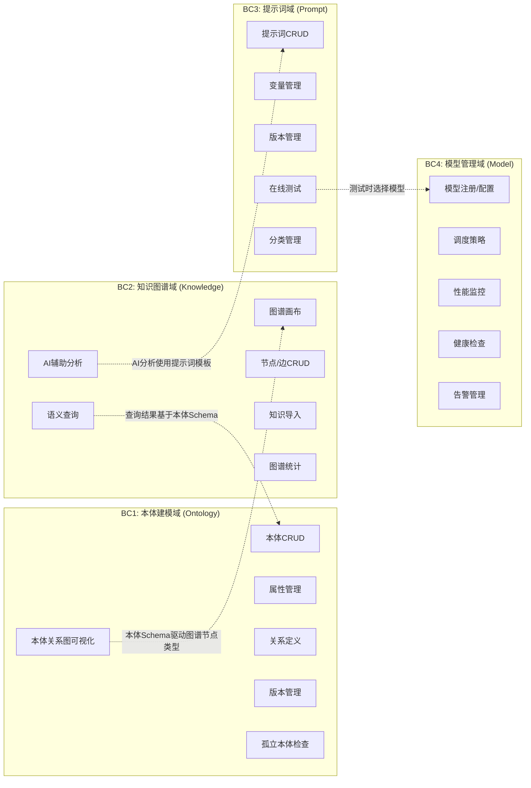
```mermaid
graph LR
    subgraph "BC1: 本体建模域 (Ontology)"
        O1[本体CRUD]
        O2[属性管理]
        O3[关系定义]
        O4[版本管理]
        O5[本体关系图可视化]
        O6[孤立本体检查]
    end

    subgraph "BC2: 知识图谱域 (Knowledge)"
        K1[图谱画布]
        K2[节点/边CRUD]
        K3[语义查询]
        K4[AI辅助分析]
        K5[知识导入]
        K6[图谱统计]
    end

    subgraph "BC3: 提示词域 (Prompt)"
        PM1[提示词CRUD]
        PM2[变量管理]
        PM3[版本管理]
        PM4[在线测试]
        PM5[分类管理]
    end

    subgraph "BC4: 模型管理域 (Model)"
        M1[模型注册/配置]
        M2[调度策略]
        M3[性能监控]
        M4[健康检查]
        M5[告警管理]
    end

    %% 跨域交互（通过Widgets层组合，不直接依赖）
    O5 -.->|本体Schema驱动图谱节点类型| K1
    PM4 -.->|测试时选择模型| M1
    K4 -.->|AI分析使用提示词模板| PM1
    K3 -.->|查询结果基于本体Schema| O1
```

**跨域交互规则**：
- 域间不直接引用Feature层代码
- 通过Widgets层组合实现跨域协作
- 共享数据通过TanStack Query缓存传递（如本体列表供知识图谱使用）
- 事件通信通过Zustand全局Store或React Context

### 2.3 数据流架构

> **追溯**: 全栈架构设计 4.3节（前端状态管理）、后端详细设计 2.2节（API契约）

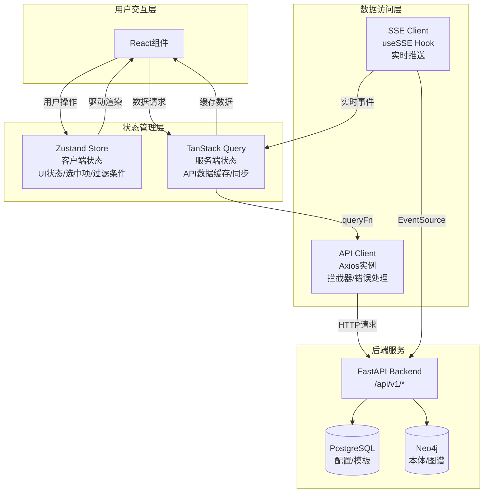
```mermaid
flowchart TB
    subgraph "用户交互层"
        UI[React组件]
    end

    subgraph "状态管理层"
        direction LR
        ZS[Zustand Store<br/>客户端状态<br/>UI状态/选中项/过滤条件]
        TQ[TanStack Query<br/>服务端状态<br/>API数据缓存/同步]
    end

    subgraph "数据访问层"
        API[API Client<br/>Axios实例<br/>拦截器/错误处理]
        SSE[SSE Client<br/>useSSE Hook<br/>实时推送]
    end

    subgraph "后端服务"
        BE[FastAPI Backend<br/>/api/v1/*]
        PG[(PostgreSQL<br/>配置/模板)]
        NEO[(Neo4j<br/>本体/图谱)]
    end

    UI -->|用户操作| ZS
    UI -->|数据请求| TQ
    ZS -->|驱动渲染| UI
    TQ -->|缓存数据| UI
    TQ -->|queryFn| API
    SSE -->|实时事件| TQ
    API -->|HTTP请求| BE
    SSE -->|EventSource| BE
    BE --> PG & NEO
```

#### 2.3.1 核心数据流：本体建模 → 知识图谱

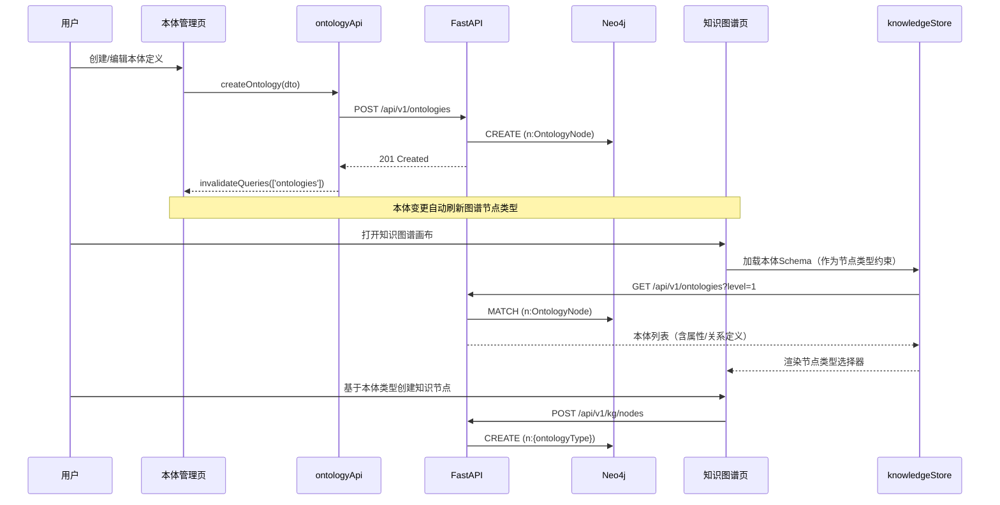
```mermaid
sequenceDiagram
    participant User as 用户
    participant OntologyPage as 本体管理页
    participant OntologyAPI as ontologyApi
    participant Backend as FastAPI
    participant Neo4j as Neo4j
    participant KGPage as 知识图谱页
    participant KGStore as knowledgeStore

    User->>OntologyPage: 创建/编辑本体定义
    OntologyPage->>OntologyAPI: createOntology(dto)
    OntologyAPI->>Backend: POST /api/v1/ontologies
    Backend->>Neo4j: CREATE (n:OntologyNode)
    Backend-->>OntologyAPI: 201 Created
    OntologyAPI-->>OntologyPage: invalidateQueries(['ontologies'])

    Note over OntologyPage,KGPage: 本体变更自动刷新图谱节点类型

    User->>KGPage: 打开知识图谱画布
    KGPage->>KGStore: 加载本体Schema（作为节点类型约束）
    KGStore->>Backend: GET /api/v1/ontologies?level=1
    Backend->>Neo4j: MATCH (n:OntologyNode)
    Backend-->>KGStore: 本体列表（含属性/关系定义）
    KGStore-->>KGPage: 渲染节点类型选择器
    User->>KGPage: 基于本体类型创建知识节点
    KGPage->>Backend: POST /api/v1/kg/nodes
    Backend->>Neo4j: CREATE (n:{ontologyType})
```

#### 2.3.2 核心数据流：提示词测试

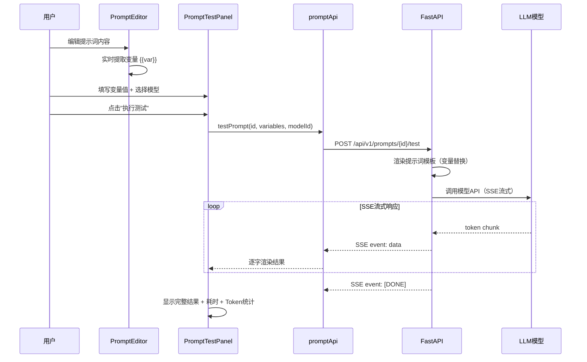
```mermaid
sequenceDiagram
    participant User as 用户
    participant Editor as PromptEditor
    participant TestPanel as PromptTestPanel
    participant PromptAPI as promptApi
    participant Backend as FastAPI
    participant LLM as LLM模型

    User->>Editor: 编辑提示词内容
    Editor->>Editor: 实时提取变量 {{var}}
    User->>TestPanel: 填写变量值 + 选择模型
    User->>TestPanel: 点击"执行测试"
    TestPanel->>PromptAPI: testPrompt(id, variables, modelId)
    PromptAPI->>Backend: POST /api/v1/prompts/{id}/test
    Backend->>Backend: 渲染提示词模板（变量替换）
    Backend->>LLM: 调用模型API（SSE流式）
    loop SSE流式响应
        LLM-->>Backend: token chunk
        Backend-->>PromptAPI: SSE event: data
        PromptAPI-->>TestPanel: 逐字渲染结果
    end
    Backend-->>PromptAPI: SSE event: [DONE]
    TestPanel->>TestPanel: 显示完整结果 + 耗时 + Token统计
```

### 2.4 组件/模块交互矩阵

> **追溯**: 全栈架构设计 4.1节、后端详细设计 2.1节（服务依赖矩阵）

| 调用方 (→) | ontologyApi | knowledgeApi | promptApi | modelApi | GraphCanvas | MonacoEditor |
|-----------|:-----------:|:------------:|:---------:|:--------:|:-----------:|:------------:|
| **OntologyDefinitionPanel** | ✅ CRUD | - | - | - | - | - |
| **OntologyGraphPanel** | ✅ 读取 | - | - | - | ✅ 渲染 | - |
| **KnowledgeCanvas** | ✅ Schema | ✅ CRUD | - | - | ✅ 渲染 | - |
| **KnowledgeCanvas/QueryToolTab** | - | ✅ 查询 | - | - | - | ✅ Cypher |
| **KnowledgeCanvas/AIAssistTab** | - | ✅ RAG | ✅ 读取模板 | ✅ 选择模型 | - | - |
| **PromptEditor** | - | - | ✅ CRUD | - | - | ✅ 编辑 |
| **PromptTestPanel** | - | - | ✅ 测试 | ✅ 选择模型 | - | - |
| **ModelList** | - | - | - | ✅ CRUD | - | - |
| **PerformanceMonitor** | - | - | - | ✅ 监控 | - | - |

### 2.5 未来扩展点

> **追溯**: PRD 4.2节（P1/P2功能规划）

| 扩展点 | 当前实现 | P1扩展 | P2扩展 | 隔离方式 |
|-------|---------|--------|--------|---------|
| **图谱渲染引擎** | G6 4.8.x | - | 保持4.8.x或升级到5.x（需评估成熟度）/ WebGPU | GraphCanvas组件封装隔离 |
| **编辑器引擎** | Monaco Editor | 自定义语法插件 | 协同编辑 | MonacoEditor组件封装 |
| **提示词引擎** | 模板变量替换 | CoT链式推理 | Agent编排 | promptRenderer抽象层 |
| **分析报告** | - | Markdown报告 | HTML/PDF导出 | 新增report Feature模块 |
| **多模态输入** | - | 图片上传分析 | 音视频分析 | 新增multimodal Feature模块 |
| **场景模板** | - | 预设场景 | 场景市场 | 新增scenario Feature模块 |
| **权限系统** | 无（单用户） | RBAC | 多租户 | 路由守卫 + API拦截器 |

**插件化预留设计**：

```typescript
// 提示词引擎抽象层（当前仅实现TemplateRenderer）
interface PromptRenderer {
  /** 渲染提示词：变量替换 + 预览 */
  render(template: string, variables: Record<string, string>): string;
  /** 提取模板中的变量占位符 */
  extractVariables(template: string): VariableDefinition[];
  /** 验证变量值是否满足约束 */
  validateVariables(variables: Record<string, string>, definitions: VariableDefinition[]): ValidationResult;
}

// 图谱渲染引擎抽象层（当前仅实现G6Renderer）
interface GraphRenderer {
  /** 初始化画布 */
  init(container: HTMLElement, options: GraphOptions): void;
  /** 设置图数据 */
  setData(data: GraphData): void;
  /** 更新布局 */
  updateLayout(layout: LayoutConfig): void;
  /** 销毁实例 */
  destroy(): void;
  /** 事件监听 */
  on(event: string, handler: EventHandler): void;
}
```

**开发实现 checklist**：
- [ ] 确认FSD分层架构图与目录结构一致
- [ ] 确认跨域交互仅通过Widgets层组合
- [ ] 确认数据流架构：Zustand（客户端）+ TanStack Query（服务端）
- [ ] 确认组件交互矩阵无逆向依赖
- [ ] 确认扩展点接口定义，当前仅实现P0部分

---

## 3. 状态管理设计

### 3.1 分层策略

> **追溯**: 全栈架构设计 4.3节（前端状态管理）

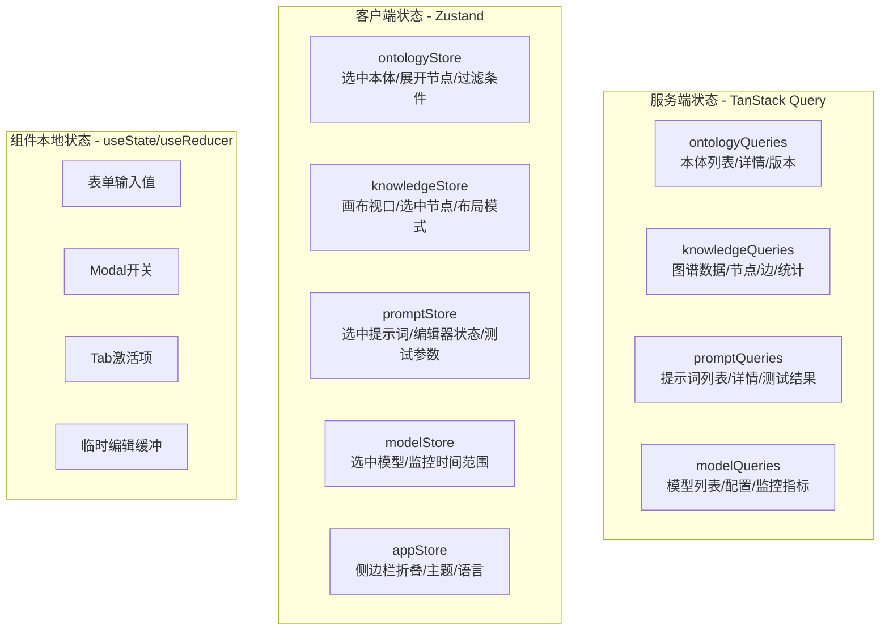
```mermaid
graph TB
    subgraph "服务端状态 - TanStack Query"
        TQ1[ontologyQueries<br/>本体列表/详情/版本]
        TQ2[knowledgeQueries<br/>图谱数据/节点/边/统计]
        TQ3[promptQueries<br/>提示词列表/详情/测试结果]
        TQ4[modelQueries<br/>模型列表/配置/监控指标]
    end

    subgraph "客户端状态 - Zustand"
        ZS1[ontologyStore<br/>选中本体/展开节点/过滤条件]
        ZS2[knowledgeStore<br/>画布视口/选中节点/布局模式]
        ZS3[promptStore<br/>选中提示词/编辑器状态/测试参数]
        ZS4[modelStore<br/>选中模型/监控时间范围]
        ZS5[appStore<br/>侧边栏折叠/主题/语言]
    end

    subgraph "组件本地状态 - useState/useReducer"
        LS1[表单输入值]
        LS2[Modal开关]
        LS3[Tab激活项]
        LS4[临时编辑缓冲]
    end
```

**状态归属决策规则**：

| 状态类型 | 归属 | 示例 |
|---------|------|------|
| 来自API的数据 | TanStack Query | 本体列表、模型配置、提示词内容 |
| 跨组件共享的UI状态 | Zustand | 选中项、过滤条件、画布视口 |
| 单组件内部状态 | useState | 表单输入、Modal开关、Tab切换 |
| 复杂组件内部逻辑 | useReducer | 多步骤表单、拖拽状态机 |

### 3.2 各Store定义

#### 3.2.1 appStore（全局应用状态）

```typescript
// src/app/store.ts
import { create } from 'zustand';
import { persist } from 'zustand/middleware';

interface AppState {
  /** 侧边栏是否折叠 */
  sidebarCollapsed: boolean;
  /** 当前语言 */
  locale: 'zh-CN' | 'en-US';
  /** 当前主题 */
  theme: 'light' | 'dark';

  // Actions
  toggleSidebar: () => void;
  setLocale: (locale: 'zh-CN' | 'en-US') => void;
  setTheme: (theme: 'light' | 'dark') => void;
}

export const useAppStore = create<AppState>()(
  persist(
    (set) => ({
      sidebarCollapsed: false,
      locale: 'zh-CN',
      theme: 'light',

      toggleSidebar: () => set((s) => ({ sidebarCollapsed: !s.sidebarCollapsed })),
      setLocale: (locale) => set({ locale }),
      setTheme: (theme) => set({ theme }),
    }),
    { name: 'app-store' },
  ),
);
```

#### 3.2.2 ontologyStore

```typescript
// src/features/ontology/store/ontologyStore.ts
import { create } from 'zustand';

interface OntologyStoreState {
  /** 当前选中的本体ID */
  selectedOntologyId: string | null;
  /** 分类树展开的节点keys */
  expandedCategoryKeys: string[];
  /** 搜索关键词 */
  searchKeyword: string;
  /** 当前激活的Tab: 'definition' | 'graph' */
  activeTab: 'definition' | 'graph';

  // Actions
  selectOntology: (id: string | null) => void;
  setExpandedKeys: (keys: string[]) => void;
  setSearchKeyword: (keyword: string) => void;
  setActiveTab: (tab: 'definition' | 'graph') => void;
  reset: () => void;
}

const initialState = {
  selectedOntologyId: null,
  expandedCategoryKeys: [],
  searchKeyword: '',
  activeTab: 'definition' as const,
};

export const useOntologyStore = create<OntologyStoreState>()((set) => ({
  ...initialState,

  selectOntology: (id) => set({ selectedOntologyId: id }),
  setExpandedKeys: (keys) => set({ expandedCategoryKeys: keys }),
  setSearchKeyword: (keyword) => set({ searchKeyword: keyword }),
  setActiveTab: (tab) => set({ activeTab: tab }),
  reset: () => set(initialState),
}));
```

#### 3.2.3 knowledgeStore

```typescript
// src/features/knowledge/store/knowledgeStore.ts
import { create } from 'zustand';

interface Viewport {
  x: number;
  y: number;
  zoom: number;
}

interface KnowledgeStoreState {
  /** 画布视口状态 */
  viewport: Viewport;
  /** 当前选中的节点IDs */
  selectedNodeIds: string[];
  /** 当前选中的边IDs */
  selectedEdgeIds: string[];
  /** 布局模式 */
  layoutMode: 'force' | 'dagre' | 'circular' | 'radial';
  /** 右侧工具栏激活Tab */
  rightToolTab: 'node' | 'edge' | 'ai' | 'query';
  /** Cypher查询输入 */
  cypherInput: string;
  /** 节点过滤：按本体类型 */
  nodeTypeFilter: string[];

  // Actions
  setViewport: (viewport: Viewport) => void;
  selectNodes: (ids: string[]) => void;
  selectEdges: (ids: string[]) => void;
  setLayoutMode: (mode: KnowledgeStoreState['layoutMode']) => void;
  setRightToolTab: (tab: KnowledgeStoreState['rightToolTab']) => void;
  setCypherInput: (input: string) => void;
  setNodeTypeFilter: (types: string[]) => void;
  clearSelection: () => void;
  reset: () => void;
}

const initialState = {
  viewport: { x: 0, y: 0, zoom: 1 },
  selectedNodeIds: [],
  selectedEdgeIds: [],
  layoutMode: 'force' as const,
  rightToolTab: 'node' as const,
  cypherInput: '',
  nodeTypeFilter: [],
};

export const useKnowledgeStore = create<KnowledgeStoreState>()((set) => ({
  ...initialState,

  setViewport: (viewport) => set({ viewport }),
  selectNodes: (ids) => set({ selectedNodeIds: ids, selectedEdgeIds: [] }),
  selectEdges: (ids) => set({ selectedEdgeIds: ids, selectedNodeIds: [] }),
  setLayoutMode: (mode) => set({ layoutMode: mode }),
  setRightToolTab: (tab) => set({ rightToolTab: tab }),
  setCypherInput: (input) => set({ cypherInput: input }),
  setNodeTypeFilter: (types) => set({ nodeTypeFilter: types }),
  clearSelection: () => set({ selectedNodeIds: [], selectedEdgeIds: [] }),
  reset: () => set(initialState),
}));
```

#### 3.2.4 promptStore

```typescript
// src/features/prompt/store/promptStore.ts
import { create } from 'zustand';

interface PromptStoreState {
  /** 当前选中的提示词ID */
  selectedPromptId: string | null;
  /** 分类树选中的分类ID */
  selectedCategoryId: string | null;
  /** 编辑器激活Tab: 'content' | 'variable' | 'version' */
  editorTab: 'content' | 'variable' | 'version';
  /** 编辑器内容（未保存的草稿） */
  draftContent: string;
  /** 是否有未保存的修改 */
  isDirty: boolean;
  /** 测试面板：选中的模型ID */
  testModelId: string | null;
  /** 测试面板：变量值 */
  testVariables: Record<string, string>;
  /** 测试面板：是否正在执行 */
  isTesting: boolean;

  // Actions
  selectPrompt: (id: string | null) => void;
  selectCategory: (id: string | null) => void;
  setEditorTab: (tab: PromptStoreState['editorTab']) => void;
  setDraftContent: (content: string) => void;
  markClean: () => void;
  setTestModelId: (id: string | null) => void;
  setTestVariable: (key: string, value: string) => void;
  setIsTesting: (testing: boolean) => void;
  reset: () => void;
}

const initialState = {
  selectedPromptId: null,
  selectedCategoryId: null,
  editorTab: 'content' as const,
  draftContent: '',
  isDirty: false,
  testModelId: null,
  testVariables: {},
  isTesting: false,
};

export const usePromptStore = create<PromptStoreState>()((set) => ({
  ...initialState,

  selectPrompt: (id) => set({ selectedPromptId: id, isDirty: false, draftContent: '' }),
  selectCategory: (id) => set({ selectedCategoryId: id }),
  setEditorTab: (tab) => set({ editorTab: tab }),
  setDraftContent: (content) => set({ draftContent: content, isDirty: true }),
  markClean: () => set({ isDirty: false }),
  setTestModelId: (id) => set({ testModelId: id }),
  setTestVariable: (key, value) =>
    set((s) => ({ testVariables: { ...s.testVariables, [key]: value } })),
  setIsTesting: (testing) => set({ isTesting: testing }),
  reset: () => set(initialState),
}));
```

#### 3.2.5 modelStore

```typescript
// src/features/model/store/modelStore.ts
import { create } from 'zustand';

interface ModelStoreState {
  /** 当前选中的模型ID */
  selectedModelId: string | null;
  /** 模型管理激活Tab: 'list' | 'schedule' | 'monitor' */
  activeTab: 'list' | 'schedule' | 'monitor';
  /** 监控时间范围 */
  monitorTimeRange: '1h' | '6h' | '24h' | '7d';
  /** 列表过滤：提供商 */
  providerFilter: string[];
  /** 列表过滤：状态 */
  statusFilter: string[];

  // Actions
  selectModel: (id: string | null) => void;
  setActiveTab: (tab: ModelStoreState['activeTab']) => void;
  setMonitorTimeRange: (range: ModelStoreState['monitorTimeRange']) => void;
  setProviderFilter: (providers: string[]) => void;
  setStatusFilter: (statuses: string[]) => void;
  reset: () => void;
}

const initialState = {
  selectedModelId: null,
  activeTab: 'list' as const,
  monitorTimeRange: '24h' as const,
  providerFilter: [],
  statusFilter: [],
};

export const useModelStore = create<ModelStoreState>()((set) => ({
  ...initialState,

  selectModel: (id) => set({ selectedModelId: id }),
  setActiveTab: (tab) => set({ activeTab: tab }),
  setMonitorTimeRange: (range) => set({ monitorTimeRange: range }),
  setProviderFilter: (providers) => set({ providerFilter: providers }),
  setStatusFilter: (statuses) => set({ statusFilter: statuses }),
  reset: () => set(initialState),
}));
```

### 3.3 TanStack Query集成

> **追溯**: 全栈架构设计 4.3节

#### 3.3.1 QueryClient配置

```typescript
// src/shared/config/queryClient.ts
import { QueryClient } from '@tanstack/react-query';

export const queryClient = new QueryClient({
  defaultOptions: {
    queries: {
      /** 窗口聚焦时不自动重新请求（避免频繁刷新） */
      refetchOnWindowFocus: false,
      /** 重试1次 */
      retry: 1,
      /** 数据5分钟内视为新鲜 */
      staleTime: 5 * 60 * 1000,
      /** 缓存保留10分钟 */
      gcTime: 10 * 60 * 1000,
    },
    mutations: {
      /** mutation失败时不自动重试 */
      retry: false,
    },
  },
});
```

#### 3.3.2 Query Key规范

```typescript
// 统一的Query Key工厂模式
export const ontologyKeys = {
  all: ['ontologies'] as const,
  lists: () => [...ontologyKeys.all, 'list'] as const,
  list: (filters: OntologyFilters) => [...ontologyKeys.lists(), filters] as const,
  details: () => [...ontologyKeys.all, 'detail'] as const,
  detail: (id: string) => [...ontologyKeys.details(), id] as const,
  versions: (id: string) => [...ontologyKeys.detail(id), 'versions'] as const,
  graph: () => [...ontologyKeys.all, 'graph'] as const,
};

export const knowledgeKeys = {
  all: ['knowledge'] as const,
  graphs: () => [...knowledgeKeys.all, 'graph'] as const,
  graph: (filters: GraphFilters) => [...knowledgeKeys.graphs(), filters] as const,
  nodes: () => [...knowledgeKeys.all, 'nodes'] as const,
  node: (id: string) => [...knowledgeKeys.nodes(), id] as const,
  edges: () => [...knowledgeKeys.all, 'edges'] as const,
  stats: () => [...knowledgeKeys.all, 'stats'] as const,
  query: (cypher: string) => [...knowledgeKeys.all, 'query', cypher] as const,
};

export const promptKeys = {
  all: ['prompts'] as const,
  lists: () => [...promptKeys.all, 'list'] as const,
  list: (filters: PromptFilters) => [...promptKeys.lists(), filters] as const,
  details: () => [...promptKeys.all, 'detail'] as const,
  detail: (id: string) => [...promptKeys.details(), id] as const,
  versions: (id: string) => [...promptKeys.detail(id), 'versions'] as const,
  categories: () => [...promptKeys.all, 'categories'] as const,
};

export const modelKeys = {
  all: ['models'] as const,
  lists: () => [...modelKeys.all, 'list'] as const,
  list: (filters: ModelFilters) => [...modelKeys.lists(), filters] as const,
  details: () => [...modelKeys.all, 'detail'] as const,
  detail: (id: string) => [...modelKeys.details(), id] as const,
  metrics: (id: string, range: string) => [...modelKeys.detail(id), 'metrics', range] as const,
  schedules: () => [...modelKeys.all, 'schedules'] as const,
};
```

**开发实现 checklist**：
- [ ] 创建 appStore（persist中间件持久化侧边栏/主题/语言）
- [ ] 创建 ontologyStore / knowledgeStore / promptStore / modelStore
- [ ] 配置 QueryClient（staleTime=5min, gcTime=10min）
- [ ] 定义各模块 Query Key 工厂
- [ ] 验证 Store 的 reset() 方法在页面切换时正确清理状态

---

## 4. 路由与布局设计

### 4.1 路由配置

> **追溯**: 全栈架构设计 4.2节（路由设计）、P0交互需求 2.3节（页面路由结构）

```typescript
// src/app/router.tsx
import { createBrowserRouter, Navigate } from 'react-router-dom';
import { lazy, Suspense } from 'react';

import { AdminLayout } from '@pages/_layout/AdminLayout';
import { LoadingFallback } from '@shared/ui/LoadingFallback';
import { ErrorBoundary } from '@shared/ui/ErrorBoundary';

// 懒加载页面组件
const OntologyPage = lazy(() => import('@pages/ontology/OntologyPage'));
const KnowledgeCanvasPage = lazy(() => import('@pages/knowledge/KnowledgeCanvasPage'));
const KnowledgeImportPage = lazy(() => import('@pages/knowledge/KnowledgeImportPage'));
const PromptPage = lazy(() => import('@pages/prompt/PromptPage'));
const ModelPage = lazy(() => import('@pages/model/ModelPage'));

/** 懒加载包装器 */
function LazyPage({ Component }: { Component: React.LazyExoticComponent<() => JSX.Element> }) {
  return (
    <Suspense fallback={<LoadingFallback />}>
      <ErrorBoundary>
        <Component />
      </ErrorBoundary>
    </Suspense>
  );
}

export const router = createBrowserRouter([
  {
    path: '/',
    element: <AdminLayout />,
    errorElement: <ErrorBoundary />,
    children: [
      // 默认重定向到本体管理
      { index: true, element: <Navigate to="/ontology" replace /> },

      // P0-3: 元本体管理
      {
        path: 'ontology',
        element: <LazyPage Component={OntologyPage} />,
      },

      // P0-4: 知识图谱
      {
        path: 'knowledge',
        children: [
          { index: true, element: <LazyPage Component={KnowledgeCanvasPage} /> },
          { path: 'import', element: <LazyPage Component={KnowledgeImportPage} /> },
        ],
      },

      // P0-2: 提示词管理
      {
        path: 'prompt',
        element: <LazyPage Component={PromptPage} />,
      },

      // P0-1: 模型管理
      {
        path: 'model',
        element: <LazyPage Component={ModelPage} />,
      },

      // P1预留路由（当前显示"即将推出"占位页）
      // { path: 'analysis', element: <ComingSoon /> },
      // { path: 'report', element: <ComingSoon /> },
      // { path: 'scenario', element: <ComingSoon /> },
    ],
  },
]);
```

**路由表汇总**：

| 路径 | 页面 | 阶段 | 对应PRD |
|-----|------|------|--------|
| `/` | 重定向到 `/ontology` | P0 | - |
| `/ontology` | 元本体管理（Tab: 定义/关系图） | P0-3 | PRD 3.4 |
| `/knowledge` | 知识图谱画布 | P0-4 | PRD 3.6 |
| `/knowledge/import` | 知识导入 | P0-4 | PRD 3.6.4 |
| `/prompt` | 提示词管理（三栏布局） | P0-2 | PRD 3.2 |
| `/model` | 模型管理（Tab: 列表/调度/监控） | P0-1 | PRD 3.7 |
| `/analysis` | 心理分析（占位） | P1 | PRD 3.1 |
| `/report` | 报告管理（占位） | P1 | PRD 3.3 |
| `/scenario` | 场景管理（占位） | P1 | PRD 3.5 |

### 4.2 布局组件

> **追溯**: P0交互需求 2.1节（系统整体布局）

```typescript
// src/pages/_layout/AdminLayout.tsx
import { useState } from 'react';
import { Outlet, useNavigate, useLocation } from 'react-router-dom';
import { Layout, Menu } from 'antd';
import {
  ApartmentOutlined,    // 本体管理
  DeploymentUnitOutlined, // 知识图谱
  FileTextOutlined,     // 提示词管理
  ApiOutlined,          // 模型管理
} from '@ant-design/icons';
import { useTranslation } from 'react-i18next';

import { useAppStore } from '@app/store';

const { Sider, Content } = Layout;

/** 导航菜单项定义 */
const menuItems = [
  {
    key: '/ontology',
    icon: <ApartmentOutlined />,
    labelKey: 'common.nav.ontology',  // 元本体管理
  },
  {
    key: '/knowledge',
    icon: <DeploymentUnitOutlined />,
    labelKey: 'common.nav.knowledge', // 知识图谱
  },
  {
    key: '/prompt',
    icon: <FileTextOutlined />,
    labelKey: 'common.nav.prompt',    // 提示词管理
  },
  {
    key: '/model',
    icon: <ApiOutlined />,
    labelKey: 'common.nav.model',     // 模型管理
  },
];

export function AdminLayout() {
  const { t } = useTranslation();
  const navigate = useNavigate();
  const location = useLocation();
  const { sidebarCollapsed, toggleSidebar } = useAppStore();

  // 根据当前路径确定选中的菜单项
  const selectedKey = '/' + location.pathname.split('/')[1];

  return (
    <Layout style={{ minHeight: '100vh' }}>
      {/* 左侧导航栏: 宽240px, 深色主题 #001529 */}
      <Sider
        collapsible
        collapsed={sidebarCollapsed}
        onCollapse={toggleSidebar}
        width={240}
        theme="dark"
        style={{ position: 'fixed', left: 0, top: 0, bottom: 0, zIndex: 100 }}
      >
        {/* Logo区域 */}
        <div style={{ height: 64, display: 'flex', alignItems: 'center', justifyContent: 'center' }}>
          <span style={{ color: '#fff', fontSize: sidebarCollapsed ? 16 : 18, fontWeight: 600 }}>
            {sidebarCollapsed ? 'PA' : t('common.appTitle')}
          </span>
        </div>

        <Menu
          theme="dark"
          mode="inline"
          selectedKeys={[selectedKey]}
          items={menuItems.map((item) => ({
            key: item.key,
            icon: item.icon,
            label: t(item.labelKey),
          }))}
          onClick={({ key }) => navigate(key)}
        />
      </Sider>

      {/* 主工作区: 自适应宽度, 浅色背景 */}
      <Layout style={{ marginLeft: sidebarCollapsed ? 80 : 240, transition: 'margin-left 0.2s' }}>
        <Content style={{ margin: 16, minHeight: 'calc(100vh - 32px)' }}>
          <Outlet />
        </Content>
      </Layout>
    </Layout>
  );
}
```

**布局规格**（追溯P0交互需求 2.1节）：
- 左侧导航栏: 宽240px（折叠后80px），深色主题 `#001529`
- 主工作区: 自适应宽度，浅色背景 `#f5f5f5`
- 内容区内边距: 16px
- 导航栏固定定位，内容区滚动

### 4.3 权限守卫

> P0阶段为单用户系统，权限守卫仅做预留，不实现具体鉴权逻辑。

```typescript
// src/app/guards/AuthGuard.tsx（P0占位，P1实现）
import type { ReactNode } from 'react';

interface AuthGuardProps {
  children: ReactNode;
  /** P1: 所需权限列表 */
  permissions?: string[];
}

/**
 * P0阶段: 直接放行
 * P1阶段: 接入RBAC权限校验
 */
export function AuthGuard({ children }: AuthGuardProps) {
  // P0: 无鉴权，直接渲染子组件
  return <>{children}</>;
}
```

**开发实现 checklist**：
- [ ] 创建 router.tsx（懒加载 + 嵌套路由）
- [ ] 创建 AdminLayout（左侧导航 + 主工作区）
- [ ] 创建 LazyPage 包装器（Suspense + ErrorBoundary）
- [ ] 创建 AuthGuard 占位组件
- [ ] 验证所有路由正确渲染对应页面
- [ ] 验证导航菜单高亮与路由同步

---

## 5. Shared层设计

### 5.1 API Client封装

> **追溯**: 全栈架构设计 4.3节、后端详细设计 2.2节（API契约）

```typescript
// src/shared/api/apiClient.ts
import axios, { type AxiosError, type AxiosRequestConfig, type InternalAxiosRequestConfig } from 'axios';
import { message } from 'antd';

/** 后端统一响应格式 */
export interface ApiResponse<T = unknown> {
  code: number;
  message: string;
  data: T;
  timestamp: string;
  request_id: string;
}

/** 分页响应 */
export interface PaginatedResponse<T> {
  items: T[];
  total: number;
  page: number;
  page_size: number;
  total_pages: number;
}

/** 分页请求参数 */
export interface PaginationParams {
  page?: number;
  page_size?: number;
  sort_by?: string;
  sort_order?: 'asc' | 'desc';
}

/**
 * 错误通知去重管理器
 * 防止短时间内相同错误消息重复弹出
 */
class ErrorNotificationManager {
  private errorCache = new Map<string, number>();
  private readonly CACHE_DURATION = 3000; // 3秒内相同错误只显示一次

  /**
   * 显示错误消息（带去重）
   * @param msg 错误消息
   * @param status HTTP状态码（可选，用于生成缓存key）
   */
  showError(msg: string, status?: number): void {
    const cacheKey = status ? `${status}_${msg}` : msg;
    const now = Date.now();
    const lastShown = this.errorCache.get(cacheKey);

    // 如果3秒内已显示过相同错误，跳过
    if (lastShown && now - lastShown < this.CACHE_DURATION) {
      return;
    }

    // 显示错误消息
    message.error(msg);

    // 更新缓存
    this.errorCache.set(cacheKey, now);

    // 清理过期缓存（避免内存泄漏）
    setTimeout(() => {
      this.errorCache.delete(cacheKey);
    }, this.CACHE_DURATION);
  }

  /**
   * 清空错误缓存（用于测试或特殊场景）
   */
  clear(): void {
    this.errorCache.clear();
  }
}

const errorManager = new ErrorNotificationManager();

const apiClient = axios.create({
  baseURL: import.meta.env.VITE_API_BASE_URL || '/api/v1',
  timeout: 30000,
  headers: { 'Content-Type': 'application/json' },
});

// 请求拦截器
apiClient.interceptors.request.use(
  (config: InternalAxiosRequestConfig) => {
    // P1: 在此注入 Authorization header
    // const token = getToken();
    // if (token) config.headers.Authorization = `Bearer ${token}`;
    return config;
  },
  (error) => Promise.reject(error),
);

// 响应拦截器
apiClient.interceptors.response.use(
  (response) => {
    const data = response.data as ApiResponse;
    if (data.code !== 0 && data.code !== 200) {
      errorManager.showError(data.message || '请求失败');
      return Promise.reject(new Error(data.message));
    }
    return response;
  },
  (error: AxiosError<ApiResponse>) => {
    const status = error.response?.status;
    const msg = error.response?.data?.message;

    switch (status) {
      case 400:
        errorManager.showError(msg || '请求参数错误', status);
        break;
      case 401:
        errorManager.showError('未授权，请重新登录', status);
        // P1: 跳转登录页
        break;
      case 403:
        errorManager.showError('无权限访问', status);
        break;
      case 404:
        errorManager.showError(msg || '资源不存在', status);
        break;
      case 422:
        errorManager.showError(msg || '数据验证失败', status);
        break;
      case 429: {
        // FIX-20: 限流感知和友好提示
        const retryAfter = error.response?.headers?.['retry-after'] || 60;
        errorManager.showError(
          `请求过于频繁，请等待 ${retryAfter} 秒后重试`,
          status,
          { duration: Number(retryAfter) * 1000 }
        );
        break;
      }
      case 500:
        errorManager.showError('服务器内部错误', status);
        break;
      default:
        if (error.code === 'ECONNABORTED') {
          errorManager.showError('请求超时，请重试');
        } else if (!error.response) {
          errorManager.showError('网络连接失败');
        }
    }
    return Promise.reject(error);
  },
);

export { apiClient, errorManager };
```

**错误通知去重说明**：

1. **去重策略**：
   - 3秒内相同错误消息只显示一次
   - 缓存key = `${status}_${message}`，区分不同HTTP状态码的相同消息
   - 自动清理过期缓存，避免内存泄漏

2. **使用场景**：
   - 并发请求失败（如批量删除节点时，多个请求同时返回403）
   - 轮询请求失败（如模型监控页面每5秒轮询一次，网络断开时避免弹窗轰炸）
   - 表单提交失败（用户快速点击提交按钮，避免重复提示）

3. **特殊处理**：
   - 如果某个API需要禁用去重（如关键操作的错误必须每次都提示），可以在业务代码中手动调用 `message.error()`
   - 可以通过 `errorManager.clear()` 清空缓存（用于测试或页面切换时重置状态）

### 5.2 通用类型定义

```typescript
// src/shared/api/types.ts

/** 树形结构节点 */
export interface TreeNode<T = unknown> {
  id: string;
  label: string;
  children?: TreeNode<T>[];
  data?: T;
}

/** 选项类型（下拉框等） */
export interface SelectOption {
  label: string;
  value: string;
  disabled?: boolean;
}

/** 操作结果 */
export interface OperationResult {
  success: boolean;
  message: string;
  affected_count?: number;
}

/** 版本信息 */
export interface VersionInfo {
  version: number;
  created_at: string;
  created_by: string;
  change_summary: string;
}

/** 审计字段（所有实体共用） */
export interface AuditFields {
  created_at: string;
  updated_at: string;
  created_by: string;
  updated_by: string;
}
```

### 5.3 通用Hooks

#### 5.3.1 useDebounce

```typescript
// src/shared/hooks/useDebounce.ts
import { useState, useEffect } from 'react';

/**
 * 防抖Hook：延迟更新值，用于搜索输入等场景
 * @param value 原始值
 * @param delay 延迟毫秒数，默认300ms
 */
export function useDebounce<T>(value: T, delay = 300): T {
  const [debouncedValue, setDebouncedValue] = useState(value);

  useEffect(() => {
    const timer = setTimeout(() => setDebouncedValue(value), delay);
    return () => clearTimeout(timer);
  }, [value, delay]);

  return debouncedValue;
}
```

#### 5.3.2 useSSE（Server-Sent Events）

> **增强**: 添加重连机制、事件类型校验、错误处理策略

```typescript
// src/shared/hooks/useSSE.ts
import { useCallback, useRef, useState } from 'react';

interface UseSSEOptions {
  /** SSE请求URL */
  url: string;
  /** 请求方法，默认POST */
  method?: 'GET' | 'POST';
  /** 请求体 */
  body?: Record<string, unknown>;
  /** 收到每个token的回调 */
  onMessage?: (token: string) => void;
  /** 完成回调 */
  onDone?: (fullText: string) => void;
  /** 错误回调 */
  onError?: (error: Error) => void;
  /** 结构化事件回调（progress/fallback/result/error/done） */
  onEvent?: (type: SSEEventType, payload: unknown) => void;
  /** 最大重试次数，默认3次 */
  maxRetries?: number;
  /** 重试延迟基数（ms），默认1000ms，采用指数退避 */
  retryDelay?: number;
}

interface UseSSEReturn {
  /** 累积的完整文本 */
  text: string;
  /** 是否正在流式接收 */
  isStreaming: boolean;
  /** 当前重试次数 */
  retryCount: number;
  /** 开始SSE请求 */
  start: () => void;
  /** 中止SSE请求 */
  abort: () => void;
}

/**
 * SSE结构化事件类型（对应全栈架构设计 §5.4 SSE事件格式）
 */
type SSEEventType = 'progress' | 'fallback' | 'result' | 'error' | 'done';

/** 安全解析JSON，失败时返回原始字符串 */
function tryParseJSON(data: string): unknown {
  try { return JSON.parse(data); } catch { return data; }
}

/**
 * SSE事件类型
 */
interface SSEEvent {
  type: 'event' | 'data' | 'id' | 'retry' | 'unknown';
  value: string;
}

/**
 * 解析SSE事件行
 * 支持标准SSE格式：event: xxx, data: xxx, id: xxx, retry: xxx
 */
function parseSSELine(line: string): SSEEvent | null {
  if (!line.trim()) return null;

  if (line.startsWith('event: ')) {
    return { type: 'event', value: line.slice(7).trim() };
  }
  if (line.startsWith('data: ')) {
    return { type: 'data', value: line.slice(6) };
  }
  if (line.startsWith('id: ')) {
    return { type: 'id', value: line.slice(4).trim() };
  }
  if (line.startsWith('retry: ')) {
    return { type: 'retry', value: line.slice(7).trim() };
  }

  return { type: 'unknown', value: line };
}

/**
 * SSE流式请求Hook，用于提示词测试、RAG查询等场景
 *
 * 特性：
 * - 使用fetch + ReadableStream实现，支持POST请求体
 * - 自动重连机制（指数退避策略）
 * - 事件类型校验（event/data分离）
 * - 错误分类处理（网络错误、业务错误、超时）
 */
export function useSSE(options: UseSSEOptions): UseSSEReturn {
  const {
    url,
    method = 'POST',
    body,
    onMessage,
    onDone,
    onError,
    maxRetries = 3,
    retryDelay = 1000
  } = options;

  const [text, setText] = useState('');
  const [isStreaming, setIsStreaming] = useState(false);
  const [retryCount, setRetryCount] = useState(0);
  const abortRef = useRef<AbortController | null>(null);
  const currentEventType = useRef<string>('message'); // 当前事件类型

  const start = useCallback(async () => {
    abortRef.current?.abort();
    const controller = new AbortController();
    abortRef.current = controller;

    setText('');
    setIsStreaming(true);
    let accumulated = '';

    try {
      const response = await fetch(url, {
        method,
        headers: { 'Content-Type': 'application/json' },
        body: body ? JSON.stringify(body) : undefined,
        signal: controller.signal,
      });

      if (!response.ok) {
        throw new Error(`HTTP ${response.status}: ${response.statusText}`);
      }
      if (!response.body) {
        throw new Error('No response body');
      }

      const reader = response.body.getReader();
      const decoder = new TextDecoder();

      while (true) {
        const { done, value } = await reader.read();
        if (done) break;

        const chunk = decoder.decode(value, { stream: true });
        const lines = chunk.split('\n');

        for (const line of lines) {
          const event = parseSSELine(line);
          if (!event) continue;

          // 处理事件类型
          if (event.type === 'event') {
            currentEventType.current = event.value;
            continue;
          }

          // 处理数据
          if (event.type === 'data') {
            const data = event.value;

            // 检查结束信号
            if (data === '[DONE]' || currentEventType.current === 'done') {
              const payload = tryParseJSON(data);
              onEvent?.('done', payload);
              onDone?.(accumulated);
              continue;
            }

            // 检查错误事件
            if (currentEventType.current === 'error') {
              const payload = tryParseJSON(data);
              onEvent?.('error', payload);
              throw new Error(typeof payload === 'object' ? payload.message : data);
            }

            // 结构化事件分发（progress/fallback/result等）
            if (['progress', 'fallback', 'result'].includes(currentEventType.current)) {
              const payload = tryParseJSON(data);
              onEvent?.(currentEventType.current as SSEEventType, payload);
            }

            // 正常数据流（文本累加，兼容非结构化场景）
            accumulated += data;
            setText(accumulated);
            onMessage?.(data);
          }
        }
      }

      // 成功完成，重置重试计数
      setRetryCount(0);

    } catch (err) {
      const error = err as Error;

      // 如果是用户主动中止，不触发错误回调
      if (error.name === 'AbortError') {
        return;
      }

      // 判断是否需要重连
      const shouldRetry = retryCount < maxRetries &&
                         (error.message.includes('network') ||
                          error.message.includes('timeout') ||
                          error.message.includes('fetch'));

      if (shouldRetry) {
        // 指数退避重连
        const delay = retryDelay * Math.pow(2, retryCount);
        console.warn(`SSE连接失败，${delay}ms后重试（${retryCount + 1}/${maxRetries}）`);

        setTimeout(() => {
          setRetryCount(prev => prev + 1);
          start(); // 递归重连
        }, delay);
      } else {
        // 达到最大重试次数或非网络错误，触发错误回调
        onError?.(error);
        setRetryCount(0);
      }
    } finally {
      setIsStreaming(false);
    }
  }, [url, method, body, onMessage, onDone, onError, maxRetries, retryDelay, retryCount]);

  const abort = useCallback(() => {
    abortRef.current?.abort();
    setIsStreaming(false);
    setRetryCount(0);
  }, []);

  return { text, isStreaming, retryCount, start, abort };
}
```

**增强说明**：

1. **重连机制**：
   - 网络错误、超时错误自动重连（最多3次）
   - 采用指数退避策略：1s → 2s → 4s
   - 业务错误（如验证失败）不重连，直接触发onError

2. **事件类型校验**：
   - 支持标准SSE格式：`event: xxx` 和 `data: xxx` 分离
   - 支持自定义事件类型（如 `event: error`, `event: done`）
   - 避免事件类型混淆导致的解析错误

3. **错误分类处理**：
   - 网络错误：自动重连
   - 业务错误（event: error）：直接抛出，不重连
   - 用户中止（AbortError）：静默处理，不触发onError

4. **使用示例**：

```typescript
// 提示词测试场景
const { text, isStreaming, retryCount, start, abort } = useSSE({
  url: '/api/v1/prompts/test',
  body: { prompt_id: '123', variables: { name: '张三' } },
  onMessage: (token) => console.log('收到token:', token),
  onDone: (fullText) => message.success('测试完成'),
  onError: (err) => message.error(`测试失败: ${err.message}`),
  maxRetries: 3,
  retryDelay: 1000
});

// 显示重连状态
{isStreaming && retryCount > 0 && (
  <Alert message={`连接中断，正在重连（${retryCount}/3）...`} type="warning" />
)}
```

#### 5.3.3 useLocalStorage

```typescript
// src/shared/hooks/useLocalStorage.ts
import { useState, useCallback } from 'react';

/**
 * localStorage持久化Hook
 */
export function useLocalStorage<T>(key: string, initialValue: T) {
  const [storedValue, setStoredValue] = useState<T>(() => {
    try {
      const item = window.localStorage.getItem(key);
      return item ? (JSON.parse(item) as T) : initialValue;
    } catch {
      return initialValue;
    }
  });

  const setValue = useCallback(
    (value: T | ((prev: T) => T)) => {
      const valueToStore = value instanceof Function ? value(storedValue) : value;
      setStoredValue(valueToStore);
      window.localStorage.setItem(key, JSON.stringify(valueToStore));
    },
    [key, storedValue],
  );

  return [storedValue, setValue] as const;
}
```

#### 5.3.4 useKeyboardShortcut

```typescript
// src/shared/hooks/useKeyboardShortcut.ts
import { useEffect } from 'react';

interface ShortcutConfig {
  key: string;
  ctrl?: boolean;
  shift?: boolean;
  alt?: boolean;
  handler: (e: KeyboardEvent) => void;
}

/**
 * 键盘快捷键Hook
 * 追溯: P0交互需求 5.4节（键盘快捷键）
 */
export function useKeyboardShortcut(shortcuts: ShortcutConfig[]) {
  useEffect(() => {
    function handleKeyDown(e: KeyboardEvent) {
      for (const shortcut of shortcuts) {
        const ctrlMatch = shortcut.ctrl ? e.ctrlKey || e.metaKey : !e.ctrlKey && !e.metaKey;
        const shiftMatch = shortcut.shift ? e.shiftKey : !e.shiftKey;
        const altMatch = shortcut.alt ? e.altKey : !e.altKey;

        if (e.key.toLowerCase() === shortcut.key.toLowerCase() && ctrlMatch && shiftMatch && altMatch) {
          e.preventDefault();
          shortcut.handler(e);
          return;
        }
      }
    }

    window.addEventListener('keydown', handleKeyDown);
    return () => window.removeEventListener('keydown', handleKeyDown);
  }, [shortcuts]);
}
```

### 5.4 通用UI组件

#### 5.4.1 GraphCanvas（G6图画布封装）

> **追溯**: 全栈架构设计 4.4节（G6可视化）、P0交互需求 3.2节（知识图谱画布）

> **设计说明**: GraphCanvas组件位于Shared层，这是一个**基础能力封装**，而非业务组件。它的职责是隔离G6 API，提供统一的图画布能力。业务逻辑（如本体关系图的节点样式、知识图谱的工具栏）由Widgets层的OntologyGraphPanel和KnowledgeCanvas负责。这种分层设计确保了：
> 1. **技术栈隔离**：P2阶段升级G6 5.x时，只需修改GraphCanvas内部实现，上层业务代码无需改动
> 2. **复用性**：本体关系图和知识图谱共享同一个GraphCanvas基础组件，但通过不同的Widgets层组件实现差异化的业务逻辑
> 3. **可测试性**：GraphCanvas可以独立测试，不依赖业务数据和状态管理

```typescript
// src/shared/ui/GraphCanvas/types.ts

/** 图节点数据 */
export interface GraphNodeData {
  id: string;
  label: string;
  /** 本体类型（决定节点颜色和形状） */
  ontologyType?: string;
  /** 节点属性 */
  properties?: Record<string, unknown>;
  /** 节点样式覆盖 */
  style?: Partial<NodeStyle>;
}

/** 图边数据 */
export interface GraphEdgeData {
  id: string;
  source: string;
  target: string;
  label?: string;
  /** 关系类型 */
  relationType?: string;
  properties?: Record<string, unknown>;
}

/** 图数据 */
export interface GraphData {
  nodes: GraphNodeData[];
  edges: GraphEdgeData[];
}

/** 布局配置 */
export interface LayoutConfig {
  type: 'force' | 'dagre' | 'circular' | 'radial';
  /** 力导向布局参数 */
  forceOptions?: {
    linkDistance?: number;
    nodeStrength?: number;
    edgeStrength?: number;
  };
}

/** 画布事件 */
export interface GraphEvents {
  onNodeClick?: (nodeId: string, data: GraphNodeData) => void;
  onEdgeClick?: (edgeId: string, data: GraphEdgeData) => void;
  onCanvasClick?: () => void;
  onNodeDragEnd?: (nodeId: string, x: number, y: number) => void;
  onZoomChange?: (zoom: number) => void;
}

/** 节点样式 */
interface NodeStyle {
  fill: string;
  stroke: string;
  size: number;
  labelFontSize: number;
}
```

```typescript
// src/shared/ui/GraphCanvas/useGraph.ts
import { useEffect, useRef, useCallback } from 'react';
import G6, { type Graph, type GraphOptions } from '@antv/g6';

import type { GraphData, LayoutConfig, GraphEvents } from './types';
import { registerCustomNodes } from './registerNodes';
import { registerCustomEdges } from './registerEdges';

// 注册自定义节点和边（仅执行一次）
let registered = false;
function ensureRegistered() {
  if (registered) return;
  registerCustomNodes();
  registerCustomEdges();
  registered = true;
}

interface UseGraphOptions {
  layout?: LayoutConfig;
  events?: GraphEvents;
  /** 是否启用缩略图 */
  minimap?: boolean;
  /** 图谱ID，用于localStorage布局缓存的key（FIX-12） */
  graphId?: string;
}

/**
 * G6图实例管理Hook
 * 封装G6初始化、数据更新、布局切换、事件绑定、销毁
 */
export function useGraph(options: UseGraphOptions = {}) {
  const containerRef = useRef<HTMLDivElement>(null);
  const graphRef = useRef<Graph | null>(null);

  // 初始化
  useEffect(() => {
    if (!containerRef.current) return;
    ensureRegistered();

    const { width, height } = containerRef.current.getBoundingClientRect();
    const plugins: GraphOptions['plugins'] = [];

    if (options.minimap) {
      plugins.push(new G6.Minimap({ size: [150, 100] }));
    }

    const graph = new G6.Graph({
      container: containerRef.current,
      width,
      height,
      fitView: true,
      fitViewPadding: 20,
      animate: true,
      modes: {
        default: ['drag-canvas', 'zoom-canvas', 'drag-node', 'click-select'],
      },
      layout: {
        type: options.layout?.type || 'force',
        linkDistance: options.layout?.forceOptions?.linkDistance || 200,
        nodeStrength: options.layout?.forceOptions?.nodeStrength || -300,
        preventOverlap: true,
        nodeSize: 40,
      },
      defaultNode: {
        type: 'ontology-node',
        size: 40,
      },
      defaultEdge: {
        type: 'relation-edge',
        style: { endArrow: true },
      },
      plugins,
    });

    // 绑定事件
    if (options.events?.onNodeClick) {
      graph.on('node:click', (e) => {
        const model = e.item?.getModel();
        if (model) options.events!.onNodeClick!(model.id as string, model as any);
      });
    }
    if (options.events?.onEdgeClick) {
      graph.on('edge:click', (e) => {
        const model = e.item?.getModel();
        if (model) options.events!.onEdgeClick!(model.id as string, model as any);
      });
    }
    if (options.events?.onCanvasClick) {
      graph.on('canvas:click', () => options.events!.onCanvasClick!());
    }

    // 节点拖拽结束后自动保存布局到localStorage（FIX-12）
    graph.on('node:dragend', () => {
      if (options.graphId) {
        const nodes = graph.getNodes().map(node => ({
          id: node.getModel().id,
          x: node.getModel().x,
          y: node.getModel().y,
        }));
        localStorage.setItem(`kg_layout_${options.graphId}`, JSON.stringify(nodes));
      }
    });

    graphRef.current = graph;

    // 响应容器尺寸变化
    const observer = new ResizeObserver((entries) => {
      const { width: w, height: h } = entries[0].contentRect;
      graph.changeSize(w, h);
    });
    observer.observe(containerRef.current);

    return () => {
      observer.disconnect();
      graph.destroy();
      graphRef.current = null;
    };
  }, []); // 仅初始化一次

  /** 设置图数据 */
  const setData = useCallback((data: GraphData) => {
    const graph = graphRef.current;
    if (!graph) return;
    graph.data({
      nodes: data.nodes.map((n) => ({ ...n, type: 'ontology-node' })),
      edges: data.edges.map((e) => ({ ...e, type: 'relation-edge' })),
    });
    graph.render();
    graph.fitView();
  }, []);

  /** 切换布局 */
  const updateLayout = useCallback((layout: LayoutConfig) => {
    const graph = graphRef.current;
    if (!graph) return;
    graph.updateLayout({ type: layout.type, ...layout.forceOptions });
  }, []);

  /** 聚焦到指定节点 */
  const focusNode = useCallback((nodeId: string) => {
    const graph = graphRef.current;
    if (!graph) return;
    graph.focusItem(nodeId, true, { easing: 'easeCubic', duration: 500 });
  }, []);

  /** 导出图片 */
  const exportImage = useCallback((type: 'png' | 'svg' = 'png') => {
    const graph = graphRef.current;
    if (!graph) return;
    if (type === 'png') graph.downloadFullImage('knowledge-graph', 'image/png');
  }, []);

  /** 保存布局到localStorage（FIX-12） */
  const saveLayout = useCallback((graphId: string) => {
    const graph = graphRef.current;
    if (!graph) return;
    const nodes = graph.getNodes().map(node => ({
      id: node.getModel().id,
      x: node.getModel().x,
      y: node.getModel().y,
    }));
    localStorage.setItem(`kg_layout_${graphId}`, JSON.stringify(nodes));
  }, []);

  /** 恢复布局（加载图谱时优先从localStorage恢复，无缓存时使用力导向自动布局） */
  const restoreLayout = useCallback((graphData: GraphData, graphId: string): GraphData => {
    const cached = localStorage.getItem(`kg_layout_${graphId}`);
    if (cached) {
      const positions: Array<{ id: string; x: number; y: number }> = JSON.parse(cached);
      const posMap = new Map(positions.map(p => [p.id, p]));
      graphData.nodes.forEach(node => {
        const pos = posMap.get(node.id);
        if (pos) { node.x = pos.x; node.y = pos.y; }
      });
    }
    return graphData;
  }, []);

  return { containerRef, graphRef, setData, updateLayout, focusNode, exportImage, saveLayout, restoreLayout };
}
```

```typescript
// src/shared/ui/GraphCanvas/index.tsx
import { forwardRef, useImperativeHandle } from 'react';

import type { GraphData, LayoutConfig, GraphEvents } from './types';
import { useGraph } from './useGraph';

export interface GraphCanvasProps {
  /** 图数据 */
  data?: GraphData;
  /** 布局配置 */
  layout?: LayoutConfig;
  /** 事件回调 */
  events?: GraphEvents;
  /** 是否显示缩略图 */
  minimap?: boolean;
  /** 容器样式 */
  style?: React.CSSProperties;
  /** 容器className */
  className?: string;
}

export interface GraphCanvasRef {
  setData: (data: GraphData) => void;
  updateLayout: (layout: LayoutConfig) => void;
  focusNode: (nodeId: string) => void;
  exportImage: (type?: 'png' | 'svg') => void;
}

/**
 * G6图画布封装组件
 * 隔离G6 API，上层组件通过props和ref交互
 * P2阶段可替换为G6 5.x，仅需修改此组件内部实现
 */
export const GraphCanvas = forwardRef<GraphCanvasRef, GraphCanvasProps>(
  ({ data, layout, events, minimap = false, style, className }, ref) => {
    const { containerRef, setData, updateLayout, focusNode, exportImage } = useGraph({
      layout,
      events,
      minimap,
    });

    // 数据变更时更新图
    useEffect(() => {
      if (data) setData(data);
    }, [data, setData]);

    // 暴露方法给父组件
    useImperativeHandle(ref, () => ({ setData, updateLayout, focusNode, exportImage }), [
      setData, updateLayout, focusNode, exportImage,
    ]);

    return (
      <div
        ref={containerRef}
        className={className}
        style={{ width: '100%', height: '100%', ...style }}
      />
    );
  },
);

GraphCanvas.displayName = 'GraphCanvas';
```

#### 5.4.2 MonacoEditor封装

```typescript
// src/shared/ui/MonacoEditor/index.tsx
import { useRef, useCallback } from 'react';
import Editor, { type OnMount, type OnChange } from '@monaco-editor/react';
import type { editor } from 'monaco-editor';

export interface MonacoEditorProps {
  /** 编辑器内容 */
  value: string;
  /** 内容变更回调 */
  onChange?: (value: string) => void;
  /** 语言模式 */
  language?: 'markdown' | 'cypher' | 'json' | 'python';
  /** 是否只读 */
  readOnly?: boolean;
  /** 高度 */
  height?: string | number;
  /** 主题 */
  theme?: 'vs' | 'vs-dark';
  /** 占位文本 */
  placeholder?: string;
}

/**
 * Monaco Editor封装组件
 * 支持Cypher语法高亮（知识图谱查询）和Markdown（提示词编辑）
 */
export function MonacoEditor({
  value,
  onChange,
  language = 'markdown',
  readOnly = false,
  height = '400px',
  theme = 'vs',
}: MonacoEditorProps) {
  const editorRef = useRef<editor.IStandaloneCodeEditor | null>(null);

  const handleMount: OnMount = useCallback((editor) => {
    editorRef.current = editor;
    editor.focus();
  }, []);

  const handleChange: OnChange = useCallback(
    (val) => {
      onChange?.(val ?? '');
    },
    [onChange],
  );

  return (
    <Editor
      height={height}
      language={language}
      theme={theme}
      value={value}
      onChange={handleChange}
      onMount={handleMount}
      options={{
        readOnly,
        minimap: { enabled: false },
        lineNumbers: 'on',
        wordWrap: 'on',
        scrollBeyondLastLine: false,
        fontSize: 14,
        tabSize: 2,
        automaticLayout: true,
        suggestOnTriggerCharacters: true,
      }}
    />
  );
}
```

#### 5.4.3 ErrorBoundary

```typescript
// src/shared/ui/ErrorBoundary/index.tsx
import { Component, type ErrorInfo, type ReactNode } from 'react';
import { Button, Result } from 'antd';

interface Props {
  children: ReactNode;
  fallback?: ReactNode;
}

interface State {
  hasError: boolean;
  error: Error | null;
}

/**
 * 错误边界组件
 * 捕获子组件渲染错误，显示友好的错误提示
 */
export class ErrorBoundary extends Component<Props, State> {
  state: State = { hasError: false, error: null };

  static getDerivedStateFromError(error: Error): State {
    return { hasError: true, error };
  }

  componentDidCatch(error: Error, info: ErrorInfo) {
    console.error('[ErrorBoundary]', error, info.componentStack);
    // P1: 上报错误到监控平台
  }

  handleRetry = () => {
    this.setState({ hasError: false, error: null });
  };

  render() {
    if (this.state.hasError) {
      if (this.props.fallback) return this.props.fallback;
      return (
        <Result
          status="error"
          title="页面出错了"
          subTitle={this.state.error?.message}
          extra={<Button onClick={this.handleRetry}>重试</Button>}
        />
      );
    }
    return this.props.children;
  }
}
```

#### 5.4.4 LoadingFallback

```typescript
// src/shared/ui/LoadingFallback/index.tsx
import { Spin } from 'antd';

/**
 * 懒加载占位组件
 */
export function LoadingFallback() {
  return (
    <div style={{ display: 'flex', justifyContent: 'center', alignItems: 'center', height: '100%', minHeight: 200 }}>
      <Spin size="large" tip="加载中..." />
    </div>
  );
}
```

#### 5.4.5 ConfirmModal

```typescript
// src/shared/ui/ConfirmModal/index.tsx
import { Modal } from 'antd';
import { ExclamationCircleOutlined } from '@ant-design/icons';

interface ConfirmOptions {
  title: string;
  content: string;
  onOk: () => void | Promise<void>;
  okText?: string;
  cancelText?: string;
  danger?: boolean;
}

/**
 * 确认对话框（命令式调用）
 * 用于删除、发布等危险操作的二次确认
 */
export function showConfirm({ title, content, onOk, okText = '确定', cancelText = '取消', danger = false }: ConfirmOptions) {
  Modal.confirm({
    title,
    icon: <ExclamationCircleOutlined />,
    content,
    okText,
    cancelText,
    okButtonProps: { danger },
    onOk,
  });
}
```

### 5.5 主题配置

> **追溯**: P0交互需求 5.1节（视觉规范）

```typescript
// src/shared/config/theme.ts
import type { ThemeConfig } from 'antd';

/** 本体类型颜色映射（追溯P0交互需求 5.1.1节） */
export const ONTOLOGY_TYPE_COLORS: Record<string, string> = {
  Entity: '#1890ff',       // 蓝色 - 实体
  Event: '#52c41a',        // 绿色 - 事件
  State: '#faad14',        // 黄色 - 状态
  Observable: '#13c2c2',   // 青色 - 可观测指标
  Rule: '#722ed1',         // 紫色 - 规则
  ModelConcept: '#eb2f96', // 粉色 - 模型概念
};

/** Ant Design主题Token */
export const lightTheme: ThemeConfig = {
  token: {
    colorPrimary: '#1890ff',
    borderRadius: 6,
    fontSize: 14,
    colorBgContainer: '#ffffff',
    colorBgLayout: '#f5f5f5',
    fontFamily: '-apple-system, BlinkMacSystemFont, "Segoe UI", Roboto, "Helvetica Neue", Arial, sans-serif',
  },
  components: {
    Layout: {
      siderBg: '#001529',
      headerBg: '#ffffff',
    },
    Menu: {
      darkItemBg: '#001529',
      darkItemSelectedBg: '#1890ff',
    },
    Table: {
      headerBg: '#fafafa',
    },
  },
};

export const darkTheme: ThemeConfig = {
  token: {
    colorPrimary: '#1890ff',
    borderRadius: 6,
    fontSize: 14,
    colorBgContainer: '#141414',
    colorBgLayout: '#000000',
  },
  algorithm: undefined, // 使用antd内置darkAlgorithm
};
```

### 5.6 i18n配置

```typescript
// src/shared/config/i18n.ts
import i18n from 'i18next';
import { initReactI18next } from 'react-i18next';
import HttpBackend from 'i18next-http-backend';

i18n
  .use(HttpBackend)
  .use(initReactI18next)
  .init({
    lng: import.meta.env.VITE_I18N_DEFAULT_LOCALE || 'zh-CN',
    fallbackLng: 'zh-CN',
    ns: ['common', 'ontology', 'knowledge', 'prompt', 'model'],
    defaultNS: 'common',
    backend: {
      loadPath: '/locales/{{lng}}/{{ns}}.json',
    },
    interpolation: {
      escapeValue: false, // React已自动转义
    },
  });

export { i18n };
```

**开发实现 checklist**：
- [ ] 创建 apiClient.ts（拦截器、错误处理、类型定义）
- [ ] 创建通用类型 types.ts
- [ ] 创建 useDebounce / useSSE / useLocalStorage / useKeyboardShortcut
- [ ] 创建 GraphCanvas 组件（G6封装 + useGraph Hook）
- [ ] 创建 MonacoEditor 组件
- [ ] 创建 ErrorBoundary / LoadingFallback / ConfirmModal
- [ ] 创建主题配置（lightTheme / darkTheme / 本体类型颜色）
- [ ] 创建 i18n 配置
- [ ] 验证 GraphCanvas 可渲染简单图数据
- [ ] 验证 MonacoEditor 可编辑Markdown和Cypher

---

## 6. 模块详细设计：元本体管理（P0-3）

### 6.1 功能描述与追溯

> **追溯**: PRD 3.4节（元本体体系）、P0交互需求 3.1节（本体管理模块）、元本体数据模型需求文档 全文

**功能范围**：
- 本体定义CRUD（创建、查看、编辑、删除）
- 属性管理（添加/编辑/删除属性，支持14种数据类型）
- 关系定义（29种预定义关系类型 + 自定义关系）
- 分类树管理（按Level 0/1/2层级组织）
- 本体关系图可视化（G6力导向图，展示本体间关系）
- 版本管理（版本历史、版本对比、回滚）
- 孤立本体检查（检测无关系连接的本体）

**本体三级架构**（追溯元本体数据模型需求文档 2.1节）：
- Level 0（元元本体）：Thing、RelType — 代码内置，前端只读展示
- Level 1（元本体）：Entity、Event、State、Observable、Rule、ModelConcept — UI可建模
- Level 2（领域本体）：Person、PsychologicalState、Behavior等 — UI可建模

### 6.2 组件图

```mermaid
graph TB
    subgraph "OntologyPage"
        PAGE[OntologyPage.tsx<br/>Tab切换: 定义 | 关系图]
    end

    subgraph "Widgets - 本体定义面板"
        W_DEF[OntologyDefinitionPanel]
        W_TREE[CategoryTree<br/>左侧分类树]
        W_DETAIL[OntologyDetail<br/>右侧本体详情]
        W_PROP[PropertyTable<br/>属性定义表格]
        W_REL[RelationTable<br/>关系定义表格]
    end

    subgraph "Widgets - 本体关系图面板"
        W_GRAPH[OntologyGraphPanel]
        W_TOOLBAR[GraphToolbar<br/>图工具栏]
        W_DRAWER[NodeDetailDrawer<br/>节点详情抽屉]
    end

    subgraph "Widgets - 辅助面板"
        W_VER[VersionHistoryPanel<br/>版本历史]
        W_ORPHAN[OrphanCheckPanel<br/>孤立检查]
    end

    subgraph "Features"
        F_API[ontologyApi.ts]
        F_QUERY[ontologyQueries.ts]
        F_STORE[ontologyStore.ts]
        F_TRANSFORM[ontologyTransform.ts]
        F_VALIDATE[ontologyValidation.ts]
    end

    subgraph "Entities"
        E_TAG[OntologyTypeTag]
        E_SELECT[OntologySelect]
    end

    subgraph "Shared"
        S_GRAPH[GraphCanvas]
        S_CONFIRM[ConfirmModal]
    end

    PAGE --> W_DEF & W_GRAPH & W_VER & W_ORPHAN
    W_DEF --> W_TREE & W_DETAIL
    W_DETAIL --> W_PROP & W_REL
    W_GRAPH --> W_TOOLBAR & W_DRAWER

    W_DEF & W_GRAPH & W_VER & W_ORPHAN --> F_API & F_QUERY & F_STORE
    F_API --> F_TRANSFORM
    W_DETAIL --> F_VALIDATE
    W_GRAPH --> S_GRAPH
    W_DEF --> E_TAG & E_SELECT
    W_DETAIL --> S_CONFIRM
```

### 6.3 关键接口

#### 6.3.1 API函数定义

```typescript
// src/features/ontology/api/ontologyApi.ts
import { apiClient } from '@shared/api/apiClient';
import type { ApiResponse, PaginatedResponse, PaginationParams } from '@shared/api/types';
import type { OntologyDTO, OntologyDetailDTO, CreateOntologyDTO, UpdateOntologyDTO, OntologyVersionDTO, OntologyGraphDTO } from '../model/types';

const BASE = '/api/v1/ontologies';

export const ontologyApi = {
  /** 获取本体列表（分页 + 过滤） */
  getList: (params: PaginationParams & { level?: number; type?: string; keyword?: string }) =>
    apiClient.get<ApiResponse<PaginatedResponse<OntologyDTO>>>(BASE, { params }),

  /** 获取本体详情（含属性和关系定义） */
  getDetail: (id: string) =>
    apiClient.get<ApiResponse<OntologyDetailDTO>>(`${BASE}/${id}`),

  /** 创建本体 */
  create: (data: CreateOntologyDTO) =>
    apiClient.post<ApiResponse<OntologyDTO>>(BASE, data),

  /** 更新本体 */
  update: (id: string, data: UpdateOntologyDTO) =>
    apiClient.put<ApiResponse<OntologyDTO>>(`${BASE}/${id}`, data),

  /** 删除本体 */
  delete: (id: string) =>
    apiClient.delete<ApiResponse<void>>(`${BASE}/${id}`),

  /** 获取本体版本历史 */
  getVersions: (id: string) =>
    apiClient.get<ApiResponse<OntologyVersionDTO[]>>(`${BASE}/${id}/versions`),

  /** 回滚到指定版本 */
  rollback: (id: string, version: number) =>
    apiClient.post<ApiResponse<OntologyDTO>>(`${BASE}/${id}/rollback`, { version }),

  /** 获取本体关系图数据（用于G6渲染） */
  getGraph: (params?: { level?: number }) =>
    apiClient.get<ApiResponse<OntologyGraphDTO>>(`${BASE}/graph`, { params }),

  /** 获取分类树 */
  getCategoryTree: () =>
    apiClient.get<ApiResponse<OntologyCategoryNode[]>>(`${BASE}/categories`),

  /** 检查孤立本体 */
  checkOrphans: () =>
    apiClient.get<ApiResponse<OntologyDTO[]>>(`${BASE}/orphans`),
};
```

#### 6.3.2 TanStack Query Hooks

```typescript
// src/features/ontology/api/ontologyQueries.ts
import { useQuery, useMutation, useQueryClient } from '@tanstack/react-query';
import { message } from 'antd';

import { ontologyApi } from './ontologyApi';
import { ontologyKeys } from './queryKeys';
import type { CreateOntologyDTO, UpdateOntologyDTO } from '../model/types';

/** 本体列表查询 */
export function useOntologyList(filters: { level?: number; type?: string; keyword?: string; page?: number; page_size?: number }) {
  return useQuery({
    queryKey: ontologyKeys.list(filters),
    queryFn: () => ontologyApi.getList(filters).then((res) => res.data.data),
  });
}

/** 本体详情查询 */
export function useOntologyDetail(id: string | null) {
  return useQuery({
    queryKey: ontologyKeys.detail(id!),
    queryFn: () => ontologyApi.getDetail(id!).then((res) => res.data.data),
    enabled: !!id, // id为null时不发请求
  });
}

/** 本体关系图查询 */
export function useOntologyGraph(level?: number) {
  return useQuery({
    queryKey: ontologyKeys.graph(),
    queryFn: () => ontologyApi.getGraph({ level }).then((res) => res.data.data),
  });
}

/** 分类树查询 */
export function useOntologyCategoryTree() {
  return useQuery({
    queryKey: [...ontologyKeys.all, 'categories'],
    queryFn: () => ontologyApi.getCategoryTree().then((res) => res.data.data),
  });
}

/** 版本历史查询 */
export function useOntologyVersions(id: string | null) {
  return useQuery({
    queryKey: ontologyKeys.versions(id!),
    queryFn: () => ontologyApi.getVersions(id!).then((res) => res.data.data),
    enabled: !!id,
  });
}

/** 创建本体 */
export function useCreateOntology() {
  const qc = useQueryClient();
  return useMutation({
    mutationFn: (data: CreateOntologyDTO) => ontologyApi.create(data).then((res) => res.data.data),
    onSuccess: () => {
      message.success('本体创建成功');
      qc.invalidateQueries({ queryKey: ontologyKeys.all });
    },
    onError: () => message.error('本体创建失败'),
  });
}

/** 更新本体 */
export function useUpdateOntology() {
  const qc = useQueryClient();
  return useMutation({
    mutationFn: ({ id, data }: { id: string; data: UpdateOntologyDTO }) =>
      ontologyApi.update(id, data).then((res) => res.data.data),
    onSuccess: (_, { id }) => {
      message.success('本体更新成功');
      qc.invalidateQueries({ queryKey: ontologyKeys.detail(id) });
      qc.invalidateQueries({ queryKey: ontologyKeys.lists() });
      qc.invalidateQueries({ queryKey: ontologyKeys.graph() });
    },
  });
}

/** 删除本体 */
export function useDeleteOntology() {
  const qc = useQueryClient();
  return useMutation({
    mutationFn: (id: string) => ontologyApi.delete(id),
    onSuccess: () => {
      message.success('本体已删除');
      qc.invalidateQueries({ queryKey: ontologyKeys.all });
    },
  });
}

/** 孤立本体检查 */
export function useOrphanCheck() {
  return useQuery({
    queryKey: [...ontologyKeys.all, 'orphans'],
    queryFn: () => ontologyApi.checkOrphans().then((res) => res.data.data),
    enabled: false, // 手动触发
  });
}
```

### 6.4 数据模型

```typescript
// src/features/ontology/model/types.ts

/** 本体层级 */
export type OntologyLevel = 0 | 1 | 2;

/** 本体类型（Level 1预定义）
 * P0阶段：固定为6种系统预定义类型
 * P1阶段：改为从 GET /api/v1/ontologies/types 动态加载
 * 届时此类型定义改为 string，前端下拉框数据源改为API
 */
export type OntologyType = 'Entity' | 'Event' | 'State' | 'Observable' | 'Rule' | 'ModelConcept';

/** 属性数据类型（追溯元本体数据模型需求文档 3.2节） */
export type PropertyDataType =
  | 'string' | 'integer' | 'float' | 'boolean' | 'date' | 'datetime'
  | 'enum' | 'text' | 'url' | 'json' | 'array' | 'range' | 'duration' | 'geo';

/**
 * 预定义关系类型 — 权威来源：元本体数据模型需求文档 §3
 * 包含14种通用关系 + 15种心理学特定关系 = 29种
 * P1阶段：改为从 GET /api/v1/ontologies/relation-types 动态加载
 */
export type RelationType =
  // 通用关系（14种）
  | 'IS_A' | 'HAS_A' | 'PART_OF' | 'CONTAINS'
  | 'OBSERVED_AS' | 'EVIDENCE_OF' | 'TRIGGERS' | 'INFLUENCES'
  | 'HAS_HISTORY' | 'USES' | 'DERIVES' | 'MITIGATES'
  | 'PRECEDES' | 'IN_ENVIRONMENT'
  // 心理学特定关系（15种）
  | 'INDICATES' | 'SUGGESTS' | 'SHAPES' | 'MODERATES'
  | 'AFFECTS' | 'POSSESSES' | 'PARTICIPATES_IN' | 'EXPERIENCES'
  | 'HAS' | 'IMPACTS' | 'SHAPES_BY' | 'INFLUENCED_BY'
  | 'REFLECTS' | 'FOLLOWS' | 'DEVELOPS_INTO'
  | string; // 支持自定义关系类型（P1动态注册）

/** 本体列表项DTO */
export interface OntologyDTO {
  id: string;
  name: string;
  name_en: string;
  description: string;
  level: OntologyLevel;
  type: OntologyType;
  parent_id: string | null;
  version: number;
  property_count: number;
  relation_count: number;
  created_at: string;
  updated_at: string;
}

/** 属性定义 */
export interface PropertyDefinition {
  id: string;
  name: string;
  name_en: string;
  data_type: PropertyDataType;
  required: boolean;
  default_value?: unknown;
  description: string;
  constraints?: {
    min?: number;
    max?: number;
    pattern?: string;
    enum_values?: string[];
    min_length?: number;
    max_length?: number;
  };
  order: number;
}

/** 关系定义 */
export interface RelationDefinition {
  id: string;
  relation_type: RelationType;
  target_ontology_id: string;
  target_ontology_name: string;
  cardinality: '1:1' | '1:N' | 'N:1' | 'N:M';
  required: boolean;
  description: string;
  properties?: PropertyDefinition[]; // 关系上的属性
}

/** 本体详情DTO（含属性和关系） */
export interface OntologyDetailDTO extends OntologyDTO {
  properties: PropertyDefinition[];
  relations: RelationDefinition[];
  inherited_properties: PropertyDefinition[]; // 从父本体继承的属性
}

/**
 * 继承属性展示规则（FIX-16）
 *
 * 1. 继承属性为**只读**，不支持在子本体中覆盖（override）
 * 2. PropertyTable中继承属性使用浅灰色背景（`bg-gray-50`），与自有属性区分
 * 3. 继承属性行显示"继承自 {parentName}"标记（Tooltip或Tag）
 * 4. 父本体属性变更时，子本体的继承属性**自动更新**（前端重新请求API即可）
 * 5. P1阶段考虑支持属性覆盖（override）能力
 */

/** 创建本体请求 */
export interface CreateOntologyDTO {
  name: string;
  name_en: string;
  description: string;
  level: OntologyLevel;
  type: OntologyType;
  parent_id?: string;
  properties?: Omit<PropertyDefinition, 'id'>[];
  relations?: Omit<RelationDefinition, 'id' | 'target_ontology_name'>[];
}

/** 更新本体请求 */
export interface UpdateOntologyDTO {
  name?: string;
  name_en?: string;
  description?: string;
  properties?: PropertyDefinition[];
  relations?: Omit<RelationDefinition, 'target_ontology_name'>[];
}

/** 本体版本DTO */
export interface OntologyVersionDTO {
  version: number;
  snapshot: OntologyDetailDTO;
  change_summary: string;
  created_at: string;
  created_by: string;
}

/** 本体关系图DTO（G6渲染用） */
export interface OntologyGraphDTO {
  nodes: Array<{
    id: string;
    label: string;
    ontologyType: OntologyType;
    level: OntologyLevel;
    propertyCount: number;
  }>;
  edges: Array<{
    id: string;
    source: string;
    target: string;
    label: string;
    relationType: RelationType;
  }>;
}

/** 分类树节点 */
export interface OntologyCategoryNode {
  id: string;
  label: string;
  level: OntologyLevel;
  type?: OntologyType;
  children?: OntologyCategoryNode[];
  ontologyCount: number;
}
```

#### 6.4.1 Zod验证Schema

```typescript
// src/features/ontology/model/schemas.ts
import { z } from 'zod';

/** 属性定义验证 */
export const propertySchema = z.object({
  name: z.string().min(1, '属性名称不能为空').max(50),
  name_en: z.string().min(1, '英文名称不能为空').max(50).regex(/^[a-zA-Z_][a-zA-Z0-9_]*$/, '英文名称只能包含字母、数字和下划线'),
  data_type: z.enum(['string', 'integer', 'float', 'boolean', 'date', 'datetime', 'enum', 'text', 'url', 'json', 'array', 'range', 'duration', 'geo']),
  required: z.boolean().default(false),
  default_value: z.unknown().optional(),
  description: z.string().max(200).default(''),
  constraints: z.object({
    min: z.number().optional(),
    max: z.number().optional(),
    pattern: z.string().optional(),
    enum_values: z.array(z.string()).optional(),
    min_length: z.number().optional(),
    max_length: z.number().optional(),
  }).optional(),
});

/** 关系定义验证 */
export const relationSchema = z.object({
  relation_type: z.string().min(1, '关系类型不能为空'),
  target_ontology_id: z.string().min(1, '目标本体不能为空'),
  cardinality: z.enum(['1:1', '1:N', 'N:1', 'N:M']),
  required: z.boolean().default(false),
  description: z.string().max(200).default(''),
});

/** 创建本体验证 */
export const createOntologySchema = z.object({
  name: z.string().min(1, '本体名称不能为空').max(100),
  name_en: z.string().min(1, '英文名称不能为空').max(100).regex(/^[A-Z][a-zA-Z0-9]*$/, '英文名称需使用PascalCase'),
  description: z.string().min(1, '描述不能为空').max(500),
  level: z.union([z.literal(1), z.literal(2)]), // Level 0不可通过UI创建
  type: z.enum(['Entity', 'Event', 'State', 'Observable', 'Rule', 'ModelConcept']), // P0：固定枚举；P1：改为从API动态加载
  parent_id: z.string().optional(),
  properties: z.array(propertySchema).default([]),
  relations: z.array(relationSchema).default([]),
});

export type CreateOntologyFormValues = z.infer<typeof createOntologySchema>;
```

### 6.5 关键流程

#### 6.5.1 创建本体流程

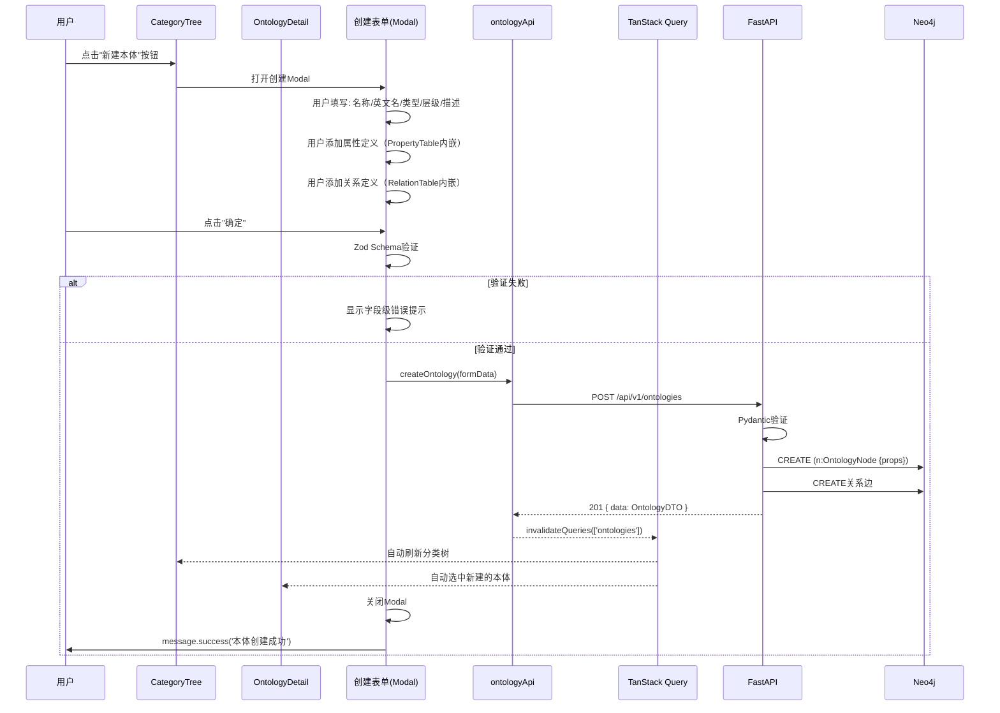
```mermaid
sequenceDiagram
    participant User as 用户
    participant Tree as CategoryTree
    participant Detail as OntologyDetail
    participant Form as 创建表单(Modal)
    participant API as ontologyApi
    participant TQ as TanStack Query
    participant Backend as FastAPI
    participant Neo4j as Neo4j

    User->>Tree: 点击"新建本体"按钮
    Tree->>Form: 打开创建Modal
    Form->>Form: 用户填写: 名称/英文名/类型/层级/描述
    Form->>Form: 用户添加属性定义（PropertyTable内嵌）
    Form->>Form: 用户添加关系定义（RelationTable内嵌）
    User->>Form: 点击"确定"
    Form->>Form: Zod Schema验证
    alt 验证失败
        Form->>Form: 显示字段级错误提示
    else 验证通过
        Form->>API: createOntology(formData)
        API->>Backend: POST /api/v1/ontologies
        Backend->>Backend: Pydantic验证
        Backend->>Neo4j: CREATE (n:OntologyNode {props})
        Backend->>Neo4j: CREATE关系边
        Backend-->>API: 201 { data: OntologyDTO }
        API-->>TQ: invalidateQueries(['ontologies'])
        TQ-->>Tree: 自动刷新分类树
        TQ-->>Detail: 自动选中新建的本体
        Form->>Form: 关闭Modal
        Form->>User: message.success('本体创建成功')
    end
```

#### 6.5.2 本体关系图交互流程

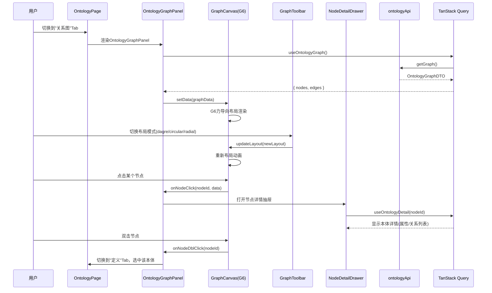
```mermaid
sequenceDiagram
    participant User as 用户
    participant Page as OntologyPage
    participant Graph as OntologyGraphPanel
    participant Canvas as GraphCanvas(G6)
    participant Toolbar as GraphToolbar
    participant Drawer as NodeDetailDrawer
    participant API as ontologyApi
    participant TQ as TanStack Query

    User->>Page: 切换到"关系图"Tab
    Page->>Graph: 渲染OntologyGraphPanel
    Graph->>TQ: useOntologyGraph()
    TQ->>API: getGraph()
    API-->>TQ: OntologyGraphDTO
    TQ-->>Graph: { nodes, edges }
    Graph->>Canvas: setData(graphData)
    Canvas->>Canvas: G6力导向布局渲染

    User->>Toolbar: 切换布局模式(dagre/circular/radial)
    Toolbar->>Canvas: updateLayout(newLayout)
    Canvas->>Canvas: 重新布局动画

    User->>Canvas: 点击某个节点
    Canvas->>Graph: onNodeClick(nodeId, data)
    Graph->>Drawer: 打开节点详情抽屉
    Drawer->>TQ: useOntologyDetail(nodeId)
    TQ-->>Drawer: 显示本体详情(属性/关系列表)

    User->>Canvas: 双击节点
    Canvas->>Graph: onNodeDblClick(nodeId)
    Graph->>Page: 切换到"定义"Tab，选中该本体
```

### 6.6 UI布局

> **追溯**: P0交互需求 3.1节（本体管理模块布局）

#### 6.6.1 本体定义Tab布局

```
┌─────────────────────────────────────────────────────────────────┐
│ [元本体管理]                                    [定义] [关系图] │
├──────────────────┬──────────────────────────────────────────────┤
│                  │ 本体详情                                     │
│  分类树           │ ┌──────────────────────────────────────────┐ │
│  ┌────────────┐  │ │ 名称: ______  英文名: ______             │ │
│  │ ▼ Level 1  │  │ │ 类型: [Entity▼]  层级: [Level 2▼]       │ │
│  │   Entity   │  │ │ 描述: __________________________________ │ │
│  │   Event    │  │ │ 父本体: [选择...]                        │ │
│  │   State    │  │ ├──────────────────────────────────────────┤ │
│  │   ...      │  │ │ 属性定义                    [+ 添加属性] │ │
│  │ ▼ Level 2  │  │ │ ┌────┬──────┬──────┬────┬────┬────────┐ │ │
│  │   Person   │  │ │ │序号│名称  │类型  │必填│默认│操作    │ │ │
│  │   Psych... │  │ │ ├────┼──────┼──────┼────┼────┼────────┤ │ │
│  │   Behav... │  │ │ │ 1  │age   │int   │ ✓  │ -  │编辑 删除│ │ │
│  │   ...      │  │ │ │ 2  │name  │string│ ✓  │ -  │编辑 删除│ │ │
│  │            │  │ │ └────┴──────┴──────┴────┴────┴────────┘ │ │
│  │ [搜索...]  │  │ ├──────────────────────────────────────────┤ │
│  │ [+ 新建]   │  │ │ 关系定义                    [+ 添加关系] │ │
│  └────────────┘  │ │ ┌────┬──────┬──────┬──────┬────┬──────┐ │ │
│                  │ │ │序号│关系  │目标  │基数  │必填│操作  │ │ │
│  版本历史 ▼      │ │ ├────┼──────┼──────┼──────┼────┼──────┤ │ │
│  ┌────────────┐  │ │ │ 1  │IS_A  │Entity│1:1   │ ✓  │编辑..│ │ │
│  │ v3 当前    │  │ │ └────┴──────┴──────┴──────┴────┴──────┘ │ │
│  │ v2 2026-02 │  │ ├──────────────────────────────────────────┤ │
│  │ v1 2026-01 │  │ │              [保存] [重置]               │ │
│  └────────────┘  │ └──────────────────────────────────────────┘ │
│                  │                                              │
│  孤立检查 ▼      │                                              │
│  ┌────────────┐  │                                              │
│  │ [执行检查] │  │                                              │
│  │ 无孤立本体 │  │                                              │
│  └────────────┘  │                                              │
├──────────────────┴──────────────────────────────────────────────┤
│ 左侧宽度: 280px (可拖拽调整)  │  右侧: 自适应                   │
└─────────────────────────────────────────────────────────────────┘
```

#### 6.6.2 本体关系图Tab布局

```
┌─────────────────────────────────────────────────────────────────┐
│ [元本体管理]                                    [定义] [关系图] │
├─────────────────────────────────────────────────────────────────┤
│ 工具栏: [力导向▼] [放大] [缩小] [适应画布] [导出PNG] [全屏]    │
├─────────────────────────────────────────────────────────────────┤
│                                                                 │
│                    G6 力导向关系图                               │
│                                                                 │
│         [Entity]──IS_A──>[Thing]                                │
│            │                                                    │
│         HAS_A                                                   │
│            │                                                    │
│         [Person]──MANIFESTS_AS──>[PsychologicalState]           │
│            │                          │                         │
│         TRIGGERS                   INDICATES                    │
│            │                          │                         │
│         [Behavior]              [Observable]                    │
│                                                                 │
│  ┌─────────────┐                                                │
│  │  缩略图     │                                                │
│  └─────────────┘                                                │
├─────────────────────────────────────────────────────────────────┤
│ 节点颜色图例: ● Entity(蓝) ● Event(绿) ● State(黄) ● ...      │
└─────────────────────────────────────────────────────────────────┘
```

**开发实现 checklist**：
- [ ] 创建 OntologyPage（Tab切换: 定义/关系图）
- [ ] 创建 CategoryTree（分类树 + 搜索 + 新建按钮）
- [ ] 创建 OntologyDetail（表单 + 属性表格 + 关系表格）
- [ ] 创建 PropertyTable（可编辑表格，支持14种数据类型）
- [ ] 创建 RelationTable（可编辑表格，29种关系类型下拉）
- [ ] 创建 OntologyGraphPanel（G6关系图 + 工具栏 + 节点详情抽屉）
- [ ] 创建 VersionHistoryPanel（版本列表 + 回滚操作 + 409依赖冲突处理）
- [ ] 创建 OrphanCheckPanel（孤立检查 + 结果列表）
- [ ] 创建 ontologyApi.ts（全部API函数）
- [ ] 创建 ontologyQueries.ts（全部Query/Mutation hooks）
- [ ] 创建 types.ts 和 schemas.ts（数据模型 + Zod验证）
- [ ] 创建 OntologyTypeTag / OntologySelect 实体组件
- [ ] 验证本体CRUD完整流程
- [ ] 验证关系图渲染和交互（点击/双击/布局切换）
- [ ] 验证版本历史和回滚功能（含409依赖冲突的错误处理）

**VersionHistoryPanel 回滚错误处理（FIX-15）**：

```typescript
// VersionHistoryPanel 中的回滚操作
const handleRollback = async (version: number) => {
    try {
        await ontologyApi.rollback(id, version);
        message.success('回滚成功');
        queryClient.invalidateQueries(['ontology', id]);
    } catch (error) {
        if (error.response?.status === 409) {
            // IntegrityError：存在知识实例依赖当前版本的本体定义
            const { dependent_instances } = error.response.data;
            Modal.confirm({
                title: '回滚受阻',
                content: `存在 ${dependent_instances.length} 个知识实例依赖当前版本的本体定义。强制回滚将删除这些实例。`,
                okText: '强制回滚（删除依赖实例）',
                okButtonProps: { danger: true },
                cancelText: '取消',
                onOk: () => ontologyApi.rollback(id, version, { force: true }),
            });
        } else {
            message.error('回滚失败：' + (error.response?.data?.message || error.message));
        }
    }
};
```

---

## 7. 模块详细设计：知识图谱（P0-4）

### 7.1 功能描述与追溯

> **追溯**: PRD 3.6节（知识图谱与语义查询）、P0交互需求 3.2节（知识图谱模块）、Neo4j RAG技术调研报告

**功能范围**：
- 知识图谱画布（G6力导向图，支持节点/边的可视化交互）
- 节点CRUD（基于本体Schema约束创建/编辑/删除节点）
- 边CRUD（基于关系类型约束创建/编辑/删除关系）
- 语义查询（Cypher查询编辑器 + 可视化结果）
- AI辅助分析（RAG查询，自然语言→Cypher→图谱结果）
- 知识导入（CSV/JSON文件上传 + 字段映射 + 预览确认）
- 图谱统计（节点/边数量、类型分布、密度等）

**RAG查询方法**（追溯Neo4j RAG技术调研报告 方法5）：
- Function Calling + Neo4j + Auto Cypher Fallback
- 6级降级策略：精确匹配 → 模糊匹配 → 向量搜索 → Auto Cypher → 全文检索 → 兜底回复

### 7.2 组件图

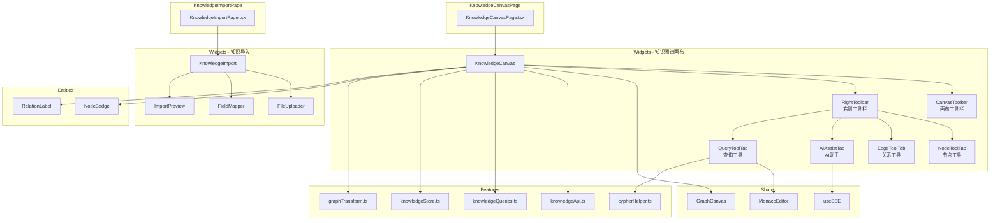
```mermaid
graph TB
    subgraph "KnowledgeCanvasPage"
        PAGE[KnowledgeCanvasPage.tsx]
    end

    subgraph "KnowledgeImportPage"
        IMP_PAGE[KnowledgeImportPage.tsx]
    end

    subgraph "Widgets - 知识图谱画布"
        W_CANVAS[KnowledgeCanvas]
        W_CTOOLBAR[CanvasToolbar<br/>画布工具栏]
        W_RIGHT[RightToolbar<br/>右侧工具栏]
        W_NODE_TAB[NodeToolTab<br/>节点工具]
        W_EDGE_TAB[EdgeToolTab<br/>关系工具]
        W_AI_TAB[AIAssistTab<br/>AI助手]
        W_QUERY_TAB[QueryToolTab<br/>查询工具]
    end

    subgraph "Widgets - 知识导入"
        W_IMPORT[KnowledgeImport]
        W_UPLOAD[FileUploader]
        W_MAPPER[FieldMapper]
        W_PREVIEW[ImportPreview]
    end

    subgraph "Features"
        F_API[knowledgeApi.ts]
        F_QUERY[knowledgeQueries.ts]
        F_STORE[knowledgeStore.ts]
        F_GRAPH_T[graphTransform.ts]
        F_CYPHER[cypherHelper.ts]
    end

    subgraph "Entities"
        E_BADGE[NodeBadge]
        E_LABEL[RelationLabel]
    end

    subgraph "Shared"
        S_GRAPH[GraphCanvas]
        S_MONACO[MonacoEditor]
        S_SSE[useSSE]
    end

    PAGE --> W_CANVAS
    IMP_PAGE --> W_IMPORT
    W_CANVAS --> W_CTOOLBAR & W_RIGHT
    W_RIGHT --> W_NODE_TAB & W_EDGE_TAB & W_AI_TAB & W_QUERY_TAB
    W_IMPORT --> W_UPLOAD & W_MAPPER & W_PREVIEW

    W_CANVAS --> S_GRAPH & F_API & F_QUERY & F_STORE
    W_QUERY_TAB --> S_MONACO
    W_AI_TAB --> S_SSE
    W_CANVAS --> F_GRAPH_T
    W_QUERY_TAB --> F_CYPHER
    W_CANVAS --> E_BADGE & E_LABEL
```

### 7.3 关键接口

#### 7.3.1 API函数定义

```typescript
// src/features/knowledge/api/knowledgeApi.ts
import { apiClient } from '@shared/api/apiClient';
import type { ApiResponse, PaginatedResponse } from '@shared/api/types';
import type {
  KnowledgeNodeDTO, KnowledgeEdgeDTO, CreateNodeDTO, UpdateNodeDTO,
  CreateEdgeDTO, GraphQueryResult, RAGQueryRequest, RAGQueryResponse,
  ImportRequest, ImportResult, GraphStatsDTO,
} from '../model/types';

const BASE = '/api/v1/kg';

export const knowledgeApi = {
  /** 获取图谱数据（节点+边，支持分页和过滤） */
  getGraph: (params?: { node_types?: string[]; limit?: number; offset?: number }) =>
    apiClient.get<ApiResponse<{ nodes: KnowledgeNodeDTO[]; edges: KnowledgeEdgeDTO[] }>>(`${BASE}/graph`, { params }),

  /** 获取单个节点详情 */
  getNode: (id: string) =>
    apiClient.get<ApiResponse<KnowledgeNodeDTO>>(`${BASE}/nodes/${id}`),

  /** 创建节点 */
  createNode: (data: CreateNodeDTO) =>
    apiClient.post<ApiResponse<KnowledgeNodeDTO>>(`${BASE}/nodes`, data),

  /** 更新节点 */
  updateNode: (id: string, data: UpdateNodeDTO) =>
    apiClient.put<ApiResponse<KnowledgeNodeDTO>>(`${BASE}/nodes/${id}`, data),

  /** 删除节点 */
  deleteNode: (id: string) =>
    apiClient.delete<ApiResponse<void>>(`${BASE}/nodes/${id}`),

  /** 创建边（关系） */
  createEdge: (data: CreateEdgeDTO) =>
    apiClient.post<ApiResponse<KnowledgeEdgeDTO>>(`${BASE}/edges`, data),

  /** 删除边 */
  deleteEdge: (id: string) =>
    apiClient.delete<ApiResponse<void>>(`${BASE}/edges/${id}`),

  /** 执行Cypher查询 */
  executeCypher: (cypher: string, params?: Record<string, unknown>) =>
    apiClient.post<ApiResponse<GraphQueryResult>>(`${BASE}/query/cypher`, { cypher, params }),

  /** RAG语义查询（SSE流式） — 返回URL供useSSE使用 */
  getRAGQueryURL: () => `${apiClient.defaults.baseURL}${BASE}/query/rag`,

  /** RAG语义查询（非流式，用于简单查询） */
  ragQuery: (data: RAGQueryRequest) =>
    apiClient.post<ApiResponse<RAGQueryResponse>>(`${BASE}/query/rag`, data),

  /** 获取图谱统计信息 */
  getStats: () =>
    apiClient.get<ApiResponse<GraphStatsDTO>>(`${BASE}/stats`),

  /** 知识导入 */
  importData: (data: ImportRequest) =>
    apiClient.post<ApiResponse<ImportResult>>(`${BASE}/import`, data),

  /** 上传导入文件 */
  uploadFile: (file: File) => {
    const formData = new FormData();
    formData.append('file', file);
    return apiClient.post<ApiResponse<{ file_id: string; columns: string[]; preview: Record<string, unknown>[] }>>(
      `${BASE}/import/upload`, formData, { headers: { 'Content-Type': 'multipart/form-data' } },
    );
  },

  /** 获取节点的邻居（展开操作） */
  getNeighbors: (nodeId: string, depth?: number) =>
    apiClient.get<ApiResponse<{ nodes: KnowledgeNodeDTO[]; edges: KnowledgeEdgeDTO[] }>>(
      `${BASE}/nodes/${nodeId}/neighbors`, { params: { depth: depth || 1 } },
    ),
};
```

#### 7.3.2 TanStack Query Hooks

```typescript
// src/features/knowledge/api/knowledgeQueries.ts
import { useQuery, useMutation, useQueryClient } from '@tanstack/react-query';
import { message } from 'antd';

import { knowledgeApi } from './knowledgeApi';
import { knowledgeKeys } from './queryKeys';
import type { CreateNodeDTO, UpdateNodeDTO, CreateEdgeDTO } from '../model/types';

/** 图谱数据查询 */
export function useKnowledgeGraph(filters?: { node_types?: string[]; limit?: number }) {
  return useQuery({
    queryKey: knowledgeKeys.graph(filters || {}),
    queryFn: () => knowledgeApi.getGraph(filters).then((res) => res.data.data),
  });
}

/** 节点详情 */
export function useKnowledgeNode(id: string | null) {
  return useQuery({
    queryKey: knowledgeKeys.node(id!),
    queryFn: () => knowledgeApi.getNode(id!).then((res) => res.data.data),
    enabled: !!id,
  });
}

/** 图谱统计 */
export function useKnowledgeStats() {
  return useQuery({
    queryKey: knowledgeKeys.stats(),
    queryFn: () => knowledgeApi.getStats().then((res) => res.data.data),
  });
}

/** 创建节点 */
export function useCreateNode() {
  const qc = useQueryClient();
  return useMutation({
    mutationFn: (data: CreateNodeDTO) => knowledgeApi.createNode(data).then((res) => res.data.data),
    onSuccess: () => {
      message.success('节点创建成功');
      qc.invalidateQueries({ queryKey: knowledgeKeys.all });
    },
  });
}

/** 更新节点 */
export function useUpdateNode() {
  const qc = useQueryClient();
  return useMutation({
    mutationFn: ({ id, data }: { id: string; data: UpdateNodeDTO }) =>
      knowledgeApi.updateNode(id, data).then((res) => res.data.data),
    onSuccess: (_, { id }) => {
      message.success('节点更新成功');
      qc.invalidateQueries({ queryKey: knowledgeKeys.node(id) });
      qc.invalidateQueries({ queryKey: knowledgeKeys.graphs() });
    },
  });
}

/** 删除节点 */
export function useDeleteNode() {
  const qc = useQueryClient();
  return useMutation({
    mutationFn: (id: string) => knowledgeApi.deleteNode(id),
    onSuccess: () => {
      message.success('节点已删除');
      qc.invalidateQueries({ queryKey: knowledgeKeys.all });
    },
  });
}

/** 创建边 */
export function useCreateEdge() {
  const qc = useQueryClient();
  return useMutation({
    mutationFn: (data: CreateEdgeDTO) => knowledgeApi.createEdge(data).then((res) => res.data.data),
    onSuccess: () => {
      message.success('关系创建成功');
      qc.invalidateQueries({ queryKey: knowledgeKeys.all });
    },
  });
}

/** 删除边 */
export function useDeleteEdge() {
  const qc = useQueryClient();
  return useMutation({
    mutationFn: (id: string) => knowledgeApi.deleteEdge(id),
    onSuccess: () => {
      message.success('关系已删除');
      qc.invalidateQueries({ queryKey: knowledgeKeys.all });
    },
  });
}

/** Cypher查询（手动触发） */
export function useCypherQuery() {
  return useMutation({
    mutationFn: ({ cypher, params }: { cypher: string; params?: Record<string, unknown> }) =>
      knowledgeApi.executeCypher(cypher, params).then((res) => res.data.data),
    onError: () => message.error('Cypher查询执行失败'),
  });
}

/** 节点邻居展开 */
export function useNodeNeighbors() {
  return useMutation({
    mutationFn: ({ nodeId, depth }: { nodeId: string; depth?: number }) =>
      knowledgeApi.getNeighbors(nodeId, depth).then((res) => res.data.data),
  });
}
```

### 7.4 数据模型

```typescript
// src/features/knowledge/model/types.ts

/** 知识节点DTO */
export interface KnowledgeNodeDTO {
  id: string;
  /** 节点标签（Neo4j label） */
  labels: string[];
  /** 本体类型（关联的本体定义） */
  ontology_type: string;
  /** 显示名称 */
  name: string;
  /** 节点属性（动态，由本体Schema定义） */
  properties: Record<string, unknown>;
  created_at: string;
  updated_at: string;
}

/** 知识边DTO */
export interface KnowledgeEdgeDTO {
  id: string;
  source_id: string;
  target_id: string;
  /** 关系类型 */
  relation_type: string;
  /** 关系属性 */
  properties: Record<string, unknown>;
  created_at: string;
}

/** 创建节点请求 */
export interface CreateNodeDTO {
  /** 本体类型ID（决定节点的Schema约束） */
  ontology_type_id: string;
  name: string;
  properties: Record<string, unknown>;
}

/** 更新节点请求 */
export interface UpdateNodeDTO {
  name?: string;
  properties?: Record<string, unknown>;
}

/** 创建边请求 */
export interface CreateEdgeDTO {
  source_id: string;
  target_id: string;
  relation_type: string;
  properties?: Record<string, unknown>;
}

/** Cypher查询结果 */
export interface GraphQueryResult {
  /** 结果节点 */
  nodes: KnowledgeNodeDTO[];
  /** 结果边 */
  edges: KnowledgeEdgeDTO[];
  /** 表格形式结果（非图结构查询时） */
  records?: Record<string, unknown>[];
  /** 查询耗时(ms) */
  execution_time: number;
  /** 结果总数 */
  total_count: number;
}

/** RAG查询请求 */
export interface RAGQueryRequest {
  /** 自然语言问题 */
  question: string;
  /** 使用的模型ID */
  model_id?: string;
  /** 是否流式返回 */
  stream?: boolean;
  /** 上下文窗口（历史对话） */
  context?: Array<{ role: 'user' | 'assistant'; content: string }>;
}

/** RAG查询响应 */
export interface RAGQueryResponse {
  /** AI回答 */
  answer: string;
  /** 生成的Cypher查询 */
  generated_cypher?: string;
  /** 引用的图谱节点 */
  referenced_nodes: KnowledgeNodeDTO[];
  /** 引用的图谱边 */
  referenced_edges: KnowledgeEdgeDTO[];
  /** 使用的降级策略 */
  fallback_level: number;
  /** Token使用统计 */
  token_usage: { prompt_tokens: number; completion_tokens: number; total_tokens: number };
}

/** 导入请求 */
export interface ImportRequest {
  file_id: string;
  /** 目标本体类型 */
  ontology_type_id: string;
  /** 字段映射: CSV列名 → 本体属性名 */
  field_mapping: Record<string, string>;
  /** 是否创建关系 */
  create_relations?: boolean;
  /** 关系映射配置 */
  relation_mapping?: Array<{
    source_field: string;
    target_field: string;
    relation_type: string;
  }>;
}

/** 导入结果 */
export interface ImportResult {
  success_count: number;
  error_count: number;
  errors: Array<{ row: number; message: string }>;
}

/** 图谱统计 */
export interface GraphStatsDTO {
  total_nodes: number;
  total_edges: number;
  node_type_distribution: Array<{ type: string; count: number }>;
  edge_type_distribution: Array<{ type: string; count: number }>;
  graph_density: number;
  avg_degree: number;
}
```

### 7.5 关键流程

#### 7.5.1 图谱画布交互流程

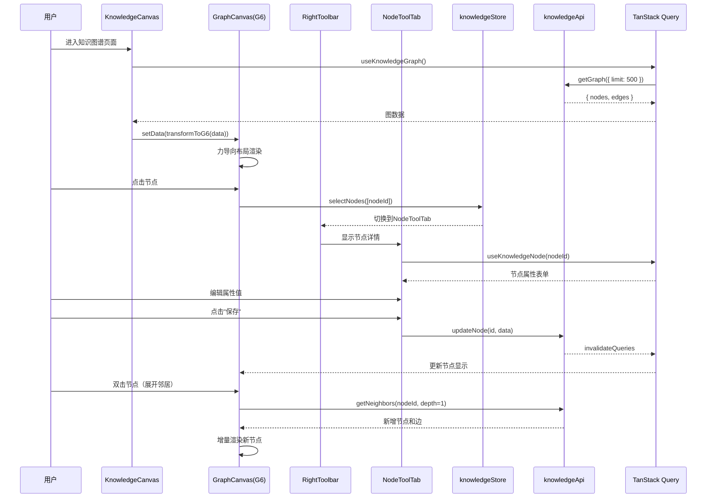
```mermaid
sequenceDiagram
    participant User as 用户
    participant Canvas as KnowledgeCanvas
    participant G6 as GraphCanvas(G6)
    participant RightBar as RightToolbar
    participant NodeTab as NodeToolTab
    participant Store as knowledgeStore
    participant API as knowledgeApi
    participant TQ as TanStack Query

    User->>Canvas: 进入知识图谱页面
    Canvas->>TQ: useKnowledgeGraph()
    TQ->>API: getGraph({ limit: 500 })
    API-->>TQ: { nodes, edges }
    TQ-->>Canvas: 图数据
    Canvas->>G6: setData(transformToG6(data))
    G6->>G6: 力导向布局渲染

    User->>G6: 点击节点
    G6->>Store: selectNodes([nodeId])
    Store-->>RightBar: 切换到NodeToolTab
    RightBar->>NodeTab: 显示节点详情
    NodeTab->>TQ: useKnowledgeNode(nodeId)
    TQ-->>NodeTab: 节点属性表单

    User->>NodeTab: 编辑属性值
    User->>NodeTab: 点击"保存"
    NodeTab->>API: updateNode(id, data)
    API-->>TQ: invalidateQueries
    TQ-->>G6: 更新节点显示

    User->>G6: 双击节点（展开邻居）
    G6->>API: getNeighbors(nodeId, depth=1)
    API-->>G6: 新增节点和边
    G6->>G6: 增量渲染新节点
```

#### 7.5.2 RAG语义查询流程

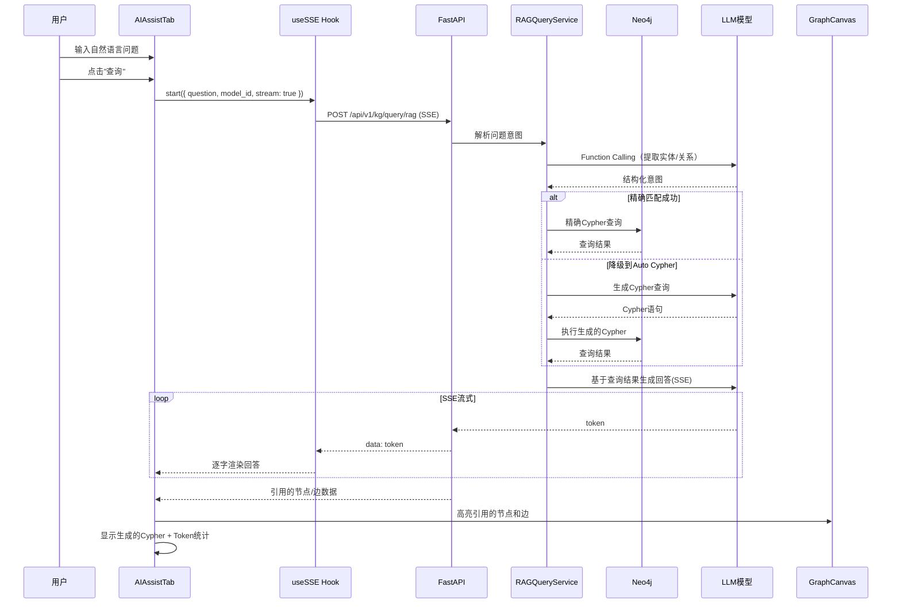
```mermaid
sequenceDiagram
    participant User as 用户
    participant AITab as AIAssistTab
    participant SSE as useSSE Hook
    participant Backend as FastAPI
    participant RAG as RAGQueryService
    participant Neo4j as Neo4j
    participant LLM as LLM模型
    participant Canvas as GraphCanvas

    User->>AITab: 输入自然语言问题
    User->>AITab: 点击"查询"
    AITab->>SSE: start({ question, model_id, stream: true })
    SSE->>Backend: POST /api/v1/kg/query/rag (SSE)

    Backend->>RAG: 解析问题意图
    RAG->>LLM: Function Calling（提取实体/关系）
    LLM-->>RAG: 结构化意图

    alt 精确匹配成功
        RAG->>Neo4j: 精确Cypher查询
        Neo4j-->>RAG: 查询结果
    else 降级到Auto Cypher
        RAG->>LLM: 生成Cypher查询
        LLM-->>RAG: Cypher语句
        RAG->>Neo4j: 执行生成的Cypher
        Neo4j-->>RAG: 查询结果
    end

    RAG->>LLM: 基于查询结果生成回答(SSE)
    loop SSE流式
        LLM-->>Backend: token
        Backend-->>SSE: data: token
        SSE-->>AITab: 逐字渲染回答
    end

    Backend-->>AITab: 引用的节点/边数据
    AITab->>Canvas: 高亮引用的节点和边
    AITab->>AITab: 显示生成的Cypher + Token统计
```

**RAG降级级别可视化（FIX-14）**：

AIAssistTab在查询结果区域将`fallback_level`数字转换为可读标签：

```typescript
const FALLBACK_LABELS: Record<number, string> = {
    0: '精确匹配',
    1: '模糊匹配',
    2: '向量搜索',
    3: 'Auto Cypher',
    4: '全文检索',
    5: '兜底回复',
};

// 展示：当 fallback_level > 0 时显示降级标签
{result.fallback_level > 0 && (
    <Tag color="orange">使用了{FALLBACK_LABELS[result.fallback_level]}降级</Tag>
)}
```

> P1增强：增加降级过程的步骤可视化（Steps组件展示每一级的尝试结果）。

#### 7.5.3 知识导入流程

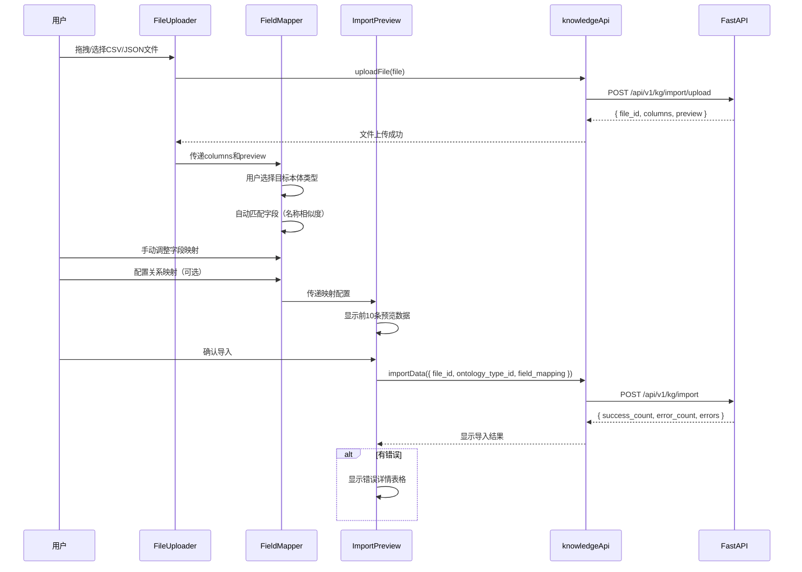
```mermaid
sequenceDiagram
    participant User as 用户
    participant Upload as FileUploader
    participant Mapper as FieldMapper
    participant Preview as ImportPreview
    participant API as knowledgeApi
    participant Backend as FastAPI

    User->>Upload: 拖拽/选择CSV/JSON文件
    Upload->>API: uploadFile(file)
    API->>Backend: POST /api/v1/kg/import/upload
    Backend-->>API: { file_id, columns, preview }
    API-->>Upload: 文件上传成功

    Upload->>Mapper: 传递columns和preview
    Mapper->>Mapper: 用户选择目标本体类型
    Mapper->>Mapper: 自动匹配字段（名称相似度）
    User->>Mapper: 手动调整字段映射
    User->>Mapper: 配置关系映射（可选）

    Mapper->>Preview: 传递映射配置
    Preview->>Preview: 显示前10条预览数据
    User->>Preview: 确认导入

    Preview->>API: importData({ file_id, ontology_type_id, field_mapping })
    API->>Backend: POST /api/v1/kg/import
    Backend-->>API: { success_count, error_count, errors }
    API-->>Preview: 显示导入结果
    alt 有错误
        Preview->>Preview: 显示错误详情表格
    end
```

#### 7.5.4 画布上创建关系流程

> **说明**: 本流程详细描述用户如何在知识图谱画布上创建节点之间的关系（边）。关系数据会持久化到Neo4j数据库，即使画布布局位置信息不保存，关系数据也会被永久保存。

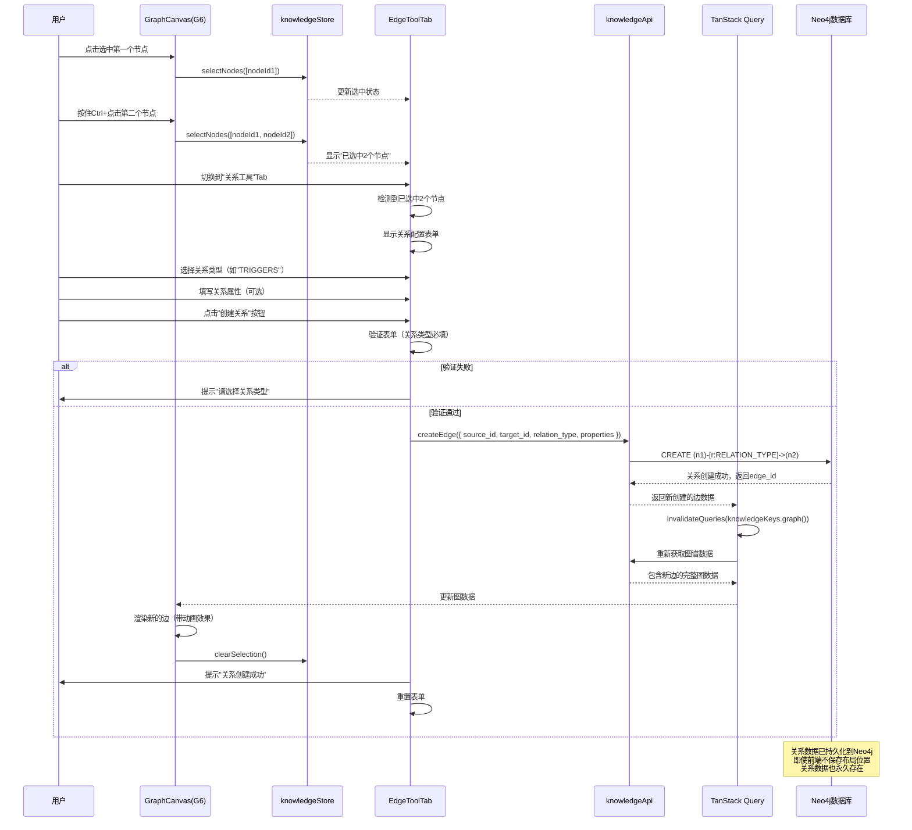
```mermaid
sequenceDiagram
    participant User as 用户
    participant Canvas as GraphCanvas(G6)
    participant Store as knowledgeStore
    participant EdgeTab as EdgeToolTab
    participant API as knowledgeApi
    participant TQ as TanStack Query
    participant Neo4j as Neo4j数据库

    User->>Canvas: 点击选中第一个节点
    Canvas->>Store: selectNodes([nodeId1])
    Store-->>EdgeTab: 更新选中状态

    User->>Canvas: 按住Ctrl+点击第二个节点
    Canvas->>Store: selectNodes([nodeId1, nodeId2])
    Store-->>EdgeTab: 显示"已选中2个节点"

    User->>EdgeTab: 切换到"关系工具"Tab
    EdgeTab->>EdgeTab: 检测到已选中2个节点
    EdgeTab->>EdgeTab: 显示关系配置表单

    User->>EdgeTab: 选择关系类型（如"TRIGGERS"）
    User->>EdgeTab: 填写关系属性（可选）
    User->>EdgeTab: 点击"创建关系"按钮

    EdgeTab->>EdgeTab: 验证表单（关系类型必填）

    alt 验证失败
        EdgeTab->>User: 提示"请选择关系类型"
    else 验证通过
        EdgeTab->>API: createEdge({ source_id, target_id, relation_type, properties })
        API->>Neo4j: CREATE (n1)-[r:RELATION_TYPE]->(n2)
        Neo4j-->>API: 关系创建成功，返回edge_id
        API-->>TQ: 返回新创建的边数据

        TQ->>TQ: invalidateQueries(knowledgeKeys.graph())
        TQ->>API: 重新获取图谱数据
        API-->>TQ: 包含新边的完整图数据

        TQ-->>Canvas: 更新图数据
        Canvas->>Canvas: 渲染新的边（带动画效果）
        Canvas->>Store: clearSelection()

        EdgeTab->>User: 提示"关系创建成功"
        EdgeTab->>EdgeTab: 重置表单
    end

    Note over Neo4j: 关系数据已持久化到Neo4j<br/>即使前端不保存布局位置<br/>关系数据也永久存在
```

**关键设计说明**：

1. **多选节点机制**：用户通过Ctrl+点击或框选（未来P1）选中多个节点，knowledgeStore维护selectedNodeIds数组。

2. **EdgeToolTab组件职责**：
   - 监听selectedNodeIds状态
   - 当选中节点数=2时，启用关系创建表单
   - 当选中节点数≠2时，显示提示"请在画布上选中2个节点"

3. **关系类型约束**：
   - 从本体定义中获取允许的关系类型列表
   - 根据源节点和目标节点的本体类型，过滤可用的关系类型
   - 例如：Person节点只能与Behavior节点建立TRIGGERS关系

4. **数据持久化**：
   - 关系数据通过createEdge API持久化到Neo4j数据库
   - P0阶段使用localStorage保存画布布局位置（x/y坐标），key格式为`kg_layout_{graphId}`
   - 加载图谱时优先从localStorage恢复布局，无缓存时使用G6力导向自动布局
   - 节点拖拽结束后自动保存布局（监听`node:dragend`事件）
   - P1阶段考虑将布局数据持久化到服务端
   - 关系数据（边）通过createEdge API持久化到Neo4j数据库

5. **用户体验优化**：
   - 创建成功后，新边以动画形式出现在画布上
   - 自动清除节点选中状态，方便用户继续创建其他关系
   - 提供撤销功能（P1阶段）

**EdgeToolTab组件伪代码**：

```typescript
export const EdgeToolTab = () => {
  const { selectedNodeIds } = useKnowledgeStore();
  const createEdge = useCreateEdge();
  const [relationConfig, setRelationConfig] = useState({
    relationType: '',
    properties: {}
  });

  // 检查是否选中了2个节点
  const canCreateEdge = selectedNodeIds.length === 2;

  const handleCreateEdge = () => {
    if (!canCreateEdge) {
      message.warning('请先在画布上选中两个节点');
      return;
    }
    if (!relationConfig.relationType) {
      message.warning('请选择关系类型');
      return;
    }

    createEdge.mutate({
      source_id: selectedNodeIds[0],
      target_id: selectedNodeIds[1],
      relation_type: relationConfig.relationType,
      properties: relationConfig.properties
    }, {
      onSuccess: () => {
        message.success('关系创建成功');
        setRelationConfig({ relationType: '', properties: {} });
      }
    });
  };

  return (
    <div>
      {!canCreateEdge && (
        <Alert message="请在画布上选中2个节点" type="info" />
      )}
      {canCreateEdge && (
        <Form>
          <Form.Item label="源节点">
            <NodeBadge nodeId={selectedNodeIds[0]} />
          </Form.Item>
          <Form.Item label="目标节点">
            <NodeBadge nodeId={selectedNodeIds[1]} />
          </Form.Item>
          <Form.Item label="关系类型" required>
            <Select
              value={relationConfig.relationType}
              onChange={(value) => setRelationConfig({ ...relationConfig, relationType: value })}
              options={getAvailableRelationTypes(selectedNodeIds)}
            />
          </Form.Item>
          <Form.Item label="关系属性">
            <DynamicPropertyForm
              properties={relationConfig.properties}
              onChange={(props) => setRelationConfig({ ...relationConfig, properties: props })}
            />
          </Form.Item>
          <Button type="primary" onClick={handleCreateEdge} loading={createEdge.isPending}>
            创建关系
          </Button>
        </Form>
      )}
    </div>
  );
};
```

### 7.6 UI布局

> **追溯**: P0交互需求 3.2节（知识图谱模块布局）

#### 7.6.1 知识图谱画布布局

```
┌─────────────────────────────────────────────────────────────────────┐
│ 画布工具栏                                                          │
│ [力导向▼] [手绘(P1)] [放大] [缩小] [适应] [全屏] [导出] │ 节点:128 边:256 │
├───────────────────────────────────────────┬─────────────────────────┤
│                                           │ 右侧工具栏 (320px)     │
│                                           │ [节点] [关系] [AI] [查询]│
│                                           ├─────────────────────────┤
│          G6 知识图谱画布                   │                         │
│                                           │ 【节点工具Tab】          │
│     [Person:张三]──TRIGGERS──>[Behavior]   │ 节点类型: [Person▼]     │
│          │                                │ 名称: 张三              │
│       MANIFESTS_AS                        │ ─────────────────       │
│          │                                │ 属性:                   │
│     [PsychologicalState:焦虑]             │   age: [35]             │
│          │                                │   gender: [男▼]         │
│       INDICATES                           │   education: [本科]     │
│          │                                │ ─────────────────       │
│     [Observable:心率升高]                  │ 关系:                   │
│                                           │   → Behavior (TRIGGERS) │
│                                           │   → State (MANIFESTS)   │
│  ┌──────────┐                             │ ─────────────────       │
│  │ 缩略图   │                             │ [保存] [删除]           │
│  └──────────┘                             │                         │
├───────────────────────────────────────────┴─────────────────────────┤
│ 状态栏: 缩放 100% │ 选中: 1个节点 │ 布局: 力导向                    │
└─────────────────────────────────────────────────────────────────────┘
```

#### 7.6.2 AI助手Tab布局

```
┌─────────────────────────┐
│ [节点] [关系] [AI] [查询]│
├─────────────────────────┤
│ AI助手                   │
│                         │
│ 对话历史:               │
│ ┌─────────────────────┐ │
│ │ 🧑 张三有哪些心理   │ │
│ │    特征？            │ │
│ │                     │ │
│ │ 🤖 根据知识图谱分析 │ │
│ │    张三表现出以下心  │ │
│ │    理特征:           │ │
│ │    1. 焦虑状态...    │ │
│ │    2. 防御机制...    │ │
│ │                     │ │
│ │ 引用节点: [张三]     │ │
│ │ [焦虑] [防御机制]    │ │
│ │                     │ │
│ │ Cypher: MATCH (p:   │ │
│ │ Person)-[*1..3]->   │ │
│ │ (n) WHERE p.name... │ │
│ │                     │ │
│ │ Token: 1,234        │ │
│ └─────────────────────┘ │
│                         │
│ ┌─────────────────────┐ │
│ │ 输入问题...     [发送]│ │
│ └─────────────────────┘ │
│ 模型: [GPT-4o▼]        │
└─────────────────────────┘
```

#### 7.6.3 Cypher查询Tab布局

```
┌─────────────────────────┐
│ [节点] [关系] [AI] [查询]│
├─────────────────────────┤
│ Cypher查询               │
│                         │
│ ┌─────────────────────┐ │
│ │ Monaco Editor        │ │
│ │ MATCH (p:Person)     │ │
│ │ -[:TRIGGERS]->       │ │
│ │ (b:Behavior)         │ │
│ │ RETURN p, b          │ │
│ │ LIMIT 50             │ │
│ └─────────────────────┘ │
│ [执行查询] [清空]        │
│                         │
│ 查询结果:               │
│ 耗时: 23ms  结果: 12条  │
│ ┌─────────────────────┐ │
│ │ p.name │ b.type     │ │
│ ├────────┼────────────┤ │
│ │ 张三   │ 回避行为   │ │
│ │ 李四   │ 攻击行为   │ │
│ │ ...    │ ...        │ │
│ └─────────────────────┘ │
│ [在画布中高亮结果]       │
└─────────────────────────┘
```

#### 7.6.4 大规模图谱性能优化策略（LOD）

> **追溯**: 反馈建议 - 大规模知识图谱性能优化

**问题背景**：当知识图谱节点数超过1000时，G6渲染性能会显著下降，导致画布交互卡顿、缩放延迟、布局计算耗时过长。

**解决方案**：采用LOD（Level of Detail）分级渲染策略，根据缩放级别和节点数量动态调整渲染细节。

**LOD配置**：

```typescript
// src/shared/ui/GraphCanvas/lodConfig.ts

export const LOD_CONFIG = {
  /** 缩放级别阈值 */
  zoomThresholds: {
    /** 缩放 < 0.5 时隐藏节点标签 */
    hideLabels: 0.5,
    /** 缩放 < 0.3 时隐藏边 */
    hideEdges: 0.3,
    /** 缩放 < 0.2 时启用节点聚合 */
    showAggregation: 0.2,
  },
  /** 节点数量阈值 */
  nodeLimits: {
    /** 节点数 > 500 时启用虚拟滚动 */
    enableVirtualScroll: 500,
    /** 节点数 > 1000 时启用按需加载 */
    enableLazyLoad: 1000,
    /** 同类节点数 > 50 时启用聚合 */
    aggregationThreshold: 50,
  },
  /**
   * 用户可控的显示设置（FIX-18）
   * CanvasToolbar中增加"显示设置"下拉菜单，用户可切换以下选项
   */
  userDisplaySettings: {
    /** 显示标签（关闭后覆盖LOD阈值，永不隐藏/永远隐藏） */
    showLabels: true,
    /** 显示关系线 */
    showEdges: true,
    /** 启用节点聚合 */
    enableAggregation: true,
  },
  /** 性能优化开关 */
  performance: {
    /** 是否启用WebWorker布局计算 */
    useWebWorker: true,
    /** 是否启用GPU加速（G6 5.x） */
    useGPU: false, // P0阶段使用G6 4.8.x，暂不启用
    /** 动画帧率限制（fps） */
    maxFPS: 30,
  },
};
```

**实现策略**：

1. **缩放级别自适应渲染**：

```typescript
// src/shared/ui/GraphCanvas/useGraph.ts 中增强

graph.on('viewportchange', (e) => {
  const zoom = e.zoom;

  // 隐藏标签
  if (zoom < LOD_CONFIG.zoomThresholds.hideLabels) {
    graph.getNodes().forEach(node => {
      graph.updateItem(node, {
        labelCfg: { style: { opacity: 0 } }
      });
    });
  } else {
    graph.getNodes().forEach(node => {
      graph.updateItem(node, {
        labelCfg: { style: { opacity: 1 } }
      });
    });
  }

  // 隐藏边
  if (zoom < LOD_CONFIG.zoomThresholds.hideEdges) {
    graph.getEdges().forEach(edge => {
      graph.updateItem(edge, {
        style: { opacity: 0.1 }
      });
    });
  } else {
    graph.getEdges().forEach(edge => {
      graph.updateItem(edge, {
        style: { opacity: 1 }
      });
    });
  }
});
```

2. **按需加载（Lazy Load）**：

```typescript
// 初始只加载视口内节点
const { nodes, edges } = await knowledgeApi.getGraph({
  limit: 500, // 首次加载500个节点
  offset: 0
});

// 用户双击节点或搜索时，动态加载邻居节点
graph.on('node:dblclick', async (e) => {
  const nodeId = e.item.getModel().id;
  const neighbors = await knowledgeApi.getNeighbors(nodeId, 1);

  // 增量添加节点和边
  graph.addItem('node', neighbors.nodes);
  graph.addItem('edge', neighbors.edges);
  graph.layout(); // 重新布局
});
```

3. **节点聚合（Aggregation）**：

```typescript
// src/features/knowledge/lib/graphAggregation.ts

/**
 * 将同类型节点聚合为一个"超级节点"
 * 例如：50个Person节点 → 1个"Person (50)"聚合节点
 */
export function aggregateNodesByType(nodes: GraphNodeData[]): GraphNodeData[] {
  const typeGroups = groupBy(nodes, 'ontologyType');
  const aggregated: GraphNodeData[] = [];

  Object.entries(typeGroups).forEach(([type, typeNodes]) => {
    if (typeNodes.length > LOD_CONFIG.nodeLimits.aggregationThreshold) {
      // 创建聚合节点
      aggregated.push({
        id: `agg_${type}`,
        label: `${type} (${typeNodes.length})`,
        ontologyType: type,
        isAggregated: true,
        aggregatedNodeIds: typeNodes.map(n => n.id),
        style: {
          size: 60, // 聚合节点更大
          fill: '#f0f0f0',
        }
      });
    } else {
      aggregated.push(...typeNodes);
    }
  });

  return aggregated;
}

// 用户双击聚合节点时，展开为原始节点
graph.on('node:dblclick', (e) => {
  const model = e.item.getModel();
  if (model.isAggregated) {
    const originalNodes = model.aggregatedNodeIds.map(id =>
      originalNodesMap.get(id)
    );
    graph.removeItem(model.id); // 移除聚合节点
    originalNodes.forEach(node => graph.addItem('node', node)); // 添加原始节点
    graph.layout();
  }
});
```

4. **WebWorker布局计算**：

```typescript
// src/shared/ui/GraphCanvas/layoutWorker.ts

// 将力导向布局计算放在WebWorker中，避免阻塞主线程
const layoutWorker = new Worker(new URL('./layoutWorker.ts', import.meta.url));

layoutWorker.postMessage({
  nodes: graphData.nodes,
  edges: graphData.edges,
  layoutType: 'force',
  options: { linkDistance: 200, nodeStrength: -300 }
});

layoutWorker.onmessage = (e) => {
  const { nodes: layoutedNodes } = e.data;
  // 应用布局结果到G6
  layoutedNodes.forEach(node => {
    graph.updateItem(node.id, { x: node.x, y: node.y });
  });
};
```

**性能指标**：

| 节点数量 | 优化前渲染时间 | 优化后渲染时间 | 优化策略 |
|---------|--------------|--------------|---------|
| < 500 | < 1s | < 1s | 无需优化 |
| 500-1000 | 2-5s | < 2s | 虚拟滚动 + 标签隐藏 |
| 1000-5000 | 10s+ | < 3s | 按需加载 + 聚合 + WebWorker |
| > 5000 | 卡死 | < 5s | 强制聚合 + 分页加载 |

**用户体验优化**：

1. **加载提示**：大图加载时显示进度条和节点数统计
2. **性能警告**：节点数 > 5000 时，提示用户"图谱过大，建议使用过滤或搜索功能"
3. **智能布局**：自动选择最优布局算法（节点 < 100 用力导向，> 100 用Dagre）
4. **缓存策略**：已加载的节点数据缓存在内存中，避免重复请求

**开发实现 checklist**：
- [ ] 创建 KnowledgeCanvasPage（画布 + 工具栏 + 右侧面板）
- [ ] 创建 CanvasToolbar（布局切换/手绘占位(P1,disabled)/缩放/导出/统计）
- [ ] 创建 RightToolbar（4个Tab切换）
- [ ] 创建 NodeToolTab（节点详情表单，基于本体Schema动态生成）
- [ ] 创建 EdgeToolTab（关系详情 + 创建关系）
- [ ] 创建 AIAssistTab（对话式RAG查询 + SSE流式 + 引用高亮）
- [ ] 创建 QueryToolTab（Monaco Cypher编辑器 + 结果表格 + 画布高亮）
- [ ] 创建 KnowledgeImportPage（文件上传 + 字段映射 + 预览确认）
- [ ] 创建 knowledgeApi.ts（全部API函数）
- [ ] 创建 knowledgeQueries.ts（全部Query/Mutation hooks）
- [ ] 创建 graphTransform.ts（API数据 ↔ G6数据转换）
- [ ] 创建 cypherHelper.ts（Cypher查询模板和辅助函数）
- [ ] 验证图谱画布渲染和交互（点击/双击展开/拖拽/缩放）
- [ ] 验证RAG查询SSE流式响应
- [ ] 验证知识导入完整流程

---

## 8. 模块详细设计：提示词管理（P0-2）

### 8.1 功能描述与追溯

> **追溯**: PRD 3.2节（提示词管理系统）、P0交互需求 3.3节（提示词管理模块）

**功能范围**：
- 提示词CRUD（创建、查看、编辑、删除）
- 分类管理（树形分类结构，支持拖拽排序）
- 变量管理（模板变量定义、类型约束、默认值）
- 版本管理（版本历史、版本对比、发布/回滚）
- 在线测试（变量填充 + 模型选择 + SSE流式执行 + 结果展示）
- 提示词预览（实时渲染变量替换后的完整提示词）

**提示词模板变量语法**：`{{variable_name}}`，支持嵌套 `{{context.user_name}}`

### 8.2 组件图

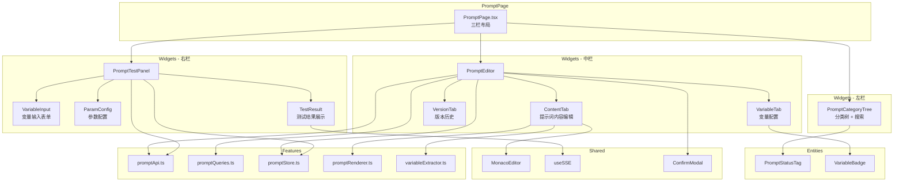
```mermaid
graph TB
    subgraph "PromptPage"
        PAGE[PromptPage.tsx<br/>三栏布局]
    end

    subgraph "Widgets - 左栏"
        W_TREE[PromptCategoryTree<br/>分类树 + 搜索]
    end

    subgraph "Widgets - 中栏"
        W_EDITOR[PromptEditor]
        W_CONTENT[ContentTab<br/>提示词内容编辑]
        W_VAR[VariableTab<br/>变量配置]
        W_VER[VersionTab<br/>版本历史]
    end

    subgraph "Widgets - 右栏"
        W_TEST[PromptTestPanel]
        W_VAR_INPUT[VariableInput<br/>变量输入表单]
        W_PARAM[ParamConfig<br/>参数配置]
        W_RESULT[TestResult<br/>测试结果展示]
    end

    subgraph "Features"
        F_API[promptApi.ts]
        F_QUERY[promptQueries.ts]
        F_STORE[promptStore.ts]
        F_RENDER[promptRenderer.ts]
        F_EXTRACT[variableExtractor.ts]
    end

    subgraph "Entities"
        E_STATUS[PromptStatusTag]
        E_VAR[VariableBadge]
    end

    subgraph "Shared"
        S_MONACO[MonacoEditor]
        S_SSE[useSSE]
        S_CONFIRM[ConfirmModal]
    end

    PAGE --> W_TREE & W_EDITOR & W_TEST
    W_EDITOR --> W_CONTENT & W_VAR & W_VER
    W_TEST --> W_VAR_INPUT & W_PARAM & W_RESULT

    W_CONTENT --> S_MONACO
    W_RESULT --> S_SSE
    W_EDITOR --> F_API & F_QUERY & F_STORE
    W_CONTENT --> F_RENDER & F_EXTRACT
    W_TEST --> F_API & F_STORE
    W_TREE --> E_STATUS
    W_VAR --> E_VAR
    W_EDITOR --> S_CONFIRM
```

### 8.3 关键接口

#### 8.3.1 API函数定义

```typescript
// src/features/prompt/api/promptApi.ts
import { apiClient } from '@shared/api/apiClient';
import type { ApiResponse, PaginatedResponse, PaginationParams } from '@shared/api/types';
import type {
  PromptDTO, PromptDetailDTO, CreatePromptDTO, UpdatePromptDTO,
  PromptVersionDTO, PromptCategoryDTO, PromptTestRequest, PromptTestResponse,
} from '../model/types';

const BASE = '/api/v1/prompts';

export const promptApi = {
  /** 获取提示词列表 */
  getList: (params: PaginationParams & { category_id?: string; status?: string; keyword?: string }) =>
    apiClient.get<ApiResponse<PaginatedResponse<PromptDTO>>>(BASE, { params }),

  /** 获取提示词详情 */
  getDetail: (id: string) =>
    apiClient.get<ApiResponse<PromptDetailDTO>>(`${BASE}/${id}`),

  /** 创建提示词 */
  create: (data: CreatePromptDTO) =>
    apiClient.post<ApiResponse<PromptDTO>>(BASE, data),

  /** 更新提示词 */
  update: (id: string, data: UpdatePromptDTO) =>
    apiClient.put<ApiResponse<PromptDTO>>(`${BASE}/${id}`, data),

  /** 删除提示词 */
  delete: (id: string) =>
    apiClient.delete<ApiResponse<void>>(`${BASE}/${id}`),

  /** 发布提示词（draft → published） */
  publish: (id: string) =>
    apiClient.post<ApiResponse<PromptDTO>>(`${BASE}/${id}/publish`),

  /** 获取版本历史 */
  getVersions: (id: string) =>
    apiClient.get<ApiResponse<PromptVersionDTO[]>>(`${BASE}/${id}/versions`),

  /** 回滚到指定版本 */
  rollback: (id: string, version: number) =>
    apiClient.post<ApiResponse<PromptDTO>>(`${BASE}/${id}/rollback`, { version }),

  /** 获取分类树 */
  getCategories: () =>
    apiClient.get<ApiResponse<PromptCategoryDTO[]>>(`${BASE}/categories`),

  /** 创建分类 */
  createCategory: (data: { name: string; parent_id?: string }) =>
    apiClient.post<ApiResponse<PromptCategoryDTO>>(`${BASE}/categories`, data),

  /** 测试提示词（SSE流式）— 返回URL */
  getTestURL: (id: string) => `${apiClient.defaults.baseURL}${BASE}/${id}/test`,

  /** 测试提示词（非流式） */
  test: (id: string, data: PromptTestRequest) =>
    apiClient.post<ApiResponse<PromptTestResponse>>(`${BASE}/${id}/test`, data),
};
```

#### 8.3.2 TanStack Query Hooks

```typescript
// src/features/prompt/api/promptQueries.ts
import { useQuery, useMutation, useQueryClient } from '@tanstack/react-query';
import { message } from 'antd';

import { promptApi } from './promptApi';
import { promptKeys } from './queryKeys';
import type { CreatePromptDTO, UpdatePromptDTO } from '../model/types';

/** 提示词列表 */
export function usePromptList(filters: { category_id?: string; status?: string; keyword?: string; page?: number }) {
  return useQuery({
    queryKey: promptKeys.list(filters),
    queryFn: () => promptApi.getList(filters).then((res) => res.data.data),
  });
}

/** 提示词详情 */
export function usePromptDetail(id: string | null) {
  return useQuery({
    queryKey: promptKeys.detail(id!),
    queryFn: () => promptApi.getDetail(id!).then((res) => res.data.data),
    enabled: !!id,
  });
}

/** 分类树 */
export function usePromptCategories() {
  return useQuery({
    queryKey: promptKeys.categories(),
    queryFn: () => promptApi.getCategories().then((res) => res.data.data),
  });
}

/** 版本历史 */
export function usePromptVersions(id: string | null) {
  return useQuery({
    queryKey: promptKeys.versions(id!),
    queryFn: () => promptApi.getVersions(id!).then((res) => res.data.data),
    enabled: !!id,
  });
}

/** 创建提示词 */
export function useCreatePrompt() {
  const qc = useQueryClient();
  return useMutation({
    mutationFn: (data: CreatePromptDTO) => promptApi.create(data).then((res) => res.data.data),
    onSuccess: () => {
      message.success('提示词创建成功');
      qc.invalidateQueries({ queryKey: promptKeys.all });
    },
  });
}

/** 更新提示词 */
export function useUpdatePrompt() {
  const qc = useQueryClient();
  return useMutation({
    mutationFn: ({ id, data }: { id: string; data: UpdatePromptDTO }) =>
      promptApi.update(id, data).then((res) => res.data.data),
    onSuccess: (_, { id }) => {
      message.success('提示词已保存');
      qc.invalidateQueries({ queryKey: promptKeys.detail(id) });
      qc.invalidateQueries({ queryKey: promptKeys.lists() });
    },
  });
}

/** 删除提示词 */
export function useDeletePrompt() {
  const qc = useQueryClient();
  return useMutation({
    mutationFn: (id: string) => promptApi.delete(id),
    onSuccess: () => {
      message.success('提示词已删除');
      qc.invalidateQueries({ queryKey: promptKeys.all });
    },
  });
}

/** 发布提示词 */
export function usePublishPrompt() {
  const qc = useQueryClient();
  return useMutation({
    mutationFn: (id: string) => promptApi.publish(id).then((res) => res.data.data),
    onSuccess: (_, id) => {
      message.success('提示词已发布');
      qc.invalidateQueries({ queryKey: promptKeys.detail(id) });
      qc.invalidateQueries({ queryKey: promptKeys.lists() });
    },
  });
}
```

### 8.4 数据模型

```typescript
// src/features/prompt/model/types.ts

/** 提示词状态 */
export type PromptStatus = 'draft' | 'published' | 'archived';

/** 变量类型 */
export type VariableType = 'string' | 'number' | 'boolean' | 'enum' | 'text' | 'json';

/** 变量定义 */
export interface VariableDefinition {
  name: string;
  type: VariableType;
  description: string;
  required: boolean;
  default_value?: string;
  /** enum类型的可选值 */
  enum_values?: string[];
  /** 验证规则 */
  validation?: {
    min_length?: number;
    max_length?: number;
    pattern?: string;
  };
}

/** 提示词列表项DTO */
export interface PromptDTO {
  id: string;
  name: string;
  description: string;
  category_id: string;
  category_name: string;
  status: PromptStatus;
  version: number;
  variable_count: number;
  tags: string[];
  created_at: string;
  updated_at: string;
}

/** 提示词详情DTO */
export interface PromptDetailDTO extends PromptDTO {
  /** 提示词模板内容（含{{variable}}占位符） */
  content: string;
  /** 系统提示词（可选） */
  system_prompt?: string;
  /** 变量定义列表 */
  variables: VariableDefinition[];
  /** 模型参数默认值 */
  default_params: {
    temperature?: number;
    max_tokens?: number;
    top_p?: number;
  };
}

/** 创建提示词请求 */
export interface CreatePromptDTO {
  name: string;
  description: string;
  category_id: string;
  content: string;
  system_prompt?: string;
  variables?: VariableDefinition[];
  tags?: string[];
  default_params?: PromptDetailDTO['default_params'];
}

/** 更新提示词请求 */
export interface UpdatePromptDTO {
  name?: string;
  description?: string;
  category_id?: string;
  content?: string;
  system_prompt?: string;
  variables?: VariableDefinition[];
  tags?: string[];
  default_params?: PromptDetailDTO['default_params'];
}

/** 提示词版本DTO */
export interface PromptVersionDTO {
  version: number;
  content: string;
  variables: VariableDefinition[];
  change_summary: string;
  status: PromptStatus;
  created_at: string;
  created_by: string;
}

/** 提示词分类 */
export interface PromptCategoryDTO {
  id: string;
  name: string;
  parent_id: string | null;
  children?: PromptCategoryDTO[];
  prompt_count: number;
}

/** 测试请求 */
export interface PromptTestRequest {
  /** 变量值 */
  variables: Record<string, string>;
  /** 使用的模型ID */
  model_id: string;
  /** 模型参数覆盖 */
  params?: {
    temperature?: number;
    max_tokens?: number;
    top_p?: number;
  };
  /** 是否流式 */
  stream?: boolean;
}

/** 测试响应 */
export interface PromptTestResponse {
  /** 模型输出 */
  output: string;
  /** 渲染后的完整提示词（变量已替换） */
  rendered_prompt: string;
  /** 耗时(ms) */
  latency: number;
  /** Token统计 */
  token_usage: {
    prompt_tokens: number;
    completion_tokens: number;
    total_tokens: number;
  };
  /** 使用的模型信息 */
  model_info: {
    id: string;
    name: string;
    provider: string;
  };
  /** 是否使用了备用模型（故障转移） */
  used_fallback: boolean;
  /** 降级原因（如"429 Rate Limit"），仅在 used_fallback=true 时有值 */
  fallback_reason?: string;
  /** 原始请求的模型ID，仅在 used_fallback=true 时有值 */
  original_model_id?: string;
}
```

### 8.5 关键流程

#### 8.5.1 提示词编辑与变量提取流程

> **增强**: 添加实时变量提取监控、变量状态追踪、智能提示

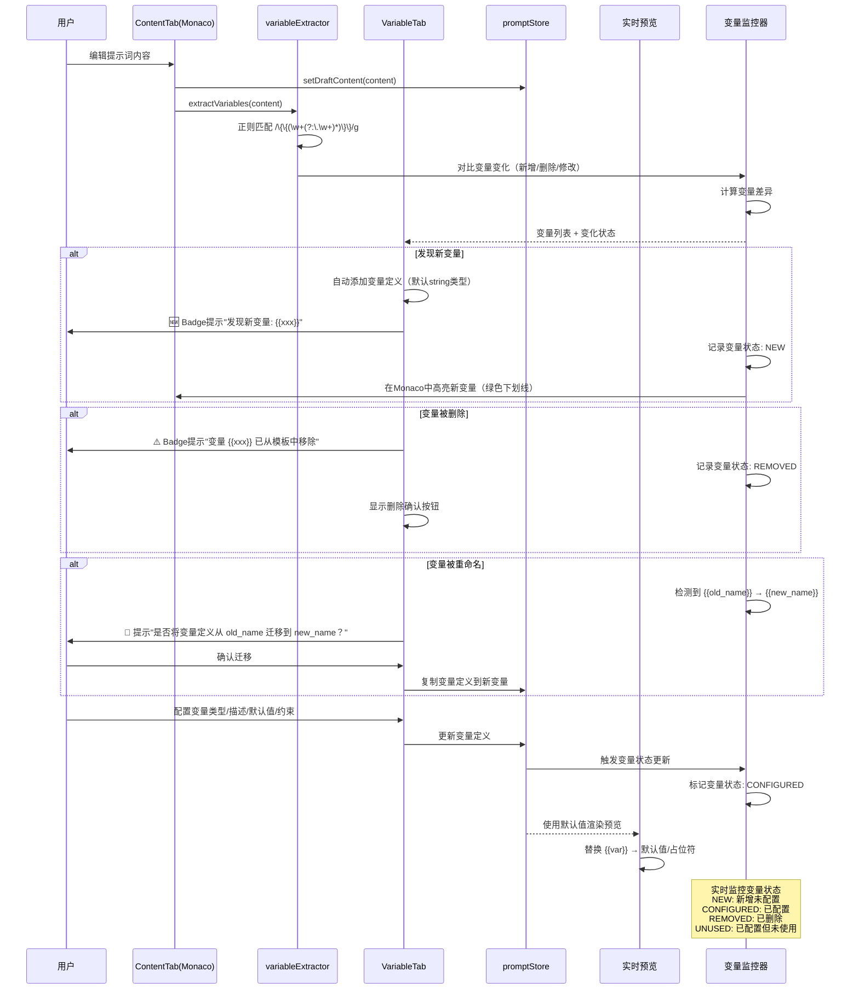
```mermaid
sequenceDiagram
    participant User as 用户
    participant Editor as ContentTab(Monaco)
    participant Extractor as variableExtractor
    participant VarTab as VariableTab
    participant Store as promptStore
    participant Preview as 实时预览
    participant Monitor as 变量监控器

    User->>Editor: 编辑提示词内容
    Editor->>Store: setDraftContent(content)
    Editor->>Extractor: extractVariables(content)
    Extractor->>Extractor: 正则匹配 /\{\{(\w+(?:\.\w+)*)\}\}/g
    Extractor->>Monitor: 对比变量变化（新增/删除/修改）

    Monitor->>Monitor: 计算变量差异
    Monitor-->>VarTab: 变量列表 + 变化状态

    alt 发现新变量
        VarTab->>VarTab: 自动添加变量定义（默认string类型）
        VarTab->>User: 🆕 Badge提示"发现新变量: {{xxx}}"
        Monitor->>Monitor: 记录变量状态: NEW
        Monitor->>Editor: 在Monaco中高亮新变量（绿色下划线）
    end

    alt 变量被删除
        VarTab->>User: ⚠️ Badge提示"变量 {{xxx}} 已从模板中移除"
        Monitor->>Monitor: 记录变量状态: REMOVED
        VarTab->>VarTab: 显示删除确认按钮
    end

    alt 变量被重命名
        Monitor->>Monitor: 检测到 {{old_name}} → {{new_name}}
        VarTab->>User: 🔄 提示"是否将变量定义从 old_name 迁移到 new_name？"
        User->>VarTab: 确认迁移
        VarTab->>Store: 复制变量定义到新变量
    end

    User->>VarTab: 配置变量类型/描述/默认值/约束
    VarTab->>Store: 更新变量定义
    Store->>Monitor: 触发变量状态更新
    Monitor->>Monitor: 标记变量状态: CONFIGURED

    Store-->>Preview: 使用默认值渲染预览
    Preview->>Preview: 替换 {{var}} → 默认值/占位符

    Note over Monitor: 实时监控变量状态<br/>NEW: 新增未配置<br/>CONFIGURED: 已配置<br/>REMOVED: 已删除<br/>UNUSED: 已配置但未使用
```

**实时变量监控增强**：

1. **变量状态追踪**：

```typescript
// src/features/prompt/lib/variableMonitor.ts

export enum VariableStatus {
  NEW = 'new',           // 新增变量，未配置
  CONFIGURED = 'configured', // 已配置
  REMOVED = 'removed',   // 已从模板中删除
  UNUSED = 'unused',     // 已配置但未在模板中使用
}

export interface VariableChange {
  name: string;
  status: VariableStatus;
  previousValue?: VariableDefinition;
  timestamp: number;
  /** FIX-19: 重命名来源（仅在检测到重命名时有值） */
  renamedFrom?: string;
}

/**
 * 变量监控器
 * 实时追踪变量的新增、删除、重命名
 */
export class VariableMonitor {
  private previousVariables = new Set<string>();
  private changeHistory: VariableChange[] = [];

  /**
   * 检测变量变化
   * @param currentContent 当前模板内容
   * @param configuredVariables 已配置的变量定义
   * @returns 变量变化列表
   */
  detectChanges(
    currentContent: string,
    configuredVariables: Map<string, VariableDefinition>
  ): VariableChange[] {
    const currentVariables = this.extractVariables(currentContent);
    const changes: VariableChange[] = [];
    const now = Date.now();

    // 检测新增变量
    currentVariables.forEach(varName => {
      if (!this.previousVariables.has(varName)) {
        const status = configuredVariables.has(varName)
          ? VariableStatus.CONFIGURED
          : VariableStatus.NEW;
        changes.push({ name: varName, status, timestamp: now });
      }
    });

    // 检测删除变量
    const removed: string[] = [];
    const added: string[] = [];
    this.previousVariables.forEach(varName => {
      if (!currentVariables.has(varName)) {
        removed.push(varName);
        changes.push({
          name: varName,
          status: VariableStatus.REMOVED,
          previousValue: configuredVariables.get(varName),
          timestamp: now
        });
      }
    });
    currentVariables.forEach(varName => {
      if (!this.previousVariables.has(varName)) added.push(varName);
    });

    /**
     * 变量重命名检测规则（FIX-19，P0简化版）
     *
     * 触发条件：同一次编辑操作中，恰好删除1个变量且新增1个变量
     * 判断逻辑：
     * 1. 如果 removed.length === 1 && added.length === 1，触发重命名提示
     * 2. 提示："检测到变量 {{removed[0]}} 可能被重命名为 {{added[0]}}，是否迁移变量定义？"
     * 3. 用户选择"迁移"：将旧变量的默认值、描述等元数据复制到新变量
     * 4. 用户选择"不迁移"：视为独立的删除和新增操作
     * 其他情况（同时删除/新增多个变量）：视为独立操作，不触发重命名提示
     */
    if (removed.length === 1 && added.length === 1) {
      changes.push({
        name: added[0],
        status: VariableStatus.NEW,
        previousValue: configuredVariables.get(removed[0]), // 携带旧变量定义，供迁移使用
        timestamp: now,
        renamedFrom: removed[0], // 标记为重命名
      });
    }

    // 检测未使用变量
    configuredVariables.forEach((def, varName) => {
      if (!currentVariables.has(varName)) {
        changes.push({
          name: varName,
          status: VariableStatus.UNUSED,
          previousValue: def,
          timestamp: now
        });
      }
    });

    // 更新历史记录
    this.changeHistory.push(...changes);
    this.previousVariables = currentVariables;

    return changes;
  }

  private extractVariables(content: string): Set<string> {
    const regex = /\{\{(\w+(?:\.\w+)*)\}\}/g;
    const variables = new Set<string>();
    let match;
    while ((match = regex.exec(content)) !== null) {
      variables.add(match[1]);
    }
    return variables;
  }

  /**
   * 获取变量变化历史
   */
  getHistory(): VariableChange[] {
    return this.changeHistory;
  }

  /**
   * 清空历史记录
   */
  clearHistory(): void {
    this.changeHistory = [];
  }
}
```

2. **Monaco编辑器变量高亮**：

```typescript
// src/shared/ui/MonacoEditor/variableDecorations.ts

/**
 * 在Monaco编辑器中高亮变量
 * 新变量显示绿色下划线，未配置变量显示黄色波浪线
 */
export function applyVariableDecorations(
  editor: monaco.editor.IStandaloneCodeEditor,
  variables: Map<string, VariableStatus>
): void {
  const model = editor.getModel();
  if (!model) return;

  const decorations: monaco.editor.IModelDeltaDecoration[] = [];
  const content = model.getValue();
  const regex = /\{\{(\w+(?:\.\w+)*)\}\}/g;
  let match;

  while ((match = regex.exec(content)) !== null) {
    const varName = match[1];
    const status = variables.get(varName);
    const startPos = model.getPositionAt(match.index);
    const endPos = model.getPositionAt(match.index + match[0].length);

    let className = '';
    let hoverMessage = '';

    switch (status) {
      case VariableStatus.NEW:
        className = 'variable-new';
        hoverMessage = `新变量: ${varName}（点击配置）`;
        break;
      case VariableStatus.CONFIGURED:
        className = 'variable-configured';
        hoverMessage = `已配置变量: ${varName}`;
        break;
      case VariableStatus.UNUSED:
        className = 'variable-unused';
        hoverMessage = `未使用变量: ${varName}（已配置但未在模板中使用）`;
        break;
    }

    decorations.push({
      range: new monaco.Range(
        startPos.lineNumber,
        startPos.column,
        endPos.lineNumber,
        endPos.column
      ),
      options: {
        inlineClassName: className,
        hoverMessage: { value: hoverMessage }
      }
    });
  }

  editor.deltaDecorations([], decorations);
}
```

3. **VariableTab实时状态显示**：

```typescript
// src/widgets/prompt/PromptEditor/VariableTab.tsx

export const VariableTab = () => {
  const { draftContent, variableDefinitions } = usePromptStore();
  const [monitor] = useState(() => new VariableMonitor());
  const [changes, setChanges] = useState<VariableChange[]>([]);

  // 实时监控变量变化
  useEffect(() => {
    const detectedChanges = monitor.detectChanges(
      draftContent,
      new Map(Object.entries(variableDefinitions))
    );
    setChanges(detectedChanges);
  }, [draftContent, variableDefinitions]);

  // 按状态分组显示变量
  const newVariables = changes.filter(c => c.status === VariableStatus.NEW);
  const removedVariables = changes.filter(c => c.status === VariableStatus.REMOVED);
  const unusedVariables = changes.filter(c => c.status === VariableStatus.UNUSED);

  return (
    <div>
      {/* 新增变量提示 */}
      {newVariables.length > 0 && (
        <Alert
          type="info"
          message={`发现 ${newVariables.length} 个新变量`}
          description={
            <Space direction="vertical">
              {newVariables.map(v => (
                <Badge key={v.name} status="processing" text={`{{${v.name}}}`} />
              ))}
              <Button size="small" onClick={() => autoConfigureVariables(newVariables)}>
                自动配置全部
              </Button>
            </Space>
          }
          closable
        />
      )}

      {/* 删除变量提示 */}
      {removedVariables.length > 0 && (
        <Alert
          type="warning"
          message={`${removedVariables.length} 个变量已从模板中移除`}
          description={
            <Space direction="vertical">
              {removedVariables.map(v => (
                <div key={v.name}>
                  <Badge status="error" text={`{{${v.name}}}`} />
                  <Button size="small" danger onClick={() => deleteVariableDefinition(v.name)}>
                    删除定义
                  </Button>
                </div>
              ))}
            </Space>
          }
          closable
        />
      )}

      {/* 未使用变量提示 */}
      {unusedVariables.length > 0 && (
        <Alert
          type="warning"
          message={`${unusedVariables.length} 个变量已配置但未使用`}
          description={unusedVariables.map(v => v.name).join(', ')}
          closable
        />
      )}

      {/* 变量配置表单 */}
      <VariableConfigForm variables={variableDefinitions} />
    </div>
  );
};
```

**用户体验优化**：

1. **实时反馈**：用户输入`{{new_var}}`后，立即在VariableTab显示"发现新变量"提示
2. **智能提示**：Monaco编辑器中，新变量显示绿色下划线，鼠标悬停显示"点击配置"
3. **批量操作**：支持"自动配置全部新变量"按钮，一键为所有新变量设置默认类型
4. **变量迁移**：检测到变量重命名时，提示用户是否迁移变量定义
5. **历史记录**：保留变量变化历史，方便用户撤销操作

#### 8.5.2 提示词在线测试流程

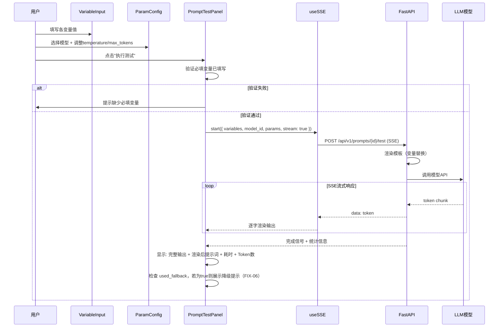
```mermaid
sequenceDiagram
    participant User as 用户
    participant VarInput as VariableInput
    participant ParamCfg as ParamConfig
    participant TestPanel as PromptTestPanel
    participant SSE as useSSE
    participant Backend as FastAPI
    participant LLM as LLM模型

    User->>VarInput: 填写各变量值
    User->>ParamCfg: 选择模型 + 调整temperature/max_tokens
    User->>TestPanel: 点击"执行测试"
    TestPanel->>TestPanel: 验证必填变量已填写

    alt 验证失败
        TestPanel->>User: 提示缺少必填变量
    else 验证通过
        TestPanel->>SSE: start({ variables, model_id, params, stream: true })
        SSE->>Backend: POST /api/v1/prompts/{id}/test (SSE)
        Backend->>Backend: 渲染模板（变量替换）
        Backend->>LLM: 调用模型API

        loop SSE流式响应
            LLM-->>Backend: token chunk
            Backend-->>SSE: data: token
            SSE-->>TestPanel: 逐字渲染输出
        end

        Backend-->>TestPanel: 完成信号 + 统计信息
        TestPanel->>TestPanel: 显示: 完整输出 + 渲染后提示词 + 耗时 + Token数
        TestPanel->>TestPanel: 检查 used_fallback，若为true则展示降级提示（FIX-06）
    end
```

**PromptTestPanel 增强设计**：

```typescript
// 测试按钮防抖（FIX-20）：最少间隔5秒，防止触发429限流
const [testCooldown, setTestCooldown] = useState(false);
const handleTest = async () => {
    if (testCooldown) return;
    setTestCooldown(true);
    setTimeout(() => setTestCooldown(false), 5000);
    await runTest();
};

// 降级提示（FIX-06）：当 used_fallback === true 时展示
{result?.used_fallback && (
    <Alert type="warning" showIcon
        message="模型已降级"
        description={`当前结果来自备用模型（${result.model_info.name}），原始模型（${result.original_model_id}）因${result.fallback_reason}暂时不可用。`}
    />
)}
```

### 8.6 UI布局

> **追溯**: P0交互需求 3.3节（提示词管理模块布局 - 三栏布局）

```
┌──────────────────────────────────────────────────────────────────────────┐
│ [提示词管理]                                                             │
├────────────┬──────────────────────────────────┬──────────────────────────┤
│ 左栏(240px) │ 中栏(自适应)                      │ 右栏(360px)              │
│            │                                  │                          │
│ 分类树      │ [内容] [变量] [版本]              │ 测试面板                  │
│ ┌────────┐ │                                  │                          │
│ │ 搜索...│ │ 名称: [心理分析提示词]            │ 变量输入:                 │
│ ├────────┤ │ 描述: [用于分析...]               │ ┌────────────────────┐   │
│ │▼ 分析类│ │ 标签: [分析] [心理] [+]           │ │ user_name: [张三]  │   │
│ │  心理  │ │ 状态: ● 草稿                      │ │ context: [多行...]  │   │
│ │  行为  │ │                                  │ │ scenario: [审讯▼]  │   │
│ │▼ 报告类│ │ ┌──────────────────────────────┐ │ └────────────────────┘   │
│ │  摘要  │ │ │ Monaco Editor                │ │                          │
│ │  详细  │ │ │                              │ │ 参数配置:                 │
│ │▼ 系统类│ │ │ 你是一位专业的心理分析师。    │ │ 模型: [GPT-4o▼]          │
│ │  ...   │ │ │                              │ │ Temperature: [0.7]       │
│ └────────┘ │ │ 请分析以下人物信息：          │ │ Max Tokens: [2048]       │
│            │ │ {{context}}                   │ │                          │
│ [+ 新建]   │ │                              │ │ [执行测试]               │
│ [+ 新分类] │ │ 分析对象：{{user_name}}       │ │ ─────────────────────    │
│            │ │ 场景：{{scenario}}            │ │ 测试结果:                │
│            │ │                              │ │ ┌────────────────────┐   │
│            │ │ 请从以下维度进行分析：        │ │ │ 根据提供的信息，   │   │
│            │ │ 1. 人格特征                   │ │ │ 张三表现出以下心   │   │
│            │ │ 2. 情绪状态                   │ │ │ 理特征：           │   │
│            │ │ 3. 行为模式                   │ │ │ 1. 人格特征：...   │   │
│            │ │ 4. 风险评估                   │ │ │ 2. 情绪状态：...   │   │
│            │ └──────────────────────────────┘ │ │ ...                │   │
│            │                                  │ └────────────────────┘   │
│            │ 预览: 变量已替换的完整提示词 ▼    │ 耗时: 3.2s               │
│            │ ┌──────────────────────────────┐ │ Tokens: 1,234            │
│            │ │ 你是一位专业的心理分析师...   │ │ 模型: GPT-4o             │
│            │ │ 分析对象：张三               │ │                          │
│            │ └──────────────────────────────┘ │                          │
│            │                                  │                          │
│            │ [保存草稿] [发布]                 │                          │
├────────────┴──────────────────────────────────┴──────────────────────────┤
│ 三栏可拖拽调整宽度                                                        │
└──────────────────────────────────────────────────────────────────────────┘
```

### 8.7 业务逻辑

#### 8.7.1 变量提取器

```typescript
// src/features/prompt/lib/variableExtractor.ts
import type { VariableDefinition } from '../model/types';

/** 变量占位符正则 */
const VARIABLE_REGEX = /\{\{(\w+(?:\.\w+)*)\}\}/g;

/**
 * 从提示词模板中提取变量名列表
 * 支持 {{name}} 和 {{context.user_name}} 格式
 */
export function extractVariableNames(template: string): string[] {
  const names = new Set<string>();
  let match: RegExpExecArray | null;
  while ((match = VARIABLE_REGEX.exec(template)) !== null) {
    names.add(match[1]);
  }
  return Array.from(names);
}

/**
 * 对比新旧变量列表，返回新增和删除的变量
 */
export function diffVariables(
  oldVars: VariableDefinition[],
  newNames: string[],
): { added: string[]; removed: string[] } {
  const oldNames = new Set(oldVars.map((v) => v.name));
  const newSet = new Set(newNames);
  return {
    added: newNames.filter((n) => !oldNames.has(n)),
    removed: oldVars.filter((v) => !newSet.has(v.name)).map((v) => v.name),
  };
}
```

#### 8.7.2 提示词渲染器

```typescript
// src/features/prompt/lib/promptRenderer.ts

/**
 * 渲染提示词模板：将 {{variable}} 替换为实际值
 * @param template 提示词模板
 * @param variables 变量值映射
 * @param fallback 未提供值时的占位符格式，默认保留原始 {{name}}
 */
export function renderPrompt(
  template: string,
  variables: Record<string, string>,
  fallback: 'keep' | 'highlight' | 'empty' = 'keep',
): string {
  return template.replace(/\{\{(\w+(?:\.\w+)*)\}\}/g, (match, name: string) => {
    if (name in variables && variables[name] !== '') {
      return variables[name];
    }
    switch (fallback) {
      case 'highlight':
        return `⟨${name}⟩`; // 高亮未填充的变量
      case 'empty':
        return '';
      case 'keep':
      default:
        return match; // 保留原始 {{name}}
    }
  });
}
```

**开发实现 checklist**：
- [ ] 创建 PromptPage（三栏布局，可拖拽调整宽度）
- [ ] 创建 PromptCategoryTree（分类树 + 搜索 + 新建分类/提示词）
- [ ] 创建 PromptEditor（Tab: 内容/变量/版本）
- [ ] 创建 ContentTab（Monaco编辑器 + 实时预览）
- [ ] 创建 VariableTab（变量定义表格，支持类型/约束/默认值）
- [ ] 创建 VersionTab（版本历史列表 + 版本对比 + 回滚）
- [ ] 创建 PromptTestPanel（变量输入 + 参数配置 + SSE流式结果）
- [ ] 创建 variableExtractor.ts（正则提取 + 增量对比）
- [ ] 创建 promptRenderer.ts（模板渲染 + 占位符处理）
- [ ] 创建 promptApi.ts 和 promptQueries.ts
- [ ] 创建 PromptStatusTag / VariableBadge 实体组件
- [ ] 验证提示词编辑 → 变量自动提取 → 测试执行完整流程
- [ ] 验证SSE流式测试结果渲染
- [ ] 验证版本发布和回滚功能

---

## 9. 模块详细设计：模型管理（P0-1）

### 9.1 功能描述与追溯

> **追溯**: PRD 3.7节（模型管理与调度）、P0交互需求 3.4节（模型管理模块）

**功能范围**：
- 模型注册与配置（支持多提供商：OpenAI、Anthropic、Google、字节豆包、阿里通义）
- 模型健康检查（连通性测试、API Key验证）
- 调度策略配置（按任务类型映射模型、优先级、降级策略）
- 性能监控（响应时间、Token消耗、成功率、错误率）
- 告警管理（阈值配置、告警记录）

### 9.2 组件图

```mermaid
graph TB
    subgraph "ModelPage"
        PAGE[ModelPage.tsx<br/>Tab切换: 列表 | 调度 | 监控]
    end

    subgraph "Widgets - 模型列表"
        W_LIST[ModelList]
        W_CARD[ModelCard<br/>模型卡片]
        W_MODAL[ModelConfigModal<br/>模型配置对话框]
    end

    subgraph "Widgets - 调度策略"
        W_SCHED[ScheduleStrategy]
        W_SELECTOR[StrategySelector<br/>策略选择器]
        W_MAPPING[TaskTypeMapping<br/>任务类型映射]
    end

    subgraph "Widgets - 性能监控"
        W_MONITOR[PerformanceMonitor]
        W_OVERVIEW[MetricsOverview<br/>关键指标概览]
        W_CHART[PerformanceChart<br/>性能对比图表]
        W_ALERT[AlertLog<br/>告警记录]
    end

    subgraph "Features"
        F_API[modelApi.ts]
        F_QUERY[modelQueries.ts]
        F_STORE[modelStore.ts]
        F_METRICS[metricsAggregator.ts]
    end

    subgraph "Entities"
        E_STATUS[ModelStatusDot]
        E_ICON[ProviderIcon]
    end

    PAGE --> W_LIST & W_SCHED & W_MONITOR
    W_LIST --> W_CARD & W_MODAL
    W_SCHED --> W_SELECTOR & W_MAPPING
    W_MONITOR --> W_OVERVIEW & W_CHART & W_ALERT

    W_LIST & W_SCHED & W_MONITOR --> F_API & F_QUERY & F_STORE
    W_MONITOR --> F_METRICS
    W_CARD --> E_STATUS & E_ICON
```

### 9.3 关键接口

```typescript
// src/features/model/api/modelApi.ts
import { apiClient } from '@shared/api/apiClient';
import type { ApiResponse, PaginatedResponse, PaginationParams } from '@shared/api/types';
import type {
  ModelDTO, ModelDetailDTO, CreateModelDTO, UpdateModelDTO,
  ModelMetricsDTO, ScheduleStrategyDTO, UpdateScheduleDTO,
  HealthCheckResult, AlertLogDTO,
} from '../model/types';

const BASE = '/api/v1/models';

export const modelApi = {
  /** 获取模型列表 */
  getList: (params?: PaginationParams & { provider?: string; status?: string }) =>
    apiClient.get<ApiResponse<PaginatedResponse<ModelDTO>>>(BASE, { params }),

  /** 获取模型详情 */
  getDetail: (id: string) =>
    apiClient.get<ApiResponse<ModelDetailDTO>>(`${BASE}/${id}`),

  /** 注册模型 */
  create: (data: CreateModelDTO) =>
    apiClient.post<ApiResponse<ModelDTO>>(BASE, data),

  /** 更新模型配置 */
  update: (id: string, data: UpdateModelDTO) =>
    apiClient.put<ApiResponse<ModelDTO>>(`${BASE}/${id}`, data),

  /** 删除模型 */
  delete: (id: string) =>
    apiClient.delete<ApiResponse<void>>(`${BASE}/${id}`),

  /** 健康检查 */
  healthCheck: (id: string) =>
    apiClient.post<ApiResponse<HealthCheckResult>>(`${BASE}/${id}/health-check`),

  /** 启用/禁用模型 */
  toggleStatus: (id: string, enabled: boolean) =>
    apiClient.patch<ApiResponse<ModelDTO>>(`${BASE}/${id}/status`, { enabled }),

  /** 获取性能指标 */
  getMetrics: (id: string, params: { time_range: string }) =>
    apiClient.get<ApiResponse<ModelMetricsDTO>>(`${BASE}/${id}/metrics`, { params }),

  /** 获取所有模型的对比指标 */
  getComparisonMetrics: (params: { time_range: string }) =>
    apiClient.get<ApiResponse<ModelMetricsDTO[]>>(`${BASE}/metrics/comparison`, { params }),

  /** 获取调度策略 */
  getScheduleStrategy: () =>
    apiClient.get<ApiResponse<ScheduleStrategyDTO>>(`${BASE}/schedule`),

  /** 更新调度策略 */
  updateScheduleStrategy: (data: UpdateScheduleDTO) =>
    apiClient.put<ApiResponse<ScheduleStrategyDTO>>(`${BASE}/schedule`, data),

  /** 获取告警记录 */
  getAlertLogs: (params?: PaginationParams & { model_id?: string; level?: string }) =>
    apiClient.get<ApiResponse<PaginatedResponse<AlertLogDTO>>>(`${BASE}/alerts`, { params }),
};
```

```typescript
// src/features/model/api/modelQueries.ts
import { useQuery, useMutation, useQueryClient } from '@tanstack/react-query';
import { message } from 'antd';

import { modelApi } from './modelApi';
import { modelKeys } from './queryKeys';
import type { CreateModelDTO, UpdateModelDTO, UpdateScheduleDTO } from '../model/types';

export function useModelList(filters?: { provider?: string; status?: string }) {
  return useQuery({
    queryKey: modelKeys.list(filters || {}),
    queryFn: () => modelApi.getList(filters).then((res) => res.data.data),
  });
}

export function useModelDetail(id: string | null) {
  return useQuery({
    queryKey: modelKeys.detail(id!),
    queryFn: () => modelApi.getDetail(id!).then((res) => res.data.data),
    enabled: !!id,
  });
}

export function useModelMetrics(id: string, timeRange: string) {
  return useQuery({
    queryKey: modelKeys.metrics(id, timeRange),
    queryFn: () => modelApi.getMetrics(id, { time_range: timeRange }).then((res) => res.data.data),
    refetchInterval: 60000, // 每分钟自动刷新
  });
}

export function useComparisonMetrics(timeRange: string) {
  return useQuery({
    queryKey: [...modelKeys.all, 'comparison', timeRange],
    queryFn: () => modelApi.getComparisonMetrics({ time_range: timeRange }).then((res) => res.data.data),
    refetchInterval: 60000,
  });
}

export function useScheduleStrategy() {
  return useQuery({
    queryKey: modelKeys.schedules(),
    queryFn: () => modelApi.getScheduleStrategy().then((res) => res.data.data),
  });
}

export function useCreateModel() {
  const qc = useQueryClient();
  return useMutation({
    mutationFn: (data: CreateModelDTO) => modelApi.create(data).then((res) => res.data.data),
    onSuccess: () => {
      message.success('模型注册成功');
      qc.invalidateQueries({ queryKey: modelKeys.all });
    },
  });
}

export function useUpdateModel() {
  const qc = useQueryClient();
  return useMutation({
    mutationFn: ({ id, data }: { id: string; data: UpdateModelDTO }) =>
      modelApi.update(id, data).then((res) => res.data.data),
    onSuccess: (_, { id }) => {
      message.success('模型配置已更新');
      qc.invalidateQueries({ queryKey: modelKeys.detail(id) });
      qc.invalidateQueries({ queryKey: modelKeys.lists() });
    },
  });
}

export function useHealthCheck() {
  return useMutation({
    mutationFn: (id: string) => modelApi.healthCheck(id).then((res) => res.data.data),
    onSuccess: (result) => {
      if (result.healthy) {
        message.success(`健康检查通过，延迟: ${result.latency_ms}ms`);
      } else {
        message.error(`健康检查失败: ${result.error}`);
      }
    },
  });
}

export function useToggleModelStatus() {
  const qc = useQueryClient();
  return useMutation({
    mutationFn: ({ id, enabled }: { id: string; enabled: boolean }) =>
      modelApi.toggleStatus(id, enabled).then((res) => res.data.data),
    onSuccess: () => {
      qc.invalidateQueries({ queryKey: modelKeys.all });
    },
  });
}

export function useUpdateSchedule() {
  const qc = useQueryClient();
  return useMutation({
    mutationFn: (data: UpdateScheduleDTO) =>
      modelApi.updateScheduleStrategy(data).then((res) => res.data.data),
    onSuccess: () => {
      message.success('调度策略已更新');
      qc.invalidateQueries({ queryKey: modelKeys.schedules() });
    },
  });
}
```

### 9.4 数据模型

```typescript
// src/features/model/model/types.ts

/** 模型提供商 */
export type ModelProvider = 'openai' | 'anthropic' | 'google' | 'doubao' | 'tongyi' | 'custom';

/** 模型状态 */
export type ModelStatus = 'active' | 'inactive' | 'error' | 'checking';

/** 模型能力 */
export type ModelCapability = 'text' | 'vision' | 'embedding' | 'function_calling';

/** 模型列表项DTO */
export interface ModelDTO {
  id: string;
  name: string;
  provider: ModelProvider;
  model_id: string; // 提供商的模型标识，如 "gpt-4o"
  status: ModelStatus;
  enabled: boolean;
  capabilities: ModelCapability[];
  max_tokens: number;
  cost_per_1k_tokens: { input: number; output: number };
  created_at: string;
  updated_at: string;
}

/** 模型详情DTO */
export interface ModelDetailDTO extends ModelDTO {
  /** API配置（敏感信息脱敏） */
  api_config: {
    base_url: string;
    api_key_masked: string; // "sk-****xxxx"
    organization?: string;
    custom_headers?: Record<string, string>;
  };
  /** 默认参数 */
  default_params: {
    temperature: number;
    max_tokens: number;
    top_p: number;
    frequency_penalty: number;
    presence_penalty: number;
  };
  /** 最近一次健康检查 */
  last_health_check?: HealthCheckResult;
}

/** 创建模型请求 */
export interface CreateModelDTO {
  name: string;
  provider: ModelProvider;
  model_id: string;
  api_config: {
    base_url: string;
    api_key: string;
    organization?: string;
  };
  capabilities: ModelCapability[];
  max_tokens: number;
  default_params?: Partial<ModelDetailDTO['default_params']>;
  cost_per_1k_tokens?: { input: number; output: number };
}

/** 更新模型请求 */
export interface UpdateModelDTO {
  name?: string;
  api_config?: {
    base_url?: string;
    api_key?: string;
    organization?: string;
  };
  default_params?: Partial<ModelDetailDTO['default_params']>;
  cost_per_1k_tokens?: { input: number; output: number };
}

/** 健康检查结果 */
export interface HealthCheckResult {
  healthy: boolean;
  latency_ms: number;
  error?: string;
  checked_at: string;
}

/** 性能指标DTO */
export interface ModelMetricsDTO {
  model_id: string;
  model_name: string;
  time_range: string;
  /** 请求总数 */
  total_requests: number;
  /** 成功率 */
  success_rate: number;
  /** 平均响应时间(ms) */
  avg_latency: number;
  /** P95响应时间(ms) */
  p95_latency: number;
  /** 总Token消耗 */
  total_tokens: number;
  /** 总费用 */
  total_cost: number;
  /** 时间序列数据（用于图表） */
  time_series: Array<{
    timestamp: string;
    requests: number;
    avg_latency: number;
    success_rate: number;
    tokens: number;
  }>;
}

/** 调度策略DTO */
export interface ScheduleStrategyDTO {
  /** 默认模型ID */
  default_model_id: string;
  /** 调度模式 */
  mode: 'priority' | 'round_robin' | 'cost_optimized' | 'latency_optimized';
  /** 任务类型 → 模型映射 */
  task_type_mapping: Array<{
    task_type: string;
    task_label: string;
    primary_model_id: string;
    fallback_model_id?: string;
  }>;
  /** 降级策略 */
  fallback: {
    enabled: boolean;
    max_retries: number;
    retry_delay_ms: number;
  };
}

/** 更新调度策略请求 */
export interface UpdateScheduleDTO {
  default_model_id?: string;
  mode?: ScheduleStrategyDTO['mode'];
  task_type_mapping?: ScheduleStrategyDTO['task_type_mapping'];
  fallback?: ScheduleStrategyDTO['fallback'];
}

/** 告警记录 */
export interface AlertLogDTO {
  id: string;
  model_id: string;
  model_name: string;
  level: 'warning' | 'error' | 'critical';
  type: 'latency' | 'error_rate' | 'availability' | 'cost';
  message: string;
  value: number;
  threshold: number;
  created_at: string;
  resolved: boolean;
}
```

**Zod验证Schema（FIX-17补充）**：

```typescript
// src/features/model/model/schemas.ts
import { z } from 'zod';

export const createModelSchema = z.object({
  name: z.string().min(1, '模型名称不能为空').max(100),
  provider: z.enum(['openai', 'anthropic', 'google', 'doubao', 'tongyi', 'custom']),
  model_id: z.string().min(1, '模型标识不能为空').max(100),
  api_config: z.object({
    base_url: z.string().url('请输入有效的URL'),
    api_key: z.string().min(1, 'API Key不能为空'),
    organization: z.string().optional(),
  }),
  capabilities: z.array(z.enum(['text', 'vision', 'embedding', 'function_calling'])).min(1, '至少选择一种能力'),
  max_tokens: z.number().int().min(1).max(1000000),
  default_params: z.object({
    temperature: z.number().min(0).max(2).default(0.7),
    max_tokens: z.number().int().min(1).max(100000).default(2048),
    top_p: z.number().min(0).max(1).default(1),
    frequency_penalty: z.number().min(-2).max(2).default(0),
    presence_penalty: z.number().min(-2).max(2).default(0),
  }).optional(),
  cost_per_1k_tokens: z.object({
    input: z.number().min(0),
    output: z.number().min(0),
  }).optional(),
});

export type CreateModelFormValues = z.infer<typeof createModelSchema>;
```

### 9.5 关键流程

#### 9.5.1 模型注册与健康检查流程

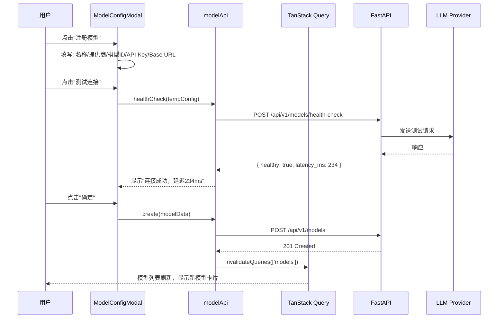
```mermaid
sequenceDiagram
    participant User as 用户
    participant Modal as ModelConfigModal
    participant API as modelApi
    participant TQ as TanStack Query
    participant Backend as FastAPI
    participant LLM as LLM Provider

    User->>Modal: 点击"注册模型"
    Modal->>Modal: 填写: 名称/提供商/模型ID/API Key/Base URL
    User->>Modal: 点击"测试连接"
    Modal->>API: healthCheck(tempConfig)
    API->>Backend: POST /api/v1/models/health-check
    Backend->>LLM: 发送测试请求
    LLM-->>Backend: 响应
    Backend-->>API: { healthy: true, latency_ms: 234 }
    API-->>Modal: 显示"连接成功，延迟234ms"

    User->>Modal: 点击"确定"
    Modal->>API: create(modelData)
    API->>Backend: POST /api/v1/models
    Backend-->>API: 201 Created
    API-->>TQ: invalidateQueries(['models'])
    TQ-->>User: 模型列表刷新，显示新模型卡片
```

#### 9.5.2 性能监控数据流

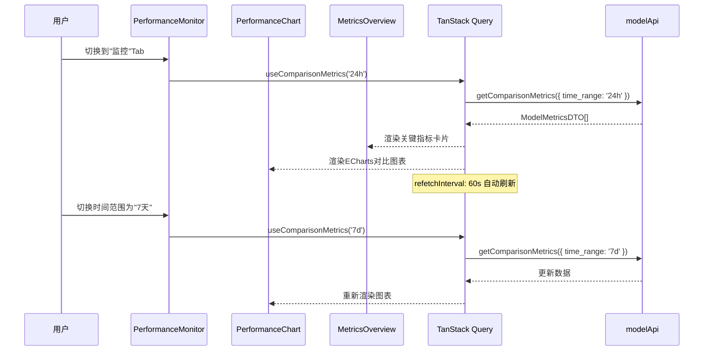
```mermaid
sequenceDiagram
    participant User as 用户
    participant Monitor as PerformanceMonitor
    participant Chart as PerformanceChart
    participant Overview as MetricsOverview
    participant TQ as TanStack Query
    participant API as modelApi

    User->>Monitor: 切换到"监控"Tab
    Monitor->>TQ: useComparisonMetrics('24h')
    TQ->>API: getComparisonMetrics({ time_range: '24h' })
    API-->>TQ: ModelMetricsDTO[]
    TQ-->>Overview: 渲染关键指标卡片
    TQ-->>Chart: 渲染ECharts对比图表

    Note over TQ: refetchInterval: 60s 自动刷新

    User->>Monitor: 切换时间范围为"7天"
    Monitor->>TQ: useComparisonMetrics('7d')
    TQ->>API: getComparisonMetrics({ time_range: '7d' })
    API-->>TQ: 更新数据
    TQ-->>Chart: 重新渲染图表
```

### 9.6 UI布局

> **追溯**: P0交互需求 3.4节（模型管理模块布局）

#### 9.6.1 模型列表Tab

```
┌─────────────────────────────────────────────────────────────────┐
│ [模型管理]                              [列表] [调度] [监控]     │
├─────────────────────────────────────────────────────────────────┤
│ 过滤: [全部提供商▼] [全部状态▼]  搜索: [______]  [+ 注册模型]  │
├─────────────────────────────────────────────────────────────────┤
│                                                                 │
│ ┌─────────────────┐ ┌─────────────────┐ ┌─────────────────┐   │
│ │ 🟢 GPT-4o       │ │ 🟢 Claude 3.5   │ │ 🔴 Gemini Pro   │   │
│ │ OpenAI          │ │ Anthropic       │ │ Google          │   │
│ │                 │ │                 │ │                 │   │
│ │ 能力: 文本 视觉 │ │ 能力: 文本 FC   │ │ 能力: 文本 视觉 │   │
│ │ 延迟: 1.2s      │ │ 延迟: 0.8s      │ │ 延迟: --        │   │
│ │ 成功率: 99.2%   │ │ 成功率: 99.8%   │ │ 成功率: --      │   │
│ │ 费用: $0.03/1K  │ │ 费用: $0.015/1K │ │ 费用: $0.01/1K  │   │
│ │                 │ │                 │ │                 │   │
│ │ [配置] [检查]   │ │ [配置] [检查]   │ │ [配置] [检查]   │   │
│ │ [启用 ✓]        │ │ [启用 ✓]        │ │ [启用 ✗]        │   │
│ └─────────────────┘ └─────────────────┘ └─────────────────┘   │
│                                                                 │
│ ┌─────────────────┐ ┌─────────────────┐                       │
│ │ 🟢 豆包          │ │ 🟡 通义千问     │                       │
│ │ ByteDance       │ │ Alibaba         │                       │
│ │ ...             │ │ ...             │                       │
│ └─────────────────┘ └─────────────────┘                       │
└─────────────────────────────────────────────────────────────────┘
```

#### 9.6.2 调度策略Tab

```
┌─────────────────────────────────────────────────────────────────┐
│ [模型管理]                              [列表] [调度] [监控]     │
├─────────────────────────────────────────────────────────────────┤
│ 调度模式: (●) 优先级  ( ) 轮询  ( ) 成本优化  ( ) 延迟优化     │
│ 默认模型: [GPT-4o ▼]                                           │
├─────────────────────────────────────────────────────────────────┤
│ 任务类型映射:                                                    │
│ ┌──────────────┬──────────────┬──────────────┬────────────────┐ │
│ │ 任务类型     │ 主模型       │ 降级模型     │ 操作           │ │
│ ├──────────────┼──────────────┼──────────────┼────────────────┤ │
│ │ 心理分析     │ GPT-4o ▼     │ Claude 3.5 ▼ │ 编辑 删除      │ │
│ │ 报告生成     │ Claude 3.5 ▼ │ GPT-4o ▼     │ 编辑 删除      │ │
│ │ 知识提取     │ GPT-4o ▼     │ 豆包 ▼       │ 编辑 删除      │ │
│ │ RAG查询      │ GPT-4o ▼     │ 通义千问 ▼   │ 编辑 删除      │ │
│ └──────────────┴──────────────┴──────────────┴────────────────┘ │
│ [+ 添加映射]                                                     │
├─────────────────────────────────────────────────────────────────┤
│ 降级策略:                                                        │
│ 启用降级: [✓]  最大重试: [3]  重试间隔: [1000] ms              │
├─────────────────────────────────────────────────────────────────┤
│                              [保存策略]                          │
└─────────────────────────────────────────────────────────────────┘
```

#### 9.6.3 性能监控Tab

```
┌─────────────────────────────────────────────────────────────────┐
│ [模型管理]                              [列表] [调度] [监控]     │
├─────────────────────────────────────────────────────────────────┤
│ 时间范围: [1小时] [6小时] [24小时] [7天]                        │
├─────────────────────────────────────────────────────────────────┤
│ 关键指标概览:                                                    │
│ ┌──────────┐ ┌──────────┐ ┌──────────┐ ┌──────────┐           │
│ │ 总请求   │ │ 平均延迟 │ │ 成功率   │ │ 总费用   │           │
│ │ 1,234    │ │ 1.05s    │ │ 99.5%    │ │ $12.34   │           │
│ │ ↑12%     │ │ ↓5%      │ │ ↑0.2%    │ │ ↑8%      │           │
│ └──────────┘ └──────────┘ └──────────┘ └──────────┘           │
├─────────────────────────────────────────────────────────────────┤
│ 性能对比图表 (ECharts):                                         │
│ ┌─────────────────────────────────────────────────────────────┐ │
│ │                                                             │ │
│ │  响应时间对比                                               │ │
│ │  2.0s ┤                                                     │ │
│ │  1.5s ┤    ╱╲                                               │ │
│ │  1.0s ┤───╱──╲──────── GPT-4o                               │ │
│ │  0.5s ┤──────────────── Claude 3.5                          │ │
│ │       └──────────────────────────────                       │ │
│ │       00:00  04:00  08:00  12:00  16:00  20:00              │ │
│ └─────────────────────────────────────────────────────────────┘ │
├─────────────────────────────────────────────────────────────────┤
│ 告警记录:                                                        │
│ ┌──────┬──────────┬──────┬──────────────────────┬──────┐       │
│ │ 级别 │ 模型     │ 类型 │ 消息                 │ 时间 │       │
│ ├──────┼──────────┼──────┼──────────────────────┼──────┤       │
│ │ ⚠️   │ Gemini   │ 可用 │ 连接超时             │ 10:23│       │
│ │ 🔴   │ GPT-4o   │ 延迟 │ P95延迟超过3s        │ 09:15│       │
│ └──────┴──────────┴──────┴──────────────────────┴──────┘       │
└─────────────────────────────────────────────────────────────────┘
```

**开发实现 checklist**：
- [ ] 创建 ModelPage（Tab切换: 列表/调度/监控）
- [ ] 创建 ModelCard（模型卡片，显示状态/能力/指标）
- [ ] 创建 ModelConfigModal（注册/编辑模型表单 + 连接测试）
- [ ] 创建 ScheduleStrategy（调度模式 + 任务映射表格 + 降级配置）
- [ ] 创建 MetricsOverview（4个关键指标卡片）
- [ ] 创建 PerformanceChart（ECharts时间序列对比图）
- [ ] 创建 AlertLog（告警记录表格）
- [ ] 创建 modelApi.ts 和 modelQueries.ts
- [ ] 创建 ModelStatusDot / ProviderIcon 实体组件
- [ ] 创建 metricsAggregator.ts（指标聚合计算）
- [ ] 验证模型注册 + 健康检查完整流程
- [ ] 验证调度策略配置和保存
- [ ] 验证监控图表渲染和自动刷新

---

## 10. 关键设计说明

### 10.1 本体关系建模与实例化

> **追溯**: 元本体数据模型需求文档 2.1节（三级架构）、全栈架构设计 3.3节

**核心概念**：元本体是Schema，知识图谱是Data。

```mermaid
flowchart LR
    subgraph "Level 0 - 元元本体（代码内置）"
        L0_THING[Thing]
        L0_REL[RelType]
    end

    subgraph "Level 1 - 元本体（UI可建模）"
        L1_ENTITY[Entity]
        L1_EVENT[Event]
        L1_STATE[State]
        L1_OBS[Observable]
        L1_RULE[Rule]
        L1_MODEL[ModelConcept]
    end

    subgraph "Level 2 - 领域本体（UI可建模）"
        L2_PERSON[Person]
        L2_PSYCH[PsychologicalState]
        L2_BEHAV[Behavior]
        L2_EMOTION[Emotion]
    end

    subgraph "知识图谱实例（数据层）"
        I1["张三 (Person)"]
        I2["焦虑 (PsychologicalState)"]
        I3["回避行为 (Behavior)"]
    end

    L0_THING -->|IS_A| L1_ENTITY
    L1_ENTITY -->|IS_A| L2_PERSON
    L2_PERSON -->|INSTANCE_OF| I1
    L2_PSYCH -->|INSTANCE_OF| I2
    I1 -->|MANIFESTS_AS| I2
    I1 -->|TRIGGERS| I3
```

**前端数据流转伪代码**：

```typescript
// 本体定义 → 知识图谱节点创建的约束传递
async function createKnowledgeNode(ontologyTypeId: string, nodeData: Record<string, unknown>) {
  // 1. 获取本体Schema（属性定义 + 约束）
  const ontologyDetail = await ontologyApi.getDetail(ontologyTypeId);

  // 2. 基于Schema动态生成表单（React Hook Form + Zod）
  const dynamicSchema = buildZodSchema(ontologyDetail.properties);

  // 3. 验证用户输入
  const validated = dynamicSchema.parse(nodeData);

  // 4. 创建知识节点（携带本体类型约束）
  return knowledgeApi.createNode({
    ontology_type_id: ontologyTypeId,
    name: validated.name as string,
    properties: validated,
  });
}

// 动态Zod Schema生成器
function buildZodSchema(properties: PropertyDefinition[]): z.ZodObject<any> {
  const shape: Record<string, z.ZodTypeAny> = {};
  for (const prop of properties) {
    let field: z.ZodTypeAny;
    switch (prop.data_type) {
      case 'string': field = z.string(); break;
      case 'integer': field = z.number().int(); break;
      case 'float': field = z.number(); break;
      case 'boolean': field = z.boolean(); break;
      case 'enum': field = z.enum(prop.constraints?.enum_values as [string, ...string[]] ?? ['']); break;
      case 'date': field = z.string().date(); break;
      default: field = z.unknown();
    }
    // 应用约束
    if (prop.constraints?.min !== undefined && 'min' in field) {
      field = (field as z.ZodNumber).min(prop.constraints.min);
    }
    if (prop.constraints?.max !== undefined && 'max' in field) {
      field = (field as z.ZodNumber).max(prop.constraints.max);
    }
    shape[prop.name_en] = prop.required ? field : field.optional();
  }
  return z.object(shape);
}
```

### 10.2 提示词流转与热更新

> **追溯**: PRD 3.2节、后端详细设计 PromptService

```mermaid
flowchart TB
    subgraph "前端提示词管理"
        EDIT[编辑提示词模板]
        EXTRACT[提取变量 {{var}}]
        PREVIEW[实时预览渲染]
        TEST[在线测试（SSE）]
        PUBLISH[发布版本]
    end

    subgraph "后端提示词服务"
        RENDER[PromptService.render]
        CACHE[Redis缓存]
        VERSION[版本管理]
    end

    subgraph "消费方"
        RAG[RAG查询服务]
        ANALYSIS[心理分析服务（P1）]
    end

    EDIT --> EXTRACT --> PREVIEW
    EDIT --> TEST
    TEST -->|POST /prompts/{id}/test| RENDER
    PUBLISH -->|POST /prompts/{id}/publish| VERSION
    VERSION -->|缓存失效| CACHE
    RAG -->|获取最新版本| CACHE
    ANALYSIS -->|获取最新版本| CACHE
```

**热更新机制**：
- 提示词发布后，后端自动失效Redis缓存
- 消费方（RAG服务等）下次请求时获取最新版本
- 前端无需额外处理，TanStack Query的`invalidateQueries`确保UI同步

### 10.3 组件选取与兼容性

| 组件 | 选定版本 | 备选方案 | 选定理由 | 已知风险 |
|------|---------|---------|---------|---------|
| G6 | 4.8.x | ECharts Graph | API稳定，社区案例丰富 | 5.x迁移需改造GraphCanvas |
| Monaco Editor | 0.52.x | CodeMirror 6 | VSCode同款，Cypher支持好 | Worker配置需vite插件 |
| Ant Design | 5.22.x | shadcn/ui | 企业级组件齐全，与G6同生态 | 包体积较大，需tree-shaking |
| ECharts | 5.5.x | Recharts | 图表类型丰富，性能好 | 需按需引入减小包体积 |
| Zustand | 5.x | Redux Toolkit | 零样板代码，TS友好 | 无DevTools浏览器扩展（用内置） |
| TanStack Query | 5.x | SWR | 缓存策略强大，DevTools好用 | 学习曲线略高 |
| @dnd-kit | 6.x | react-beautiful-dnd | 轻量，无障碍支持好 | 文档示例较少 |

---

## 11. 通用机制设计

### 11.1 国际化

> **追溯**: P0交互需求 6.2节

- 使用 `react-i18next` + `i18next-http-backend`
- 按模块拆分命名空间：`common`、`ontology`、`knowledge`、`prompt`、`model`
- 翻译文件放在 `public/locales/{lang}/{ns}.json`，支持懒加载
- 默认语言：`zh-CN`，备选：`en-US`
- 组件内使用：`const { t } = useTranslation('ontology');`

### 11.2 主题切换

- 基于 Ant Design 5 的 `ConfigProvider` + `theme` prop
- 定义 `lightTheme` 和 `darkTheme` 两套Token（见5.5节）
- 主题偏好持久化到 `localStorage`（通过 `appStore`）
- Tailwind CSS通过 `dark:` 前缀适配暗色模式

### 11.3 错误边界

- 每个Page级组件包裹 `ErrorBoundary`（见5.4.3节）
- 路由级错误通过 `errorElement` 捕获
- API错误通过Axios拦截器统一处理（见5.1节）
- TanStack Query的 `onError` 回调处理查询级错误

### 11.4 性能优化

| 优化策略 | 实现方式 | 适用场景 |
|---------|---------|---------|
| 路由懒加载 | `React.lazy` + `Suspense` | 所有Page组件 |
| 代码分包 | Vite `manualChunks` | vendor-react/antd/g6/monaco/echarts |
| 虚拟滚动 | Ant Design `Table` virtual | 属性表格、告警记录（>100行） |
| 图片懒加载 | `loading="lazy"` | 模型提供商图标 |
| 防抖搜索 | `useDebounce(300ms)` | 分类树搜索、提示词搜索 |
| 缓存策略 | TanStack Query `staleTime=5min` | 所有API查询 |
| G6大图优化 | 分页加载 + 邻居展开 | 知识图谱（>500节点时） |
| Memo优化 | `React.memo` + `useMemo` | 高频重渲染组件（图表、表格） |

### 11.5 可访问性

> **追溯**: P0交互需求 5.5节

- Ant Design组件内置ARIA属性支持
- 键盘导航：Tab切换焦点、Enter确认、Escape关闭Modal
- 快捷键支持（见 `useKeyboardShortcut`）：
  - `Ctrl+S`：保存当前编辑
  - `Ctrl+Enter`：执行测试/查询
  - `Escape`：关闭面板/取消操作
- 颜色对比度：遵循WCAG 2.1 AA标准（Ant Design默认满足）
- 图表替代文本：ECharts图表提供 `aria` 配置

### 11.6 安全

- XSS防护：React默认转义JSX输出；Monaco Editor使用沙箱模式
- CSRF：Axios请求自动携带CSRF Token（P1实现）
- API Key保护：模型API Key仅在创建时传输，后续显示脱敏（`sk-****xxxx`）
- 输入验证：所有表单使用Zod Schema验证，防止注入
- CSP：Nginx配置Content-Security-Policy头（生产环境）

---

## 12. 测试与验收设计

### 12.1 测试分层策略

> **追溯**: 全栈架构设计 5.2节（测试策略）

```mermaid
graph TB
    subgraph "测试金字塔"
        E2E["E2E测试 (Playwright)<br/>~20个用例<br/>覆盖核心用户流程"]
        INT["集成测试 (Vitest + Testing Library)<br/>~80个用例<br/>组件交互 + API集成"]
        UNIT["单元测试 (Vitest)<br/>~150个用例<br/>工具函数 + Store + 数据转换"]
    end

    E2E --> INT --> UNIT
```

| 测试层级 | 工具 | 覆盖目标 | 覆盖率要求 |
|---------|------|---------|-----------|
| 单元测试 | Vitest | 工具函数、Store、数据转换、验证Schema | ≥80% |
| 集成测试 | Vitest + Testing Library + MSW | 组件渲染、用户交互、API调用 | ≥60% |
| E2E测试 | Playwright | 核心用户流程、跨页面交互 | 核心流程100% |

### 12.2 各模块测试用例

#### 12.2.1 元本体管理测试用例

| 编号 | 类型 | 用例描述 | 预期结果 |
|------|------|---------|---------|
| ONT-01 | 正常 | 创建Level 2本体，填写完整属性和关系 | 成功创建，分类树刷新 |
| ONT-02 | 正常 | 编辑本体属性，添加新属性 | 属性表格更新，版本号+1 |
| ONT-03 | 边界 | 创建本体时名称为空 | 表单验证失败，显示错误提示 |
| ONT-04 | 边界 | 英文名使用非PascalCase格式 | Zod验证失败，提示格式要求 |
| ONT-05 | 异常 | 删除被其他本体引用的本体 | 后端返回409，前端提示"存在依赖关系" |
| ONT-06 | 正常 | 切换到关系图Tab，渲染本体关系 | G6图正确渲染节点和边 |
| ONT-07 | 正常 | 关系图中点击节点，查看详情 | 抽屉打开，显示本体属性和关系 |
| ONT-08 | 正常 | 版本回滚到v1 | 本体内容恢复到v1，版本号更新 |
| ONT-09 | 性能 | 加载100+本体的关系图 | 渲染时间<2s，交互流畅 |
| ONT-10 | 正常 | 执行孤立本体检查 | 返回无关系连接的本体列表 |

#### 12.2.2 知识图谱测试用例

| 编号 | 类型 | 用例描述 | 预期结果 |
|------|------|---------|---------|
| KG-01 | 正常 | 基于Person本体创建知识节点 | 节点出现在画布上，属性符合Schema |
| KG-02 | 正常 | 在两个节点间创建TRIGGERS关系 | 边正确渲染，箭头方向正确 |
| KG-03 | 正常 | 执行Cypher查询 `MATCH (p:Person) RETURN p` | 结果表格显示，画布高亮匹配节点 |
| KG-04 | 正常 | AI助手RAG查询"张三的心理特征" | SSE流式返回分析结果，引用节点高亮 |
| KG-05 | 边界 | 创建节点时缺少必填属性 | 表单验证失败 |
| KG-06 | 异常 | Cypher语法错误 | 后端返回400，前端显示错误信息 |
| KG-07 | 正常 | 导入CSV文件，映射字段，确认导入 | 节点批量创建，显示成功/失败统计 |
| KG-08 | 正常 | 双击节点展开邻居 | 增量加载邻居节点和边 |
| KG-09 | 性能 | 画布渲染500+节点 | 渲染时间<3s，拖拽/缩放流畅 |
| KG-10 | 正常 | 切换布局模式（力导向→层次→环形） | 布局动画过渡，节点重新排列 |

#### 12.2.3 提示词管理测试用例

| 编号 | 类型 | 用例描述 | 预期结果 |
|------|------|---------|---------|
| PM-01 | 正常 | 创建提示词，输入含{{var}}的模板 | 自动提取变量，显示在变量Tab |
| PM-02 | 正常 | 编辑模板新增变量{{new_var}} | 变量Tab自动添加新变量定义 |
| PM-03 | 正常 | 填写变量值，执行测试 | SSE流式返回模型输出 |
| PM-04 | 正常 | 发布提示词（draft→published） | 状态标签更新，版本号+1 |
| PM-05 | 边界 | 测试时未填写必填变量 | 提示"请填写必填变量" |
| PM-06 | 边界 | 模板内容为空时保存 | 验证失败，提示"内容不能为空" |
| PM-07 | 异常 | 测试时模型API返回错误 | 显示错误信息，不崩溃 |
| PM-08 | 正常 | 版本对比v1和v2 | 显示diff差异 |
| PM-09 | 正常 | 拖拽分类树节点排序 | 分类顺序更新 |
| PM-10 | 性能 | 编辑大型提示词（>5000字） | Monaco编辑器响应流畅 |

#### 12.2.4 模型管理测试用例

| 编号 | 类型 | 用例描述 | 预期结果 |
|------|------|---------|---------|
| MD-01 | 正常 | 注册OpenAI GPT-4o模型 | 模型卡片出现在列表中 |
| MD-02 | 正常 | 执行健康检查 | 显示连接状态和延迟 |
| MD-03 | 正常 | 配置调度策略，映射任务类型到模型 | 策略保存成功 |
| MD-04 | 正常 | 查看24小时性能监控 | ECharts图表正确渲染时间序列 |
| MD-05 | 边界 | 注册模型时API Key为空 | 表单验证失败 |
| MD-06 | 异常 | 健康检查超时 | 显示"连接超时"，状态变为error |
| MD-07 | 正常 | 禁用模型 | 模型状态变为inactive，卡片灰显 |
| MD-08 | 正常 | 切换监控时间范围（1h→7d） | 图表数据和指标卡片更新 |
| MD-09 | 正常 | 查看告警记录 | 表格显示告警列表，支持筛选 |
| MD-10 | 性能 | 监控页面自动刷新（60s间隔） | 数据平滑更新，无闪烁 |

### 12.3 Mock策略

> **追溯**: 全栈架构设计 5.2节

```typescript
// mocks/handlers/ontologyHandlers.ts（示例）
import { http, HttpResponse } from 'msw';

const mockOntologies = [
  { id: '1', name: '人物', name_en: 'Person', level: 2, type: 'Entity', version: 3, property_count: 5, relation_count: 3 },
  { id: '2', name: '心理状态', name_en: 'PsychologicalState', level: 2, type: 'State', version: 1, property_count: 4, relation_count: 2 },
  // ...
];

export const ontologyHandlers = [
  // 本体列表
  http.get('/api/v1/ontologies', ({ request }) => {
    const url = new URL(request.url);
    const keyword = url.searchParams.get('keyword');
    let filtered = mockOntologies;
    if (keyword) {
      filtered = filtered.filter((o) => o.name.includes(keyword) || o.name_en.includes(keyword));
    }
    return HttpResponse.json({
      code: 0,
      data: { items: filtered, total: filtered.length, page: 1, page_size: 20, total_pages: 1 },
    });
  }),

  // 本体详情
  http.get('/api/v1/ontologies/:id', ({ params }) => {
    const ontology = mockOntologies.find((o) => o.id === params.id);
    if (!ontology) return HttpResponse.json({ code: 404, message: '本体不存在' }, { status: 404 });
    return HttpResponse.json({
      code: 0,
      data: { ...ontology, properties: [], relations: [], inherited_properties: [] },
    });
  }),

  // 创建本体
  http.post('/api/v1/ontologies', async ({ request }) => {
    const body = await request.json();
    const newOntology = { id: String(Date.now()), ...body, version: 1, property_count: 0, relation_count: 0 };
    return HttpResponse.json({ code: 0, data: newOntology }, { status: 201 });
  }),
];
```

```typescript
// mocks/browser.ts（开发环境）
import { setupWorker } from 'msw/browser';
import { ontologyHandlers } from './handlers/ontologyHandlers';
import { knowledgeHandlers } from './handlers/knowledgeHandlers';
import { promptHandlers } from './handlers/promptHandlers';
import { modelHandlers } from './handlers/modelHandlers';

export const worker = setupWorker(
  ...ontologyHandlers,
  ...knowledgeHandlers,
  ...promptHandlers,
  ...modelHandlers,
);
```

```typescript
// src/main.tsx（条件启用Mock）
async function enableMocking() {
  if (import.meta.env.VITE_ENABLE_MOCK !== 'true') return;
  const { worker } = await import('../mocks/browser');
  return worker.start({ onUnhandledRequest: 'bypass' });
}

enableMocking().then(() => {
  ReactDOM.createRoot(document.getElementById('root')!).render(<App />);
});
```

### 12.4 验收标准

**Definition of Done Checklist**：

| 维度 | 验收标准 |
|------|---------|
| 功能完整性 | 所有P0功能可正常操作，无阻塞性Bug |
| 类型安全 | `pnpm type-check` 零错误 |
| 代码规范 | `pnpm lint` 零错误零警告 |
| 单元测试 | 覆盖率 ≥ 80%，全部通过 |
| 集成测试 | 覆盖率 ≥ 60%，全部通过 |
| E2E测试 | 核心流程全部通过 |
| 构建 | `pnpm build` 成功，无警告 |
| 性能 | 首屏加载 < 3s，路由切换 < 1s |
| 包体积 | 主包 < 500KB（gzip），总体 < 2MB |
| 可访问性 | 键盘可完整操作所有核心功能 |
| 国际化 | 中文翻译完整，无硬编码文案 |
| 响应式 | 最小支持1280px宽度 |

**可追溯矩阵**：

| PRD章节 | 前端模块 | 页面 | 测试用例 |
|---------|---------|------|---------|
| PRD 3.4 元本体体系 | features/ontology | OntologyPage | ONT-01 ~ ONT-10 |
| PRD 3.6 知识图谱 | features/knowledge | KnowledgeCanvasPage | KG-01 ~ KG-10 |
| PRD 3.2 提示词管理 | features/prompt | PromptPage | PM-01 ~ PM-10 |
| PRD 3.7 模型管理 | features/model | ModelPage | MD-01 ~ MD-10 |

---

## 13. 风险与缓解

| 风险 | 影响 | 概率 | 缓解措施 |
|------|------|------|---------|
| G6 4.8.x停止维护 | 中 | 低 | GraphCanvas封装隔离，可替换为G6 5.x或ECharts |
| Monaco Editor Worker加载失败 | 高 | 中 | vite-plugin-monaco-editor配置；降级为textarea |
| Ant Design 5.x Breaking Change | 中 | 低 | 锁定小版本范围（^5.22.x） |
| 后端API契约变更 | 高 | 中 | TypeScript类型严格对齐；MSW Mock独立于后端 |
| 知识图谱大数据量渲染卡顿 | 高 | 中 | 分页加载（默认500节点）；邻居展开；虚拟化 |
| SSE流式响应兼容性 | 中 | 低 | fetch + ReadableStream方案；降级为轮询 |
| Tailwind与Ant Design样式冲突 | 中 | 高 | 禁用Tailwind preflight；使用Ant Design Token |
| 国际化翻译遗漏 | 低 | 中 | ESLint插件检测硬编码中文；CI检查翻译完整性 |
| Neo4j Cypher注入 | 高 | 低 | 后端参数化查询；前端仅传参数不拼接Cypher |
| 浏览器兼容性 | 中 | 低 | target: ES2020；支持Chrome 90+/Edge 90+/Firefox 90+ |

---

**文档结束**

> 本文档覆盖心理分析系统前端架构设计与P0阶段全部模块的详细设计。开发团队可按章节顺序逐步实现，每节末尾的checklist可作为开发任务拆分依据。
